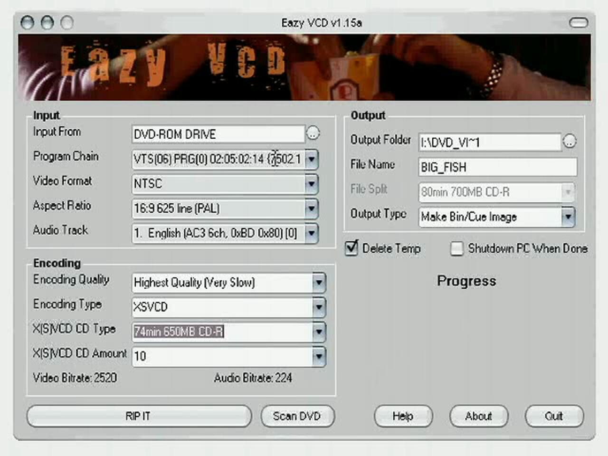
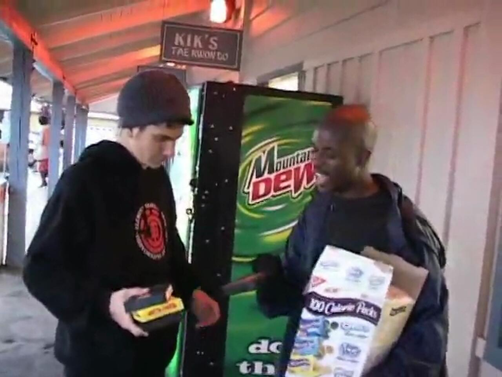
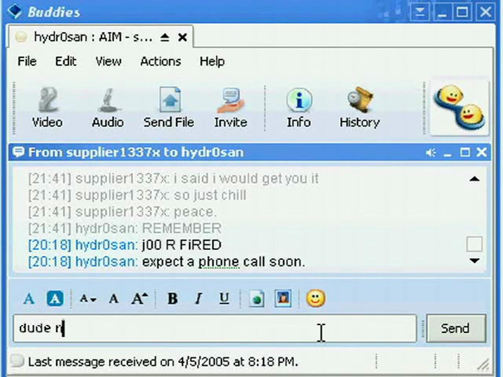
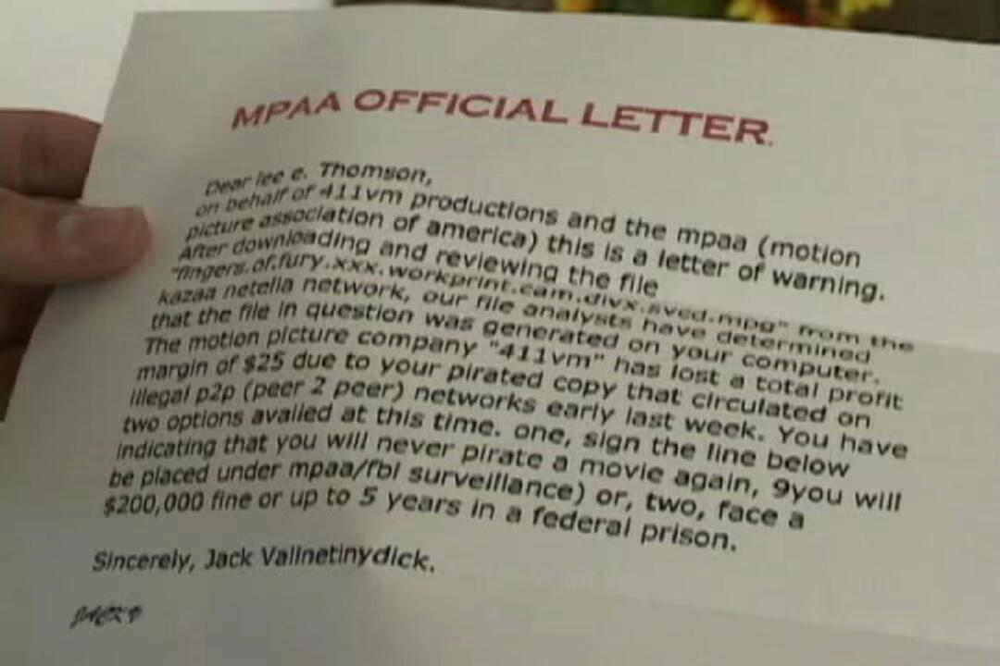
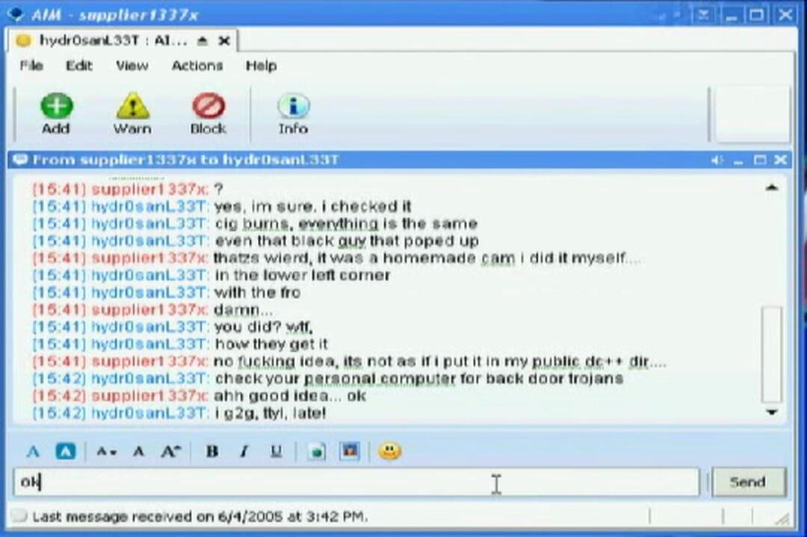
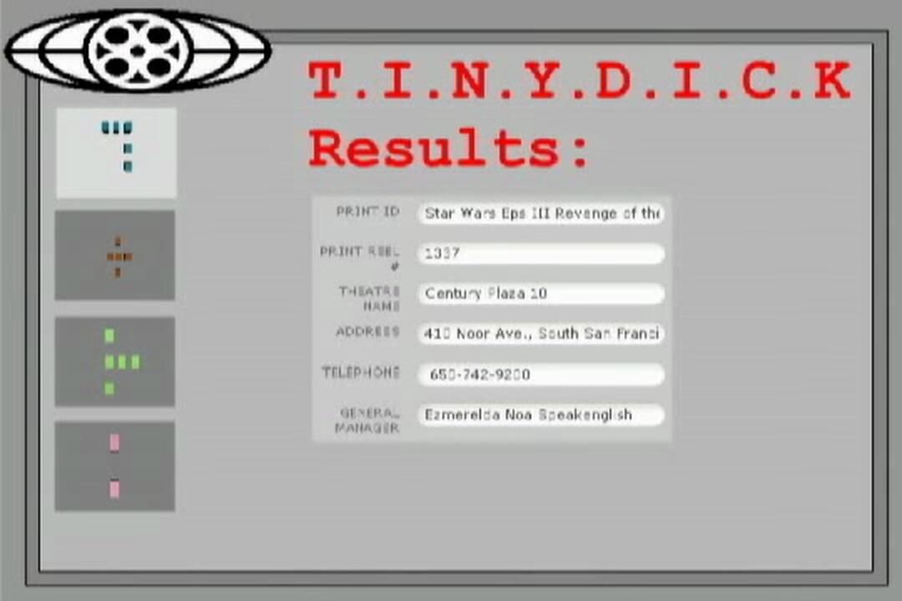
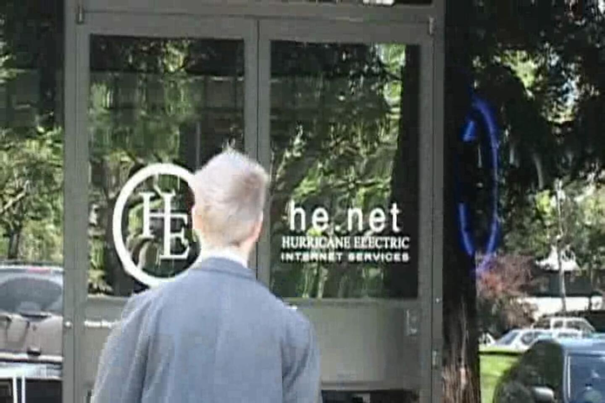
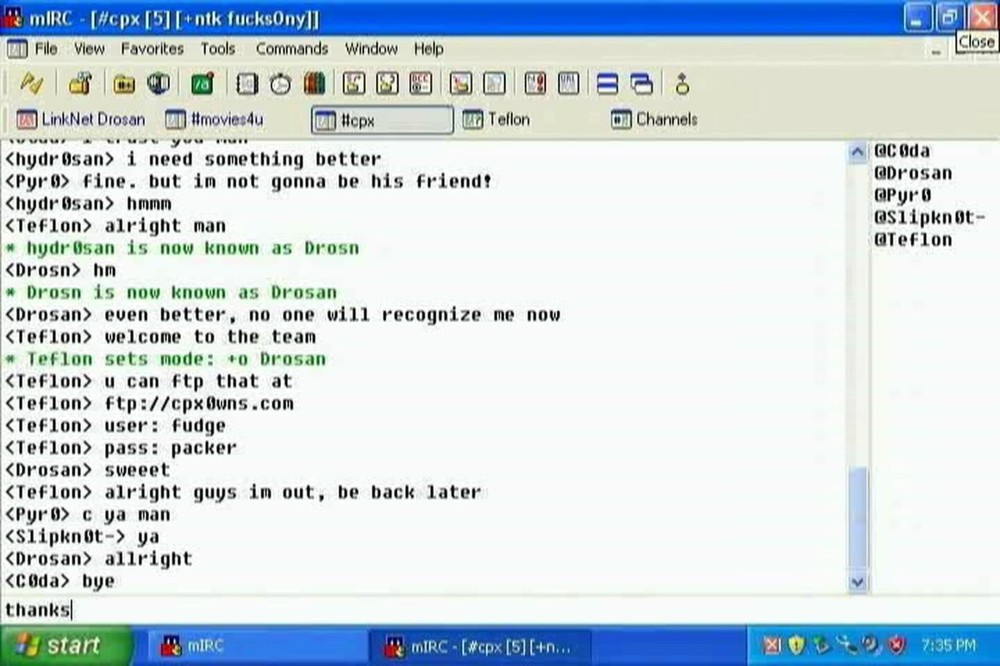
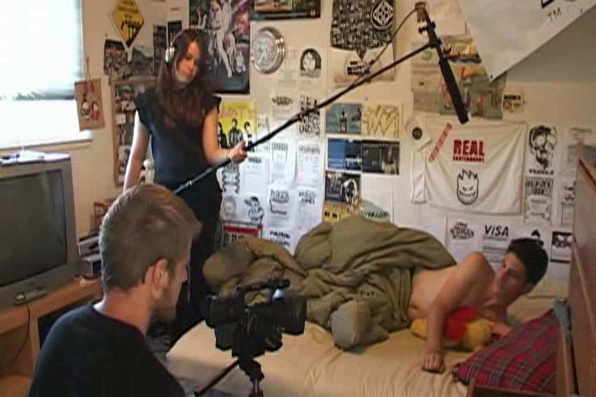
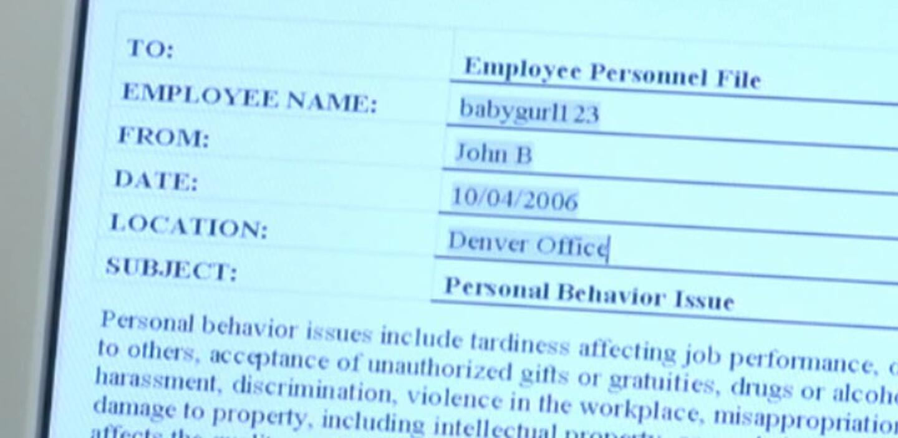

# Teh Scene (2005–2006)

*Teh Scene* — in full, *Welcome to Teh Scene* — is a fan-made parody of *The Scene*, released on the web a few months after the original began. Where *The Scene* is a fixed view of a computer desktop that the viewer reads, *Teh Scene* is shot as a live-action show, narrated by its characters in deadpan voice-over and cut with chat windows, fake commercials and title cards. Its targets are the original's earnestness, the idea of a release group as a disciplined organization, and the companies on both sides of the story: one sign-off reads *JUN IS TEH SUCK!*, a fake sponsor's message turns into a rap about hating Sony, and the password to the rival group's channel is *fuck-s0ny*.

It is told as the work of **XPC**, a fictional release group that insists it is the best in the scene and keeps losing races to a rival, TMD. Over nine episodes the joke turns into a plot — an informant, an FBI agent, an MPAA agent with a grudge — and the season finale ends by folding itself into *The Scene*: XPC's leader joins the original's group, CPX, under the name **Drosan**.

These synopses are written for someone who has watched it, or doesn't mind knowing how it ends.

## Who's who

The characters, with the actors as the finale's closing credits name them:

| Character | Who they are | Played by |
| --- | --- | --- |
| **T3hsuppli3r** (Lee T.) | XPC's supplier and the main narrator; on paper, *Lee E. Thompson* | The-Who |
| **Hydrosan** | XPC's leader | Kenshinx |
| **Melissa** (Mel) | Lee's on-and-off girlfriend, secretly working for TMD | TheWho'sPimp |
| **Leetencoder1** | XPC's encoder | — |
| **Leetencoder2** | XPC's other encoder, missing since his AOL trial expired | — |
| **Venomous** | Leader of the rival group TMD | DJ Kdubb (Truantkid) |
| **Agent Gryphon Smythe** | The FBI agent working the case | Jaku |
| **Agent Fitzgerald** | An MPAA agent, online as **babygurl123** | Lord Dusty |
| **Mr. Noir** | A bootlegger, in the season 2 episode and one fake ad | Himself |

The names are spelled differently in nearly every source, including the show's own credits: *Gryphon*, *Grephun* and *Gryphun Smythe*; *babygurl123* and *Babygirl 123*; *Venomous* and *Venemous*. T3hsuppli3r's actor is credited by his handle, The-Who (elsewhere *T-H-E-W-H-O*), who also made the series. Wikipedia gives his first name as Jordan, and lists Hydrosan as playing himself; the closing credits give Hydrosan to Kenshinx.

## The episodes at a glance

Nine episodes in two seasons, and four behind-the-scenes specials. Running times are those of the Internet Archive's copies.

| Episode | Runs | Notes |
| --- | --- | --- |
| Season 1, episode 1 | 13:46 | Online by 17 March 2005 |
| Season 1, episode 2 | 15:37 | |
| Season 1, episode 3 | 15:31 | Still "coming soon" at the end of March 2005 |
| Season 1, episode 4 | 21:01 | |
| Season 1, episode 5 | 19:55 | |
| Season 1, episode 6 | 33:51 | Widescreen; a trailer came out ahead of it |
| Season 1, episode 7 | 25:12 | Filmed on location with episode 8 |
| Season 1, episode 8 | 45:03 | Season finale |
| Season 2, episode 1 | 20:21 | 1 November 2006; no further episodes followed |
| Behind Teh Scenes, volumes 1–4 | 17:14, 21:48, 16:34, 53:03 | Outtakes and making-of; volume 1 dated 31 March 2005 |

The episodes run longer as the series goes on, and the finale is more than three times the length of the first. A DVD edition of the first episodes, with a director's commentary and other extras, was announced as the first of three discs; only the first appears to have been released.

Some episode databases list *Teh Scene* as a television series with a broadcast network. It was never broadcast: it was distributed the same way *The Scene* was, as downloads and through its own website. The same databases put the season 2 episode in December 2005, but the show's site was still announcing it as just released in November 2006.

## Episode 1 — Big Fish

It opens on a card borrowed from *24* — *The following takes place between 1337 and 1337* — and on Lee asleep, hungover, hugging a stuffed animal. His voice-over sets the tone for the series: everything in his life is pirated, *I don't even pay for my own gas*, and it's time to do his job. Someone has attacked his firewall; his trial of NeoTrace Pro has expired, so he goes looking for a crack, and Norton finds a trojan in it.

Hydrosan calls: a bootleg of *Big Fish* is in the mail, disguised in a red Netflix envelope, and nobody on VCDQuality has it yet. Then Melissa turns up, and for once Lee's evening is going somewhere — until Hydrosan calls again to ask why the DVD isn't ripped. Lee picks the group. *Once you're in a group like this, there's no turning back.* He rips it to ten discs as *Big.fish.dvdrip.cam.ts.svcd.xvid.mpg.xpc* (*quality is one of our virtues*), admires it, and gets a message: at least five other groups have released it first, TMD among them, from the exact same source. Rip a good one soon or he's out. He puts on emo music. *One minute you're on top, one minute you're on the bottom.*

*Episode 1, 9:05. Big Fish, ripped to ten CDs at Highest Quality (Very Slow). By the time it's done, five other groups have released it.*

A closing card: *THIS WAS NOT AN AD PROMOTING JUN MEDIA OR MY CHEMICAL ROMANCE. JUN IS TEH SUCK!*

## Episode 2 — Fingers of Fury

Lee needs a new source. Melissa calls at six in the morning needing her homework printed, and the printer runs out of ink on the third page — he's been using it all on NFO files to hang on his wall, *because that's what real sceners do*. He spends the school day avoiding her, and the episode spends over a minute on him at a urinal — looped five times in the edit, he admits. He has a recurring dream: any face in a crowd could be Hydrosan or one of the encoders, people he has spent countless hours talking to and has never seen.

Hydrosan is furious over AIM — *THERE'S OVER 6 BILLION ON THE PLANET, YOU ARE REPLACABLE* — and Leetencoder1 finds Lee a supplier, who meets him in front of a Mountain Dew machine with a box of VHS tapes. Lee takes one labelled *Fingers of Fury*, sold to him as a porn workprint. He cams it off his own television, discovers it is a finger-skateboarding video, and labels it as porn anyway. *Supply and demand.* Sending it to be encoded, he hears Leetencoder1's theory about *Big Fish*: *maybe they have an insider at the post office*. Hydrosan is delighted: *You've done good, Cockmonkey.*

*Episode 2, 10:12. The new source, in front of the Mountain Dew machine. The tape Lee walks away with is Fingers of Fury.*

## Episode 3 — fired

The dream gets further this time — *You're all going to get caught. All of you.* — and Lee wakes to an IM: *j00 R FIRED. expect a phone call soon.* *Fingers of Fury* went out labelled as porn, Kazaa's users noticed, and the release has been nuked. Hydrosan: *if you can't get the job done right, do it yourself.*

*Episode 3, 2:02. j00 R FIRED. Lee's reply, dude n, is still being typed.*

So both of them do. Hydrosan steals *Spy Kids 2* from a video store, sets off the alarm and is chased out by security, worried mostly that his parents will cut off his internet. Lee cams his first movie at the cinema, with a voice-over rant against the price of a ticket — *$9.75* — that the series comes back to more than once: lower the prices and there'd be no reason to pirate. Then he cooks Melissa dinner out of a can of Progresso and tells her he loves her. He puts on his ten-disc *Big Fish*. *Oh my gosh, the qual on this movie sucks.* She leaves.

The episode also has a fake sponsor's message, a rap about a counterfeit Sony that turns out to be a Panasonic, and the credits thank *SONY (NOT)*.

## Episode 4 — the letter

It begins with a public service announcement, *paid for by the Notorious Pirates of Antarctica*, in which Lee, in a suit, explains that pirates work hard to make sure their files are practically perfect. Then the plot arrives: in voice-over, Melissa is acting on *instructions from the Venomous high command*. She breaks into Lee's house at night with a TMD patch on her back. Lee hears her and creeps down the hall with a pistol; she says she came to surprise him, and drugs his drink.

Leetencoder1, meanwhile, finally tells the story of Leetencoder2: his AOL trial expired in the middle of an encode, the encode crashed, and he threw his computer off the roof. Lee, broke, stands on a street corner with a sign — *I sell movies that are still in theaters* — and sells nothing.

Then a letter comes, headed *MPAA OFFICIAL LETTER* and signed *Jack Valinetinydick*. The file *fingers.of.fury.xxx.workprint* has been traced to his computer; the studio has lost *a total profit margin of $25*; he can sign a promise never to pirate again and accept surveillance, or face a $200,000 fine or five years in prison. He signs, and keeps quiet about it — his cam of *White Noise* is about to go out through Hydrosan, and telling him why it shouldn't would get him fired again.

*Episode 4, 17:15. The letter. The studio, 411vm, has lost a total profit margin of $25; the file it names is the finger-skateboarding video from episode 2.*

## Episode 5 — White Noise

A *Star Wars* crawl opens it — *STAR WAREZ, Episode V: Revenge of the Scenith* — about pirates who have *taken the world by its balls* while the MPAA watches its profits slip through its fingers.

Lee is *tripping balls* over the letter and hoping his cam of *White Noise* will turn out badly enough that Hydrosan won't release it. Leetencoder1 tells him the paranoia is normal, that his new hardware means the MPAA can't trace his old serial numbers anyway, and that there's a scene helpline he can call. It puts him on hold for seven hours, and then he discovers it has been outsourced.

Then it gets worse in a different way. On AIM, Hydrosan tells him TMD has beaten XPC again — with *White Noise*, and the same copy, down to the cigarette burns and a man with an afro in the lower left corner. Lee made that cam himself. He never put it anywhere public. He checks his machine for a back-door trojan and finds nothing. Meanwhile in Chicago, Hydrosan is selling *White Noise* and is caught: a raid, and a fight in a park at night.

*Episode 5, 11:12. TMD's White Noise is Lee's own cam, cig burns and all. Hydrosan's advice is to check for trojans; there aren't any.*

To be sure of his next release, Lee cams *Star Wars: Episode III* on opening weekend and watches his connections to be certain nothing leaves his machine. Melissa comes over, says he looks like the actor who plays Anakin, and goes upstairs with him. At the end it is her voice-over: she has taken the disc, and Lee won't know what hit him until it's too late.

## Episode 6 — Revenge of the Sith

Hydrosan has been offline for over ten hours, which never happens. He is in an FBI interrogation room with Agent Gryphon Smythe, in a parody of *The Matrix* — *there is no spoon*; *I see a spoon* — where what Smythe wants is access to a dual AOL 56k server and what he threatens is 56k modem speed for 48 hours.

Lee's cam of *Star Wars: Episode III* has gone the same way as everything else: TMD has released it, from the same source, and there's no trojan on his machine. Someone took the disc out of his five-disc changer while he slept. He dusts for fingerprints, finds only his own, and interrogates a broken twig from the garden, eventually roasting a marshmallow on it. Melissa calls, all apologies about the last time, asks for help installing a new wireless mouse — it is a guinea pig, from the Disney store — and invites him to stay the night; the video they make is interrupted by her taking a phone call.

Then, *with the MPAA agent and Operation Kazaa Down*, Agent Fitzgerald introduces himself in voice-over. He was an amateur filmmaker until a workprint of his first film leaked; the pirates' reviews were so bad he was banned from Hollywood, and now he hunts pirates. He has traced XPC's cam through the dots a projector print carries, using a program called T.I.N.Y.D.I.C.K. — which runs, he explains, on a 486 with eight megabytes of RAM, because the anti-piracy budget went on scary magazine ads and *suing 12-year-old kids and dead people*. The trace comes back to a theater, and he takes the next flight to San Francisco.

*Episode 6, 30:56. The trace: print reel 1337, and a theater in South San Francisco.*

The closing credits drop the joke for a paragraph. *The recent tragic scene busts were not fake*, it says; XPC doesn't pirate anything, but the group thinks it's wrong for the FBI *to arrest 17-19 year old kids who upload movies onto the internet and run private ftp sites*, and sends its love to those who were caught.

## Episode 7 — the honeypot

The episode opens with a scrolling disclaimer: the internet provider Hurricane Electric is not really an FBI server farm. In the episode, it is. Fitzgerald walks into its office in a trench coat and asks for colocation for a honeypot, *a one gigabit site*. *That's quite expensive.* *I have corporate backing.*

*Episode 7, 7:45. Fitzgerald at Hurricane Electric, which the episode's own disclaimer says is not really an FBI server farm.*

He reports to Smythe by phone. Hydrosan has escaped, but the FBI's ninja implanted a tracking device in him while he was unconscious — and Fitzgerald's one concern is what happens if Hydrosan *defecates*. Fitzgerald catches Venomous first, in a chase along the tops of freight trains, and turns him. In Chicago, Smythe's *Hydr0San Tracker 2.4ßß* closes in on a movie theater.

Lee tells Melissa what he does — *I'm in a group called XPC. I'm, like, a pirate* — and plans to cam *The Island* at the Metreon in San Francisco. She thinks it's sexy. Then she makes a call: *he's going to cam The Island.* The voice on the other end tells her there will be a surprise at the theater. *Remember, don't be afraid.*

## Episode 8 — make the scene

The finale opens with a computer-animated MPAA sniper taking aim at a father and son for downloading the SpongeBob movie, under the real campaign's slogan, *you can click but you can't hide*. Fitzgerald arrests Lee outside the Metreon, chases him across San Francisco, and pins him against a tower of the Golden Gate Bridge: Melissa has been stealing his encodes for TMD for six months. Five years. *I'm only 17!*

Hydrosan, with no supplier, makes his own cam, climbing to a projection booth (*how is a fat man like me supposed to get up all these damn stairs?*), and fights Agent Smythe in the lobby under video-game health bars. There's a fake Fandango commercial for a download site called Fanleecho, acted out with paper-bag puppets.

Then he turns up in IRC, in *#movies4u*, whose topic reads *We must beat XPC on your next release! CPX Owns!!* The channel's ops are **C0da**, **Pyr0**, **Slipkn0t** and **Teflon** — *The Scene*'s group and its people — and Teflon's connection gives his username as Jaku, the actor playing the FBI agent. Hydrosan offers them *The Island*, *perfect quality*, cammed himself. Pyr0 doesn't trust it; C0da says to give it a chance; Teflon lets him in. Then Hydrosan changes his name:

> **\* hydr0san is now known as Drosan**
>
> **&lt;Drosan&gt;** even better, no one will recognize me now

He gives Teflon his AIM name, *BriSan3333*, and a moment later is talking to *melissbliss05*. In *The Scene*, Drosan's AIM name is BrianSan333 and his girlfriend Melissa's is melissbliss04.

*Episode 8, 31:02. #cpx, key fucks0ny. Hydrosan becomes Drosan, and Teflon gives him ops.*

Back in San Francisco, Fitzgerald searches Lee's room. Every DVD in it is pirated, worth *$500,000* each. But the argument goes the other way. Lee says the real problem is the quality of the films and the price of a ticket; he pays for the good ones, like *Revenge of the Sith*; he pirates as a hobby and buys what he likes in the end. Fitzgerald admits his film was bad, that he got his reviews from the pirates who stole the workprint, and that the MPAA pays him $60,000 a year. So Lee pitches him something: a show about the piracy scene, about their own lives, given away free on the internet, *because that's what the scene's about*, which would make people want to pay to see his next film. *Let's do it. We'll make the scene.* They set up a camera, and the episode ends by filming the opening of episode 1 — *scene one of the scene, take one* — with a crew visible around the bed.

*Episode 8, 39:05. Scene one of the scene, take one: the opening of episode 1, with the crew in shot.*

A narrated epilogue settles the rest. Babygurl123, Melissa and T3hsupplier made the internet show *Teh Scene*. The topsite Fitzgerald set up is still secretly run by him and Smythe, as part of a two-year sting called Operation Site Down. Hydrosan joined CPX and introduced them to topsites. Venomous is a site op on the servers at Hurricane Electric. Leetencoder2 is still missing. *Was this show all a fake parody?* it asks, or has it served as a warning to the real scene, *much like the show The Scene that we made fun of did*.

Operation Site Down was real: the FBI's raids on release groups came in June 2005, the same summer as these episodes.

## Season 2, episode 1 — the next great XPC cammer

A year later, and with most of the cast missing — the credits explain they *either lost their camera battery charger, were out slinging webs, or just decided to get drunk instead of filming* — the one season 2 episode follows the law. At the FBI's Counter Piracy Unit in Chicago, Smythe gives a slideshow on three bootleggers who sell *over a thousand movies a month*: S. Burnt, R. Black, and the mysterious Mr. Noir. The raid is staged like *COPS*. The interrogation ends with Smythe turning up the thermostat until a suspect talks.

*Season 2, episode 1, 7:18. Fitzgerald's personnel file, dated 10/04/2006, a few weeks before the episode came out.*

Fitzgerald, narrating, has had a worse year. *After the abysmal failure of my internet TV series*, he reported back to the MPAA's office in Denver after two weeks of not showing up, and was fired. He goes to church, then climbs a mountain in search of answers, and finds a DVD of *The Fast and the Furious*. At home his modded Xbox still carries an MPAA skin; the bought disc makes him sit through trailers. He decides that letting the pirates go isn't enough: *I had to become the bad guys in the shittier sequel. I had to become the next great XPC cammer.* The credits promise episode 2 for *the end of December or early January*. It never came.

## Watch it

All nine episodes, the four specials, the trailer, the DVD and the group's music are collected on the Internet Archive as **[Teh Scene Collection](https://archive.org/details/Teh.Scene)**. Several episodes were also mirrored there individually at the time, which the episode 3 credits thank the Archive for. The series' own site, welcometotehscene.com, is long gone.

## The other parody

*Teh Scene* wasn't the only one. In 2005 a group of friends were three weeks into filming their own parody of *The Scene* when *Teh Scene* showed up on VCDQuality's feed. Its upload notes call it *the most unlucky coincidence ever* — they had considered the same name — and they finished theirs anyway as **[Teh FuX0red Scene](https://archive.org/details/Teh_FuX0red_Scene_s01e01)**.

It got as far as one episode, three and a half minutes long, and it parodies *The Scene*'s first: the package arrives. A narrator explains the attractions of the scene (*we get to call people noobs*), and promises the series is *extremely accurate to real scene operations*. Then a boy in bed under a hand-lettered *WAREZ* sign groans over another nuke — *those bastards* — until a masked courier arrives in a van with *WAREZ* plates and hands over a box marked *TREAT WITH CARE — ILLEGAL WAREZ INSIDE — STARWARS REVENGE OF THE SITH*. He leaps over a parked car with joy and puts the disc in his computer, and the episode ends there. The credits promise *Episode Two Coming Soon*, followed by an appeal to donate to their PayPal. No second episode appears to have been released.

## On the sources

The episode entries come from watching the episodes in the Internet Archive collection: frames every fifteen seconds, the chat windows and documents read at full size, an OCR pass over a frame every three seconds to catch anything on screen too briefly for that, and the dialogue transcribed with Whisper. The rest comes from the release notes in the collection, the show's website as archived in 2005 and 2006, and Wikipedia's article on *The Scene*. Where those disagree, the page says so above, and the episodes' own credits win.
