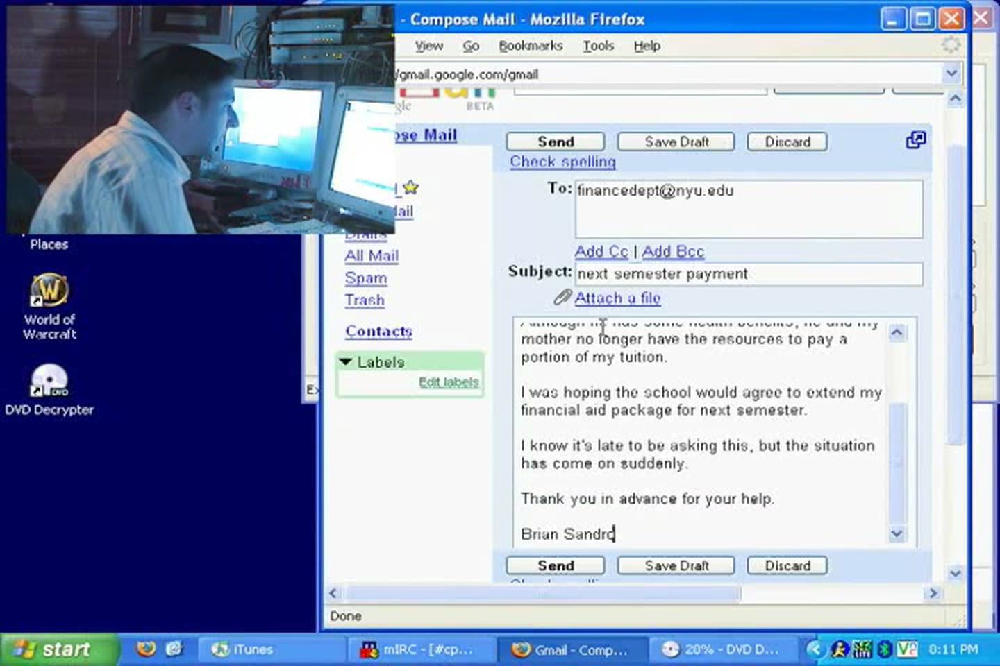
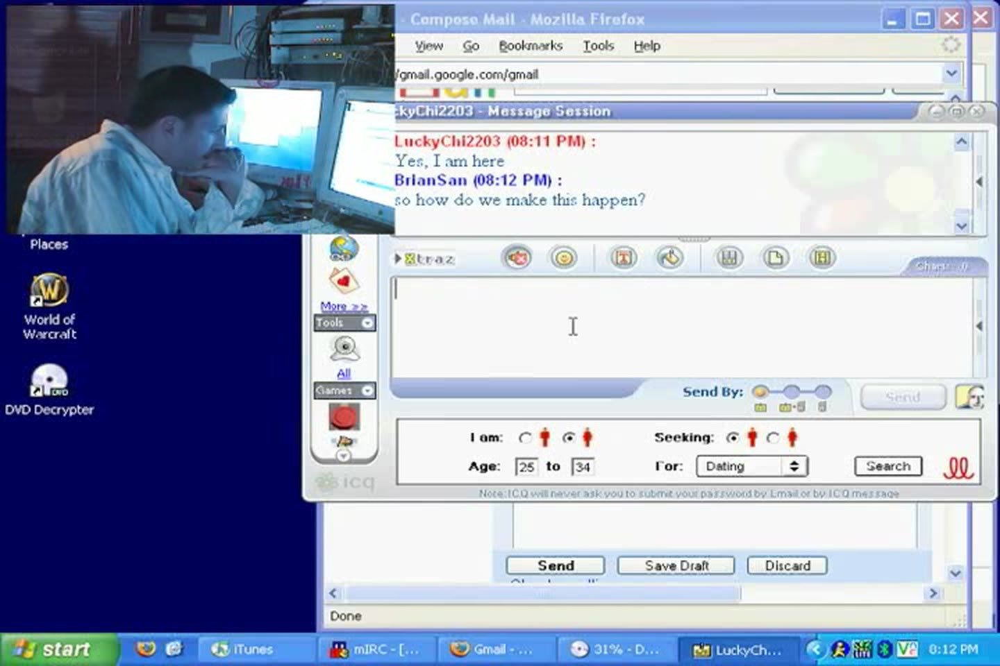
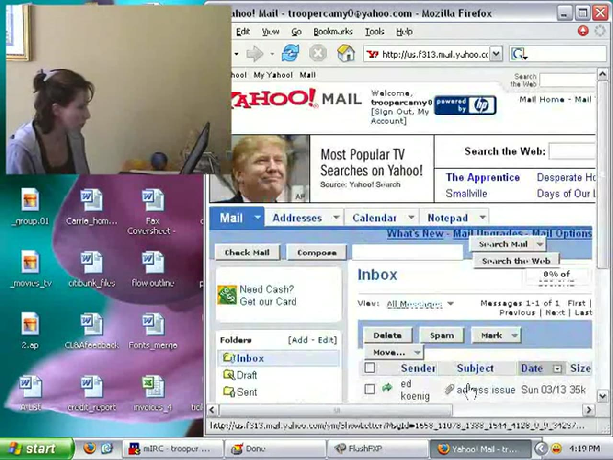
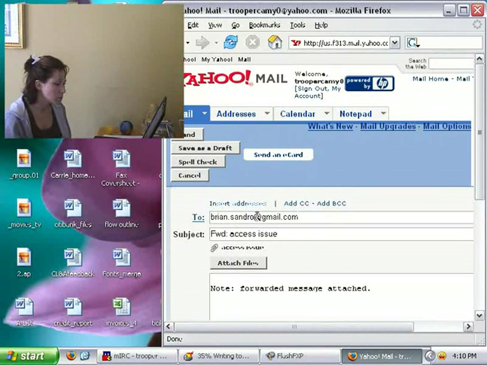
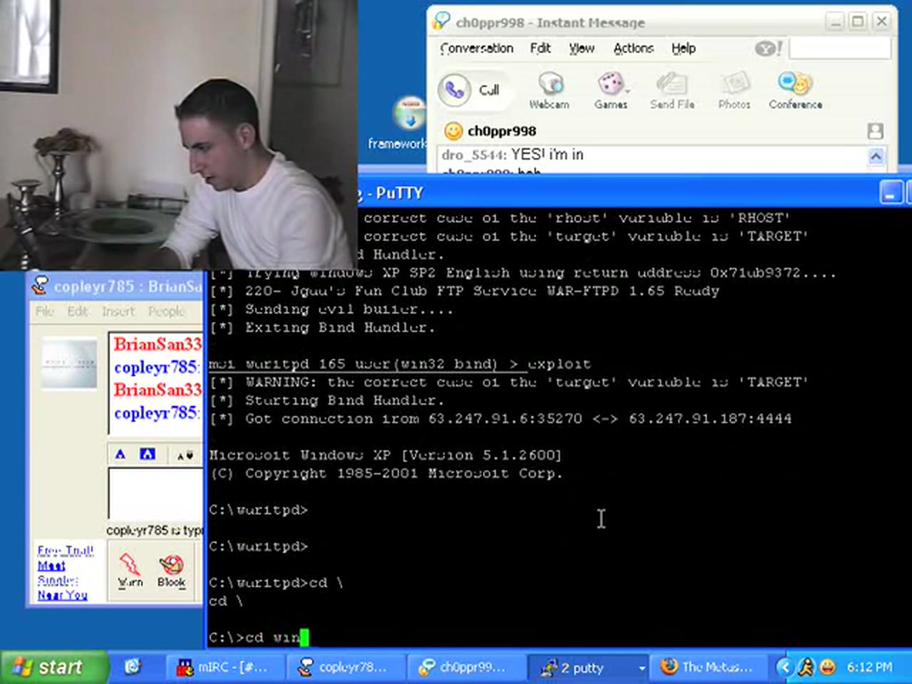
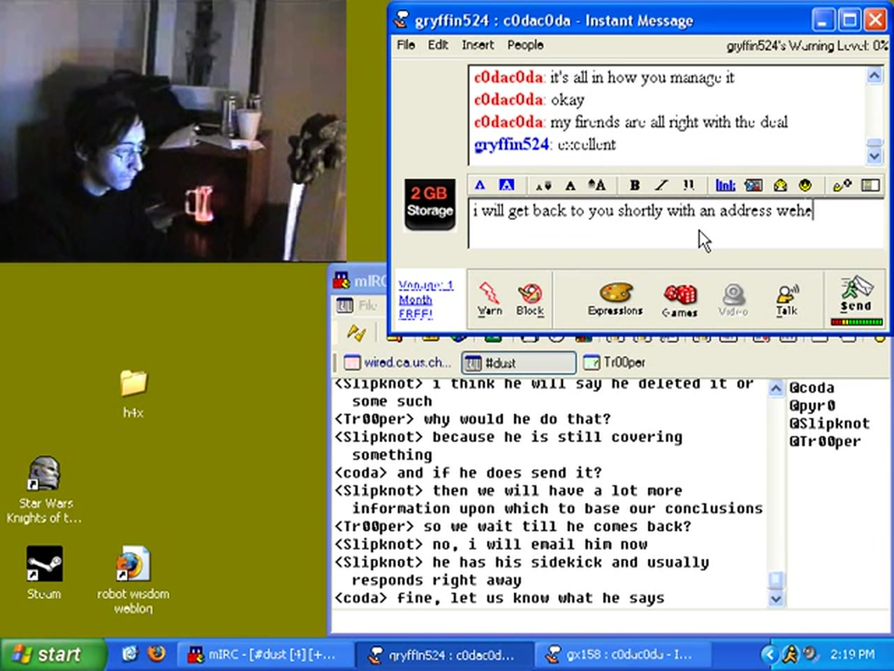
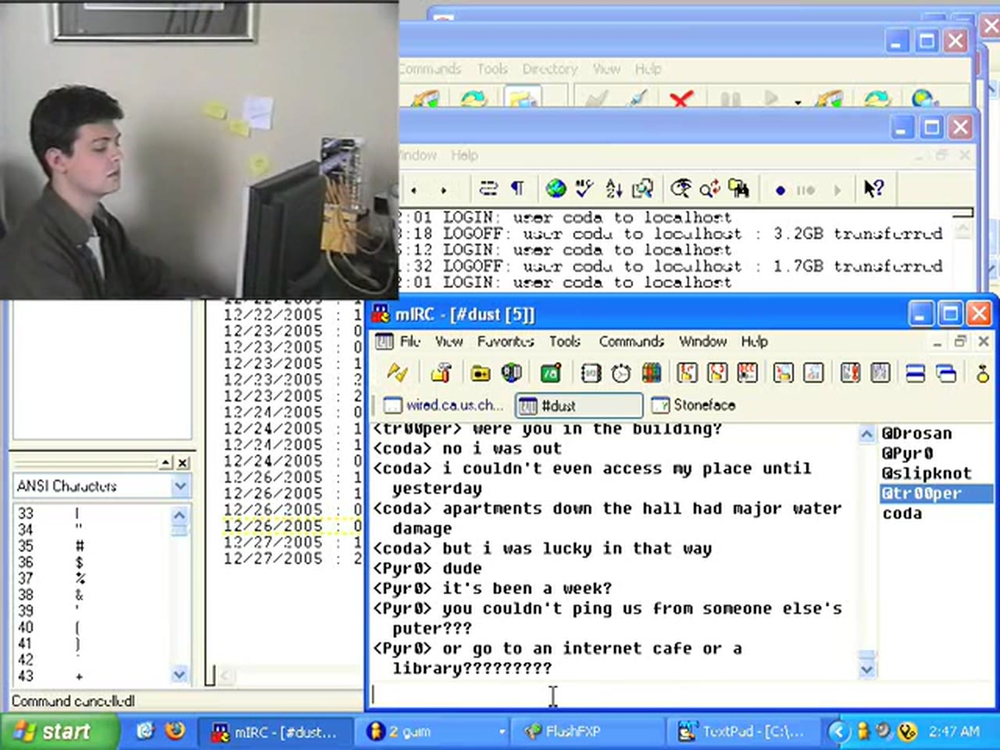
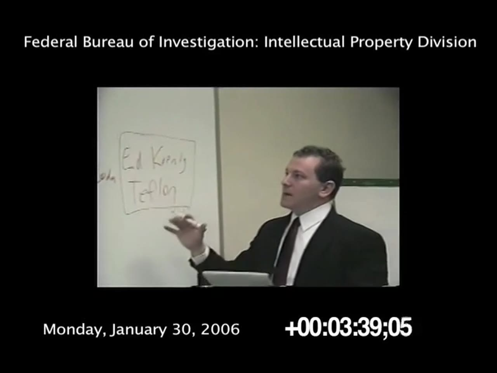
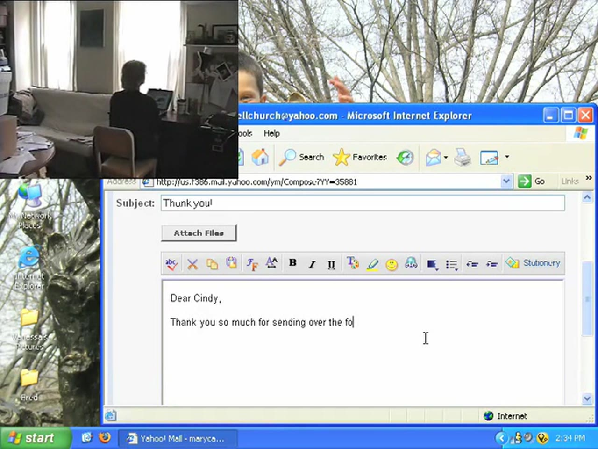

# The Scene (2004–2006) — Season 1 Episode Synopses

Reconstructed from the episodes themselves: on-screen text (IRC, IM, FTP and application windows) read frame by frame, merged with the spoken narration and phone calls from locally generated transcripts. No published episode synopses exist for this series. Links to the series and its records are at the end.

**Coverage:** complete — all 20 episodes include the on-screen text as well as the spoken narration, phone calls and dialogue.

This is written for someone who has watched the series, or doesn't mind knowing: the episode entries point forward to what things turn out to mean, and the sections after episode 20 take the whole season as read.

## The season at a glance

| # | Title | POV | What happens |
| --- | --- | --- | --- |
| 1 | the package came | Drosan | A screener of *Alexander* arrives; the group races to release it. A tuition letter and a waiting buyer establish the motive. |
| 2 | the NFO, the missing RARs | Drosan | *The Incredibles* goes out two RAR files short, because he has already sold it. |
| 3 | beaten to it | Drosan | A rival group releases *The Exorcist* first. Suspicion lands on trooper, who is innocent. |
| 4 | teflon shows his hand | Drosan | teflon reconstructs the leak from a shipping delay and demands a cut. |
| 5 | the price of silence | teflon | The elder statesman is an FBI informant with an appointment at nine in the morning. |
| 6 | trooper comes to the channel | trooper | An email teflon should never have sent — and the name in its From field. |
| 7 | the group starts performing | Drosan | The channel becomes theatre staged for teflon, who is staged for the Bureau. |
| 8 | "it will be over tonight" | Drosan | The counter-operation runs. Drosan removes himself from the board. |
| 9 | the loose thread | Drosan | A stranger called gryffin says the name of Drosan's secret buyer to his face. |
| 10 | the empty chair | Melissa, at his machine | Melissa uses his computer, looks straight at the channel, and finds it boring. |
| 11 | gryffin makes it a threat | Drosan | *They know your name and your address* — alongside a break-in at Melissa's. |
| 12 | the inconsistency | Drosan | slipknot finds the hole in Drosan's story; a stranger IMs to say he knows everything. |
| 13 | the package that wasn't there | Drosan | A break-in at teflon's employer to delete an FTP log — and four words that reframe the season. |
| 14 | pyr0 goes missing | pyr0 | The encoder's power is cut by his mother's boyfriend. slipknot finds Madrid and Brussels. |
| 15 | the meeting without Drosan | cOda | cOda sells the group out in German while slipknot, in the next window, solves it. |
| 16 | cOda goes dark | slipknot | The courier vanishes. The FTP logs say he never left. |
| 17 | Operation TOP DOWN | FBI/DOJ | The Bureau explains the whole thing to a room, three years in. |
| 18 | teflon is still running him | Drosan | The back channel, and who invented Lucky Chi. |
| 19 | the sting | a federal agent | Agents run cOda's account against gryffin — and discuss the coming trial. |
| 20 | epilogue | Drosan | Everyone lands somewhere. The wrong door gets kicked in. |

---

## Episode 1 — "the package came" *(POV: Drosan)*

**Narration:** the series opens by explaining the world it takes place in. More than two hundred million people worldwide download music, movies, television shows and games, and almost none of them know where any of it comes from. Above that traffic sits a hidden infrastructure built for one purpose — acquiring content and moving it outward — where identities are guarded, access is currency and deals are brokered between people who have never met. The ones who live there call it the scene.

Drosan comes home from a shift at a restaurant, thirty-seven dollars richer and smelling of clam sauce, to find that the package has arrived: a screener of *Alexander*. He tells teflon first, before the disc is even in the drive. The two of them founded CPX about four years earlier and built it into one of the top groups, specializing in releases that look like DVDs rather than the blurry junk most people expect online — and reaching millions of viewers inside a week. pyr0, their encoder for two years, is fast and almost never makes a mistake, which matters because the finish line is shared with every rival group working the same title.

The mechanics play out on screen in real time: DVD Decrypter grinding through the VOB files, an FTP address and login passed to pyr0, iTunes running in the background. The channel fills up as word spreads — pyr0 begging for the files, cOda praising the new source, slipknot asking for specs and a release time. Drosan sets it for the next morning and notes they've already lost six hours to his shift.

The handoff to pyr0 is given in full: `here's the IP.. 63.247.91.186`, `user: enveloped`, `password: inflames`. That address is worth remembering — in episode 13 Drosan will break into `63.247.91.187`, one digit away.

**teflon's real IP is on screen in this episode and never again.** His private query window is titled `teflon (~Lexicon@68-175-123-239.nyc.rr.com)` — a Road Runner cable connection in New York City. From episode 2 onward the members appear behind a shared bouncer (`…nfs38635.ma.chatchannel.org`), so this is the one frame in the series where the thing episode 7's narration calls "your soul" is simply legible. Episode 17 will spend a paragraph on how hard the Bureau found it to get that address.

Three other windows complicate the victory. Todd — **Tremor2212** — IMs **BrianSan333** and asks whether he and Melissa are coming out for drinks, tells him to blow off whatever he's doing, and jokes that he'll go and hit on Melissa in his place, since *she always had a thing for me anywayz*, and then that he's off to put on his leopard-skin thong. Drosan plays along — *go for it stud* — says he can't, he has to catch up on classwork, agrees to the weekend instead, and Todd signs off saying he'll tell him about it in Stats tomorrow; they are in the same statistics class. A phone call from Melissa gets the same treatment — he has to finish something.

He is also reading the news about himself. Slashdot carries **"MPAA Sues Movie-Swappers"**, and he follows the link out to an MSNBC story, "Hollywood sues alleged file swappers," timestamped **3:54 p.m. ET, Nov. 16, 2004** — the earliest date the series fixes, and the environment the whole season takes place in, delivered as an idle browser tab.

**And Lucky Chi is already there.** An ICQ window is open, `LuckyChi2203` on one side and `BrianSan` on the other, at 8:06 PM:

> **LuckyChi2203:** Brian, are you there?
>
> **BrianSan:** yes, hold on a sec

So the buyer already exists, already knows him as Brian, and is waiting on him in the very first episode — before the narration's line about never having thought of himself as the sort of person who would sell. The episode's closing confession is not a foreshadowing. It is a description of a relationship the audience has already watched him tend.

**And in a third, the motive is typed out.** He opens Gmail and composes a message to `financedept@nyu.edu`, subject **"next semester payment"**, writing it in front of the viewer sentence by sentence, deleting and restarting:

> Dear Ms. Wistrom
>
> As you know, this semester has been difficult for me. My father recently suffered a mild stroke. Although he has some health benefits, he and my mother no longer have the resources to pay a portion of my tuition.
>
> I was hoping the school would agree to extend my financial aid package for next semester. I know it's late to be asking this, but the situation has come on suddenly.
>
> Thank you in advance for your help.
>
> Brian Sandro

He signs it with his full name, which means the first episode of the series already has it on screen — before the Gmail sign-in field in episode 2 and the email header in episode 6.

It is the most ordinary document in the series and the one everything else hangs on. The narration's closing line about money being like food is not a metaphor the episode reaches for — it is a caption for a begging letter to a university finance office that the audience has just watched him write. His desktop, meanwhile, is a student's: World of Warcraft, iTunes, DVD Decrypter.

And the narration lays the track the whole season runs on: there is one unwritten rule, which is that you never sell pirated material for money. He never thought he was the sort of person who would, or that he could even be tempted. But money, he says, is a lot like food — you see the world very differently when your supply is threatened.

## Episode 2 — the NFO, the missing RARs, and what Drosan did *(POV: Drosan)*

**Narration:** he describes living two lives. One is the student hauling books to class on a ten-speed bicycle; the other is the head of a group distributing hundreds of millions of dollars' worth of pirated entertainment to a global audience. He used to believe he could keep a wall between them, and now knows that was a fallacy — each person gets only one destiny.

The release in hand is *The Incredibles*, an eight-gigabyte file that pyr0 and the others have spent seven hours preparing. The episode is a tour of the last mile of a release. slipknot writes the NFO, the text file packaged with every release, which Drosan explains is read not only by other sceners but by the RIAA, the MPAA, federal investigators and, increasingly, reporters. teflon proofreads it and signs off. cOda checks the sites for a dupe and finds none, meaning the way is clear.

Underneath, Drosan is behaving strangely. He is normally the one pushing everyone to move faster; today he is stalling. He's short with cOda, and when teflon asks privately what's wrong he says only that it's "dad stuff." A phone call with his mother fills that in: his father is in the hospital, there's an argument about getting him a private room, and a question about who understands the health plan — his uncle George does, and knows the doctor there, though Drosan says he'll call the doctors himself after class.

**The screen supplies the real reason he is stalling.** A `LuckyChi2203` window is open through the whole sequence, messages alternating at 6:10 and 6:11 in the morning, directly alongside cOda's *helllooooo?* and *dude, c'mon, we gotta get this thing out* and *c'mon dro, what's up already?*. The group reads it as a man who won't answer. He is answering — just not them.

The Melissa window is not small talk either. She asks whether he slept and what his first class is, and then: *Don't tell me you're chatting with people.* He tells her his uncle George was calling. It is a flat lie, delivered in the same minute as the buyer's window, and she takes it and moves on — *I'm just being selfish*, she says, and he answers *i like talking to you* — and they settle on eight o'clock, and she says she loves him, and he says *me too*. The episode's thesis about two lives is demonstrated here rather than narrated: one window has the man he is, the next has the man she thinks she's talking to.

His full name is on screen again, incidentally, on a Gmail sign-in page with the username field filled in: **brian.sandro**. The NFO teflon proofreads is named too — `incredibles.xvid.dvdrip-cpx.nfo`, open in Notepad — and between tasks Drosan sits on IMDb's page for the film and on Boing Boing.

Between the two lives, the episode leaves a timestamp on screen: the Boing Boing masthead reads **Thursday, December 9, 2004**.

Then cOda begins assembling and comes up two RAR files short. He checks three times. The release is incomplete, and the group turns to Drosan at exactly the moment he goes quiet.

**The narration explains why, and it is the hinge of the season.** He has sold the film. Within hours of his delivery, bootleg DVDs will begin appearing on the streets of several Asian countries. He tells himself the men he sold to are nameless, faceless and soulless, that all he has done is delay his own group slightly and give a new employer a head start on a lucrative market. That, he says, is what he tells himself.

## Episode 3 — beaten to it *(POV: Drosan)*

**Narration:** the scene is an addiction. Once you have been part of it, leaving without wanting to come back is almost impossible. There are dangers, and he admits he'd be lying if he said the danger wasn't part of the appeal — and like any addict, he always believed he had the whole thing under control.

The release is the new *Exorcist* — not the biggest film of the year, but a good get, and the group is enjoying it. Then slipknot comes in with the news that someone else has already put it out, and a link to prove it — `http://www.vcdquality.com/index.php?page=sample&id=46529`, a real release-quality review site of the period, which Drosan opens and reads on screen. The show's world is checkable: the rival release is not asserted, it is looked up. pyr0, who has just spent six hours encoding, takes it worst. The group goes straight to the obvious suspect: slipknot says it must have been their source, teflon names trooper, and cOda piles on — *we should never have trusted him*, *why are you always defending that guy*. trooper works at a DVD manufacturing plant in Los Angeles and supplies product in exchange for access to the terabytes of material on the group's servers. It's a reasonable suspicion, and Drosan defends her hard while knowing exactly where the problem actually lies.

**teflon works the technical angle, and he is already building a case against trooper** — a detail that matters, because it is the seed of the email in episode 6:

> **&lt;teflon&gt;** you seem pretty sure it wasn't trooper … I just went through the server logs. he was downloading hundreds of gigs for weeks and then he suddenly stopped. Someone from D-Pix probably found out who he was and got him to switch over
>
> **&lt;Drosan&gt;** it's possible i guess.. but i think its unlikely … there could be someone else at trooper's plant.. or maybe they're printing the DVD at two different plants?

teflon's method is log analysis and his conclusion is wrong, which is the shape of the whole season: everybody investigating carefully, aimed at the wrong person, while the man answering the questions knows the answer.

**In a private window, Drosan works his buyer, and the conversation is not what the group would imagine.** He is not haggling. He is frightened, and he is asking a man he has no leverage over for a favor:

> **BrianSan:** Please chat me as soon as you see this … we have a problem … another group has released The Exorcist
>
> **LuckyChi2203:** unfortunate but dont worry we no hold you responsible
>
> **BrianSan:** that's not what i mean. this makes things difficult for me. i can't have other groups releasing the titles that i sell to you
>
> **LuckyChi2203:** not in my interest to have movie on internet either … bad for business
>
> **BrianSan:** im not saying that you or your associates let this happen on purpose … i'm worried that there is a leak. if the guys in my group trace this back to me.. i will be in a lot of trouble
>
> **LuckyChi2203:** no leak here
>
> **BrianSan:** there must be.. this doesnt happen to us normally
>
> **LuckyChi2203:** i no like your tone
>
> **BrianSan:** sorry. im just asking you to please look into it
>
> **LuckyChi2203:** no need to look
>
> **BrianSan:** this kind of thing can't be allowed to happen
>
> **LuckyChi2203:** no problem here
>
> **BrianSan:** if my group finds out that i have a relationship with you.. i will be in deep trouble
>
> **LuckyChi2203:** your security not my responsibility

He apologizes twice to the man who is ruining him. Episode 13 reveals there is no operation at all — Lucky Chi is teflon, improvising a bootlegger's broken English — which makes *i no like your tone* and *your security not my responsibility* a performance teflon is giving to a friend who is begging him for help, in order to watch him beg.

**And then he leaves.** Melissa messages him mid-crisis: *i have a problem.* He answers *i know how you feel* before she has said what it is — the line the season keeps handing him, a man who has stopped listening — and she tells him her roommates are gone, she's alone and naked and has nobody to keep her company. *um. YES!* He tells the channel *listen guys.. i gotta take off*, says he'll have his sidekick so they should mail him, and walks out on pyr0 and cOda in the middle of the worst thing that has happened to the group, to go across town. It is the one time all season he chooses a person over the machine, and it is the one night the machine needed him.

By the end, slipknot's contact reports that D-Pix didn't get *Exorcist* from one of their usual sources — it came from someone they met randomly on IRC — and the group's suspicion turns inward for the first time.

## Episode 4 — teflon shows his hand *(POV: Drosan)*

**Narration:** a recurring dream — walking through a crowd, safe because nobody knows who he is, any face potentially cOda or pyr0. He spots cOda, they move toward each other, and he realizes he has no idea what cOda looks like. Then the street turns: everyone is staring, everyone knows who he is, and everyone knows what he's done.

The woman in the room with him is **Dana**, not Melissa — the episode's credits bill Joe Testa "with Laura Minarich," and she is blonde where Melissa is dark. The episode never names her on screen, but Minarich is credited elsewhere as danaburke123, so the on-camera woman here is the same character who spends the back half of the season in his IM window. That puts Dana in the story four episodes before her first IM window. She stands behind his chair with a hand on his shoulder while **LuckyChi2203** messages him — the bootlegger opening by addressing him as "brian," his real name, on screen, in front of a woman he is keeping at arm's length. She asks who he's talking to; he says nobody; she says he's keeping secrets; he agrees that he's a man of many secrets. Later she asks whether he's still coming home with her and he begs off with a physics test.

**What is actually in that window is the buyer running out of patience.** Lucky Chi has noticed that CPX put out a release he didn't get:

> **LuckyChi2203:** i have not hear from you for a long time … we have agreement, do we not? … Your group release this? Coach Carter XviD.DVDSCR-CPX ?
>
> **BrianSan:** yes.. we did … please tell your associates that i mean no disrespect … look.. i wish i could get you some movies … but it's too risky
>
> **LuckyChi2203:** not acceptable … we have agreement
>
> **BrianSan:** there is nothing I can do about it … i just need some time
>
> **LuckyChi2203:** i no have time for games
>
> **BrianSan:** this isn't a game! this is important
>
> **LuckyChi2203:** i need source i can trust

Then the window prints `Message was sent. User is Offline. This message will be delivered when user goes Online.` He is apologizing to an empty room — which, given who Lucky Chi turns out to be, he is doing for most of the season.

The AIM window running in parallel is Melissa's, and it is entirely tender and entirely uninformed: *sleep well?* … *any news on your dad?* … *i'd love to come with you one of these times* … *see you this afternoon?* Two women, two windows, neither of them told anything true.

**Online, teflon lays out a case step by step, and it is the best-written interrogation in the series.** He opens light — a possible line on *Phantom of the Opera*, a remark that cOda has been strange — builds the case against cOda as courier, then dismantles his own argument and turns:

> **&lt;teflon&gt;** i am 100% certain it was someone in our group … come on, dro. i'm not stupid. did you think i wasn't gonna find out? … think about it, there are only so many places on irc … he was the source for Exorcist, right? well, as it turns out, he was as shocked as anybody that that happened. in fact, he was pissed … see, he said he fed ex'd it to you for days, but you didn't tell us about it until later. did you? … oh, don't worry, it's easily explained. fed ex is great, but they're not perfect? right? … still there? … cat got your tongue? … only you and i both know that's not what really happened … don't we

> **&lt;Drosan&gt;** what do you want?
>
> **&lt;teflon&gt;** what do you think i want asshole. **i want a cut**

The trap is built out of trooper's own indignation about the early *Exorcist* release, which is to say out of the one person in the group who is completely innocent. And teflon's demand lands without any reference to loyalty, the group, or the rule the series opened on — four words, and the elder statesman is a blackmailer.

## Episode 5 — the price of silence *(POV: teflon)*

**Narration — the episode that rewrites the season:** teflon started on BBSs in the mid-80s on an Amiga with a 1200 baud modem, worked onto IRC and Usenet, and at 37 is considered an old man by the scene. None of that experience prepared him for what was coming; he never saw it coming at all.

Two phone calls put him in a very different light from the man in the chat window. The first is with Cara, about a weekend he'd promised and an "agreement" he can't honor, and about Jimmy — he'll explain it to him himself tomorrow. The second is a message left for Larry: **"it's Ed"** — he's had another note from "our friends," has to go see them again in the morning, and is asking whether there's anything at all that can be done, because he could lose his job. On his screen, an IM from **burroughs485** reads *I will see you at 9AM*; teflon's own screen name here is `monticello235`, against the `monticello222@yahoo.com` on the episode 6 email — the same handle stem across two services, which is exactly the habit that hangs him. Then the man himself arrives at the door unannounced, a day early, making small talk about the dog. His face doesn't register as important yet: it belongs to the agent the briefing room calls Burroughs in episode 17 — the one who spent six months posing as a newbie kid to catch him — and it is the face that turns up again at cOda's keyboard in episode 19.

**The job is on screen too, and it is pitiful.** While he waits on the drop he opens Gmail and writes to `jcarantha@mtrailindustries.com` — Joan — subject **"Re: tomorrow morning"**:

> Joan,
>
> I hate to do this again — especially at the last minute — but I'm afraid I'll be late tomorrow. I've mailed Rudy, and Jim has everything he needs for the status meeting. I'll try to get there by 11am. Thanks for understanding, and sorry for the inconvenience.

He sends it at 19:08, between two lines of cOda complaining in the channel that the package is taking too long. "I hate to do this *again*" is the whole characterization in one adverb: a man in his late thirties burning his standing at work to sit up waiting for a screener, in a room whose desktop is covered in other people's correspondence — `Hvichner_ltr.doc`, `JMartin_ltr.doc`, `Knapp3_ltr.doc`, `billing.doc`, `IA_spec_ltr.doc`. Episode 17's federal profile of him — an ex-wife and alimony, a wrecked house, a dead-end job, and reverence that exists only online — is not a revelation the season saves for the end. It is visible here, twelve episodes early, in an apology to a woman named Joan.

He is also, on screen, reading the directions to the meeting. His browser title is `Gmail - location details`, and the body is plain: *From where you are, take I-95 North and get off at the Downtown Expressway. Take the expressway to South Addison Street exit…* A man printing out driving directions to his own handling session.

**The channel scene that causes episode 6 is here, and it is the group at its most ordinary.** slipknot brings a complaint from a siteop:

> **&lt;slipknot&gt;** Apparently, our friend trooper has been downloading like a sonofabitch (again.)
>
> **&lt;pyr0&gt;** WTF??? I thought we were gonna ditch that guy
>
> **&lt;teflon&gt;** we never agreed to that
>
> **&lt;cOda&gt;** he is an unacceptable security risk
>
> **&lt;slipknot&gt;** I don't remember trooper being on ts1. I cant believe you guys gave him access to a new site
>
> **&lt;Drosan&gt;** he is our best source. i have to keep him happy
>
> **&lt;cOda&gt;** at what cost?
>
> **&lt;teflon&gt;** there is nothing wrong with him downloading. that's why he has access in the first place
>
> **&lt;cOda&gt;** there's something wrong if he's SELLING
>
> **&lt;Drosan&gt;** guys, for the last time, we don't know who sold the exorcist to the Asians
>
> **&lt;slipknot&gt;** I suppose you're right. I'm just uncomfortable with him
>
> **&lt;teflon&gt;** we'll continue to keep an eye on him.. the second the guy does something we'll cut him off, and scene ban him

Read that against the email in the next episode and it stops being a mystery at all. teflon's mail says "some guys in my group have become a little uncomfortable with the amount of stuff you've been downloading" — which is slipknot's sentence, nearly verbatim, plus slipknot's complaint. He is not planting anything; he is reporting a meeting. cOda's deduction in episode 6 that the mail must be deliberate is a brilliant piece of reasoning about a man who has simply been careless once.

Note too that the group says "the Asians" out loud here, in episode 5, and it is **Drosan** who says it. The theory that someone sold *The Exorcist* to Asian buyers has been in the room since February, volunteered by the man who did it, as a thing nobody can prove.

**Privately, teflon runs him.** A new package is inbound, *Are We There Yet?*; in the channel he tells Drosan to make it flawless, and in the query he tells him to sell the rip. Drosan explains the stroke and the money; teflon is contemptuous — *you are a fucking liar, your word is worth shit* — and names both earlier sales: it was fine for *The Incredibles* and for *The Exorcist*, so why is it a bad idea now? The terms are cold: $300, which teflon calls chump change, with no direct contact between teflon and the buyer, so Drosan carries the money and teflon's hands stay clean.

Drosan asks him the question the audience wants asked — *why are you doing this? it can't be the money?* — and gets *just shut up and get the fucking VOBs.* The episode's answer is the one the viewer has been watching all along: a man with a handler appointment at nine the next morning, who has just written to his boss to say — *again* — that he'll be late.

And then, after all of it, the exchange closes on something almost unbearable given what the audience learns later:

> **&lt;Drosan&gt;** look, i want you to know — i'm really sorry about this
>
> **&lt;teflon&gt;** yeah.. me too

## Episode 6 — trooper comes to the channel *(POV: trooper)*

**Narration:** trooper is a woman — something the chat logs never indicate, and for most of the season only she knows it; the group types about her as "he" throughout, so every argument about trusting her is an argument about someone they have never accurately pictured. She narrates from outside everyone's expectations — dead-end job, no long-term relationship, no direction, and the more people condescend and offer advice the further she withdraws. She lives by rules most people don't understand, in a place they'll never see. She took the job at the DVD plant about a year ago precisely because it was a perfect way into the scene: there are bins there, the size of a king-sized bed, full of misprinted discs, off-center or badly labeled, considered worthless by everyone but her.

She also explains the machinery: **TSR** is a topsite, an unglamorous FTP holding essentially all the music, TV, film, games and software anyone could want. The MPAA imagines some kid ripping a disc onto P2P, but the chain starts here instead — distribution groups spread it to IRC, Usenet and other FTPs, and only then does it reach the millions of P2P users downstream.

The plot: trooper has *Hitch* burning for morning delivery, then mentions, almost as an aside after "..btw", that teflon emailed her about the amount she's been pulling off TSR, and that he never replied when she pushed back. Drosan — who works with teflon and knew nothing about it — apologizes and asks her to forward the mail, then invites her into #CPX to meet everyone. She shrugs it off and goes back to downloading.

**The email is on screen, and it is the single most consequential document in the series.** trooper reads it in Yahoo Mail, logged in as `troopercamy0@yahoo.com`:

> **Date:** Sun, 13 Mar 2005 18:37:30 -0800 (PST)
>
> **From:** "ed koenig" `<monticello222@yahoo.com>`
>
> **Subject:** access issue
>
> Troop,
>
> Listen, don't take this the wrong way, but some guys in my group have become a little uncomfortable with the amount of stuff you've been downloading from TSR. (See the ginfo attached). You certainly have every right to be on TSR, but if you could take it easy for a couple of days I think that would make the guys feel a little better. I hope it's not an inconvenience. Thanks for understanding.

Two things are sitting in that header. The first is the name: **ed koenig** — teflon's real name, displayed in the From field of an email he sent from his own Yahoo account to someone outside his group. In episode 17 the Bureau explains how they finally caught the number two man in CPX after six months of failing to get his IP address: *eventually he sent an email*, and a court order to Yahoo produced it. This is that email, on screen eleven episodes before the series explains what it means, in an episode that is nominally about somebody else.

The second is what the group does with it. trooper forwards it — **"Fwd: access issue"** — to `brian.sandro@gmail.com`, which ties the scene handle **Drosan** to the name on the tuition letter in episode 1 and the Gmail sign-in field in episode 2, for anyone reading the To field.

In the channel the email dominates, and cOda's read lands: teflon is fastidious about security, email is insecure, and putting an accusation in writing to an outside source is so out of character that it looks deliberate. Suspicion rotates onto teflon. They are right about the significance and wrong about the reason — the mail is not a plant, it is a slip, and the only party it burns is teflon himself.

## Episode 7 — the group starts performing *(POV: Drosan)*

**Narration — the most important thirty seconds in the series.** In the scene, he says, your IP address is your soul: it can be traced through your ISP to your identity, so whoever holds it owns you. Years earlier, when he and teflon were first building CPX, he needed to drop a file onto one of teflon's machines. He thought nothing of it at the time, and then at the last moment, on a twinge of paranoia, he masked his IP. He never gave the incident another thought. Had he not done it, he says, he wouldn't be sitting here narrating — he'd be in prison.

The episode opens on ordinary craft talk, which is part of its trick. A release from the group TRiX is judged garbage — they didn't handle the telecine properly and the video looks jerky — and the group debates whether to "proper" it, putting out a corrected version that would embarrass their rivals. cOda thinks propering someone else's work is beneath the group; slipknot argues a fast, clean job would make TRiX look very bad. The title in play is *Assault on Precinct 13*.

Then teflon logs on, and pyr0 panics in a way that gives the whole game away. The channel is no longer a group of friends talking. It's a performance, and teflon is the audience.

In private, cOda is coming apart: he can't do this, teflon will never buy it, and they should all have vanished the moment they knew. Drosan holds him together with the logic of the operation — they had no way of knowing how much the Bureau had, and disappearing would have confirmed everything at once. Their working theory is stated plainly here: teflon has been caught, and is being run against them.

slipknot gets cold feet and raises the sharpest objection anyone makes:

> **&lt;slipknot&gt;** i'm getting cold feet … i agree it's a smart plan … but i still say tef will not go for it … he would \_never\_ sell movies to asian pirates

Which is, in its way, the most touching line in the episode — slipknot's model of teflon is still a man with principles, and the plan depends on him having none. Drosan's answer is the cold heart of it: teflon isn't the audience anyway. The feds are, and the PayPal trail hands them a name, an address and a target pointing away from the group entirely.

**trooper is in on it, and the episode says so in six lines.** In a small IM window behind the others, `troopercamy` and `dro_5544` are having a conversation nobody in the channel can see:

> **troopercamy:** howd it go?
>
> **troopercamy:** did he take the bait?
>
> **dro_5544:** its going down right now
>
> **troopercamy:** yes!
>
> **troopercamy:** good luck!
>
> **dro_5544:** thanks man

It runs at 22:20, alongside the teflon window where teflon is asking whether he'll actually go through with the sale. So the woman who arrived in the channel one episode earlier under suspicion is already inside the group's counter-operation, cheering it on — and Drosan signs off to her with *thanks man*, because as far as he knows he is talking to a guy. The series lets that land without comment. Read against episode 18, where teflon presses him to bring trooper in because "trooper is key" and Drosan refuses on the grounds that it would put her in jeopardy, this window is the measure of how far he has already gone.

Underneath all of it, the personal thread keeps running. Melissa mentions that Todd has met someone — a woman in her thirties with curly blonde hair, name of **Dana Burke** — and Drosan admits he knows her, that she hosts sometimes. When Melissa asks how well he knows her, he deflects with "jealous?"

## Episode 8 — "it will be over tonight" *(POV: Drosan)*

**Narration:** staring into his computer, he says, is like looking into a complex gem: each facet refracts a different image of his life. The scene has become a house of mirrors, and each time he turns a corner he can only hope he's that much closer to the exit. Later, more bluntly: he and teflon were once the closest of friends and can now barely hold a conversation, because they aren't talking to each other anymore. They're saying what they think the people watching them want to hear.

The group's situation is deteriorating in public view. There's no new source, their status is slipping, affiliate sites are unhappy, and pyr0 is desperate for anything at all to encode. slipknot, whose job is those affiliate relationships, is in constant contact with sites he has nothing to give to. teflon plays the patient elder in the channel and then, privately, makes peace with Drosan over the selling — saying neither of them should have been selling, admitting he felt he deserved something for himself, and accepting the explanation about Drosan's father.

Drosan reads that warmth exactly as what it is. He tells cOda the operation is moving and will be finished tonight, and explains teflon's behavior as instructions from a handler: stay close, keep him talking, set up an arrest. The PayPal information has already gone across, so the Bureau has what it thinks it wants. slipknot asks for another day to prepare properly; Drosan refuses, because the entire plan runs on the feds' fear that the group knows it's burned and is about to evaporate.

He also leaves two voicemails. The one for Melissa is *hey, it's me*; the one for Todd opens **"Hey Todd, it's Brian"** — the first time in eight episodes the series puts his real name in his own mouth, and he gives it to his friend rather than his girlfriend.

**The episode opens, before any of that, on the first Dana conversation shown on screen** — and it is a small, exact piece of writing. `danaburke55` IMs `dro_5544` at 19:10, the night of the sting:

> **danaburke55:** hey you … we're still meeting at Phebe's, right?
>
> **dro_5544:** yeah, around eleven … thought you were working this afternoon?
>
> **danaburke55:** nah, I got out of it — charlie took my shift
>
> **danaburke55:** hey, I saw your friend todd this afternoon … yeah, he just moved into a place around [the corner]
>
> **danaburke55:** he seemed kind of surprised when I told him … so it's not like you're uncomfortable
>
> **dro_5544:** I like to keep my private life private … it's just the way I am
>
> **danaburke55:** well, I didn't know that our relationship —
>
> **dro_5544:** that's not what I'm saying
>
> **danaburke55:** what are you saying, brian?
>
> **danaburke55:** whatever … alright … we can talk tonight … k. bye

One episode before she starts chasing him in earnest, the shape of the problem is already complete. She has told Todd they know each other; Drosan is embarrassed that she did and retreats behind a principle about privacy; she starts to say what she thought their relationship was; he cuts in to deny he is saying the thing he is obviously saying, and she asks the question that hangs over the rest of the season — *what are you saying, brian?* — then lets it go with *whatever*, and *we can talk tonight*. He has agreed to meet her at eleven, at a bar, on the one night of the season he has told the group will end everything. Note too which account he uses: `dro_5544`, the one he gives to the scene, rather than the `BrianSan333` that Melissa and Todd have. By episode 9 she has migrated to `BrianSan333` anyway — the compartment does not hold, and she is the one who crosses it.

He then tells teflon he's leaving in the morning to see his father, with no fixed return, which removes him from the board at the critical moment. The episode closes on a staged confrontation in the main channel: cOda raises the rumor that the group is compromised, slipknot confirms it, and Drosan allows himself to be drawn into saying out loud, where teflon can see it, that he believes someone inside is working with the feds.

## Episode 9 — the loose thread *(POV: Drosan)*

**Narration:** when he started out, everything was legible, and his success was proof enough that his instincts were sharp. Now he knows better — that everything visible is driven by something that isn't, and that whatever looks solid is made of disparate particles lurking just below the surface. A television plays through much of the episode, running a documentary about unexplained sightings and government secrecy, returning again and again to a line about a man who works for the FBI. It's the episode's joke and its thesis at once.

The group has been renamed. After seven episodes in **#CPX** on Linknet, and an episode 8 that shows both names in one session, the channel here is **#DUST** on DustNet — and nobody comments on it.

slipknot brings the first sighting of what will destroy them. Someone using the nick **gryffin** has been in the TSR site channel asking questions about the group. slipknot goes back, talks to him, and pastes the transcript — *i want to speak to someone…* / *does anyone here know them?* — first to Drosan (*that's whack, who the hell is this guy?*) and then, on his own insistence that the group should be told, to the channel. Nobody has heard of him. trooper says nope, cOda asks what he said, pyr0 says *your mama's called "gryffin"*. It is the last time the group treats him as a joke.

Underneath, slipknot presses Drosan on the thing he has never been told: whose PayPal account was handed to the feds. He asks for it under seal — *this does NOT go beyond the two of us* — tells him *this is a dangerous maneuver, dro*, and says he has a right to know because he may be responsible for someone. He wants one assurance: tell me it's not a scener.

Drosan finally explains, and it is one of the few times he tells slipknot something substantial. The account belongs to a man on the buyer side, connected to the bootleggers he presumes are Asian mafia — someone who wanted out of that business but was too frightened to walk away himself. In Drosan's telling, feeding him to the Bureau was a favor, and there's no way to trace any of it back to CPX. slipknot's reaction lands somewhere between impressed and appalled.

Three personal windows run alongside. **Dana** has been trying to reach him for days and is done being polite — and this time she is on `BrianSan333`, his own name, not the scene handle he used in episode 8:

> **danaburke123:** i've been trying to get a hold of you … if you didn't want to speak with me you should have just said that the other day … sleeping with me isn't serious? i don't buy it … you are being TOTALLY unfair to me … this is such bullshit … we still have a lot to talk about. this isn't the end, brian … fine. **i'll come see you after your shift tonight.** we can talk then

She is not asking. **Melissa** is looking for him too; he tells her he went out to grab a cup of coffee, which is a lie, and she offers to come to him — her professor pushed a deadline, she has the day off, she and Suzy could stop by and get a drink at the bar — and he refuses. He is managing two women's access to the same evening, and lying to both. **Todd** congratulates him on the move — Drosan is moving in with Melissa — asks when the big day is, then asks how Dana took it, adding that getting over him can't be too big a deal.

The release plot ends on farce: pyr0's ripbox can't RAR the files, the release is stuck, and Drosan calls for plan B.

**But the episode's real last beat is gryffin, and it is the season's hinge.** The group decides someone should go and talk to this stranger; cOda exhales and says fine, one of you; Drosan says *ill do it, brb* — and opens a query with `Gryffin (gryffin@the.yankees-suck.net)`:

> **&lt;gryffin&gt;** oh, cool! hey, nice to meet you!
>
> **&lt;Drosan&gt;** what can i do for you?
>
> **&lt;gryffin&gt;** hey man, i just want you to know, i just pinged you cause i thought i … a friend of mine's dad is a guru at … he gets ALL the top DVDs before [release] … so I could be a good new source for [you]
>
> **&lt;Drosan&gt;** intersting … but we have to be very careful about …
>
> **&lt;gryffin&gt;** oh, you'll be very comfortable with me … i'm sure of it
>
> **&lt;Drosan&gt;** is that right?
>
> **&lt;gryffin&gt;** yeah, … in fact … we even have a mutual friend … **his name is luckychi**

That is the curtain line of episode 9. A stranger nobody in the group has heard of, who approached them out of nowhere, says the name of Drosan's secret buyer to his face in the second minute of their first conversation. Everything from here — the threat in episode 11, the PayPal trace in 15, cOda's box, the sting — proceeds from Drosan volunteering to handle this himself and then not telling anyone what was said.

## Episode 10 — the empty chair *(POV: Melissa, at Drosan's machine)*

**Narration:** the narration is Drosan's, and it is about lying. A lie is a living thing — once spoken it goes off on its own and the teller has to keep track of it. Lying is a black art he uses for protection, for advantage, for camouflage; he stays on guard because words meant to serve him can come back to do harm. The episode demonstrates it by removing him from the room.

For most of the running time the chair is simply empty. The desktop carries on without him: the group argues about the failing ripbox and how to fund a replacement, slipknot lists the options, cOda vetoes anything that advertises weakness so soon after their troubles, and it emerges that the old box was teflon's. In the private window, **gryffin**'s messages pile up unanswered and escalate — do they have a deal, he's been patient, he's spoken to one of the others in the group, Drosan doesn't understand how serious this is, he's messing with the wrong people.

Then **Melissa** comes in and sits down in his chair, in front of all of it, and uses the machine for something else entirely. This is her first appearance on camera — she has been a voice on the phone and a name in an IM window for nine episodes, and the series introduces her by seating her at his desk rather than beside him. The desk is in *her* place: he has moved in, and she says so — *brian moved his computers in here* — and that it's a million degrees in the room.

**And she asks what she is looking at.** This is the detail that makes the episode:

> **melissbliss04:** i'm on one now and theres this chat going on
>
> **suzyxiao:** it's probably just an IRC channel

That is the whole of her contact with the thing that is about to end his life: one glance, one shrug from a friend, and she scrolls past it. She is not kept in the dark by his cleverness. She is kept in the dark because the surface of it is boring.

With **suzyxiao** the exchange is halting and intimate and far more explicit than the group's careful talk in the window behind: something happened, Suzy didn't mean for it to, *it just kinda did*, neither has done anything like it before, and *for now, it can be our little secret*. Melissa's side is *conflicted, nervous, confused*, an apology for something she said the other day, and the hope that she and Brian have gotten to a good place. With **Tremor2212** — Todd — the first thing he asks is whether she knows where Brian was that afternoon; he then softens it into a complaint that *he totally dissed me at lunch today*; she says Brian is having a tough day and not to be too hard on him.

It is the series' cleverest piece of staging. Drosan spends the episode being lied about and lied to in absentia, while the person closest to him sits at his desk keeping secrets of her own, with his unanswered threats glowing on the screen in front of her — and she looks straight at them, asks what they are, and is told it's nothing much.

## Episode 11 — gryffin makes it a threat *(POV: Drosan)*

**Narration:** he's been part of the scene in some form since he was a kid and has never said a word about it to anyone — so the last thing he expected was for his actions to come back and hurt someone other than himself.

gryffin drops the pretense: someone in the group was selling, and from his behavior it was Drosan; the people he burned *know your name and your address*, and he'll hear from them. Drosan stonewalls.

**slipknot's side of it is a chain, not an accusation**, and it is worth reading as one: he knew sending that PayPal was a mistake; this guy says he knows the group caused a bust of his ring; he says Drosan already knows this; how can it be that Drosan isn't worried; what is this guy's motivation; he has listened to what gryffin has to say and based on it he is beginning to think something; *i cannot shake the feeling*; *so far i am not feeling better*; *but i fear that some thread of…* — the line runs off the edge of the window and the rest is never legible; *i will continue to think about it*; and, finally, *you are a very smart strategist* — which is not a compliment.

**Drosan's rebuttal is a chain too**, and it is built out of plausible deniability rather than facts: first he tells us he's a source, now he's threatening us; clearly he's phishing; he's some rich kid; it's just some guy playing mind games; and anyway slipknot himself told a room of siteops that teflon was selling, so gryffin could have picked it up there. Then the construction he can't get out of: *now let's just say for the sake of argument that i believe him* — *(which i don't)* — *if there was such a person as luckychi* — *and this person got busted because of the paypal i sent* — *the only place the paypal would lead him is the feds.* He has to argue the whole thing in the subjunctive, because the only version of events that clears him is one in which the person he has been dealing with for a year is hypothetical.

**The other half of the episode** runs in an IM window and is the most frightening stretch in the series. Melissa is at her parents' house, alone; her parents have taken someone called Jackie to Burlington, her father is unwell, and there has already been a break-in during the day — the locks were changed, the police came and said whoever it was may have been frightened off. Now she is hearing noises downstairs. *there's definitely someone in here!!* Drosan talks her through it in real time — stay calm, call 911, get to the bedroom, lock the door, how long since you called, what can you hear, are there neighbors you can call. She goes quiet for long stretches while he types her name into the silence, and at his most frantic he is typing in capitals; at one point the window simply prints that she has signed off.

**And he opens a third window to get to her another way.** He messages Todd: *hey todd, you there?* … *not so good* … *i was chatting her just now and she's hearing noises downstairs* … *do you have liss' number up at her parents'? i have it written down at home but im not there* … *need to talk to her right away* … *she's up there alone* … *yeah, not working* … *thanks anyway*. Todd checks (*hold on- checking*), comes back with *sorry, all i have is her cell*, and asks to be told what happens. He asks for help exactly twice in the season — here, for a phone number he doesn't have because he isn't at his own apartment, and in episode 13, for a way into a stranger's server.

It resolves as a false alarm — the person downstairs was her neighbor letting himself in. She comes back, he asks what happened, tells her she's given him a heart attack, and they say they love each other. He also tells slipknot, mid-argument, exactly why he keeps vanishing: *girlfriend issue, can i get back to you in a few?* … *sorry, back now, i was really sweating it.*

The placement is deliberate. gryffin has just told him the people he burned know his name and where he lives, and the narration opens with Drosan saying the last thing he expected was for his actions to hurt someone other than himself. The series never confirms a connection between the break-in and the scene, and there may be none. It puts the two windows side by side and leaves the possibility sitting there — which is also what Drosan is doing while he types.

## Episode 12 — the inconsistency, and the voice in the other window *(POV: Drosan)*

**Narration, stated without decoration:** eight months ago he went behind his friends' backs and sold movies to an Asian bootlegger. Since then he has done everything he can think of to make it right. But some mistakes, he says, have to be faced whatever the consequences.

For about two minutes, the group works. pyr0 finishes *The Island* and is delighted with it; the new machine performs; trooper gets the credit for sourcing it. cOda, who spends the season being wrong about people, says he will never doubt her again. It's the last time the group is happy together.

Then slipknot reports that he has finally spoken to gryffin at length, and the picture changes shape. gryffin was never a source. He was a middleman who helped sell films to bootleggers and used the proceeds to fund his own setup — and his ring was busted. His contact, luckychi, told him the bust came out of a release group, and gryffin has concluded that the group was CPX. slipknot isn't accusing anyone, which is what makes it dangerous: he is pointing at a hole. If teflon was the one the feds turned, the PayPal account Drosan handed over doesn't fit the shape of what happened. Drosan improvises a bridge — the feds would have pressed teflon for other people to sell — and slipknot neither accepts nor rejects it.

He also works him procedurally, the way a lawyer would. Drosan protests that he has been open — *bullshit.. i've told you [everything you wanted]* — and slipknot answers it precisely: *you did not volunteer this. you held it back until i insisted.* Only then does the admission come. *Did you know tef was selling?* — *in retrospect.. he made overtures … and it wasn't clear to me … but it was nothing blatant … then, later, this other friend of…* — *and this is when you began to* — *yes.* The denial comes first, the charge second, and the confession only after that.

**And slipknot ends on a warning.** *there is one other thing…* — gryffin is adamant about the Asians story; he knows he is just a kid, but he honestly believes that **they have the name and address of someone in our group**; gryffin may well have bitten off more than he can chew; *so you may want to tell 'your friend' to be very careful.* The quotation marks around *your friend* are slipknot's. He does not believe in the friend, and he passes on the threat anyway.

**And in a window of his own, a stranger under the handle copleyr785 tells Drosan they need to talk.** There's no time, he says. Drosan has a problem. Shut up and listen. You are in trouble, you arrogant fool — how many people in the world know what you just did? Do I have your attention now?

Drosan asks the only question that matters: how do you know my name? The answer is that this man has known his name and his personal details for a long time — and then, quietly, *does that date ring a bell? Haven't you figured it out by now?*

This is where Drosan learns that the buyer he sold to was never a bootlegger. Episode 13 puts it in three words; episode 12 is where the floor drops. The man he betrayed his group for, the anonymous Asian mafia contact he congratulated himself on handling carefully, has been teflon the entire time — and teflon has just told him so in the middle of an episode where slipknot is calmly proving, in the next window over, that Drosan's account of events cannot be true.

Note which account teflon uses to do it. `copleyr785` messages **BrianSan333**, the personal AIM name, and when Drosan asks how he knows it the answer is *you gave it to me*. He has no compartment left that teflon isn't already inside.

In the personal windows, Melissa messages from Michigan: she and Suzy are driving to see Suzy's cousin, who lives on a big lake; they fly in Friday; will he meet her at the airport. And Todd, who thinks he is telling a funny story, delivers a small piece of the plot:

> **Todd:** bet you're glad you're not with dana … especially after sunday … you didn't hear about what happened at [the restaurant]? … he's this total nutjob … anyway, this guy somehow gets the idea … so he comes into the restaurant when [she's working] … she's like, dude chill, we'll talk after i get [off] … and he knocks over a table and storms [out] … the manager asks him to leave … nice ex you got there, buddy

Drosan says *oh man* and *thanks a lot*. Episode 14 establishes that the man is Dana's other boyfriend and that he is convinced Drosan is trying to take her; episode 20 puts Dana drunk in a bar at one in the morning teasing a biker she used to know. The series builds that thread out of throwaway gossip in three separate episodes and never once has a character say what it adds up to.

## Episode 13 — the package that wasn't there, and the log file *(POV: Drosan)*

**Narration:** over the past nine months his life has become an assemblage of schemes, workarounds and lies. The design, he says, is elegant and complex — but if anyone ever got close enough, one small tap would destabilize the whole thing. This episode is that tap.

The channel is **#DUST**, keyed (`mode +k forgotkey`) and running without timestamps.

**On the surface**, a package has gone missing. trooper sent *Lords of Dogtown* for morning delivery and Drosan says it never arrived. Tracking shows it was signed for at 10:22 a.m. by a "J. Kim" — a name nobody knows, attached to a stolen film. It forces Drosan to explain his arrangement: packages go to a shop down the street run by an elderly Korean man who holds them for him in exchange for the occasional bottle of Wild Turkey, and who has no idea who he is. cOda says a store isn't secure; slipknot, three episodes into not believing him, asks whether they're playing games again. Drosan phones the shop — only his side is audible — and comes back with the mundane answer: it went to the right place, and it was the owner's **daughter** who signed for it. He'll collect it and start uploading within the hour. The scene works because it's entirely innocent and, from the other side of the channel, indistinguishable from another cover story.

**Underneath it, the episode is a heist run at gunpoint.** teflon is back in the private window, and he opens at full volume: *its worse than i thought* … *THERE IS NO TIME FOR THIS* … *you stupid bastard* … *if it wasnt me you'd be in jail* … *now shut up and listen.* He was escorted out of work that day: his employer found out he'd been arrested, and his boss is now going through all the servers. There is a file on one of them that will sink them both. He is messaging from someone else's BlackBerry and has seconds.

The file is an FTP log. If the feds read it, they will have Drosan's IP — because the group's drop box lived on a server at teflon's workplace. The address teflon gives, `63.247.91.187`, sits one number away from `63.247.91.186`, the machine Drosan handed to pyr0 for the *Alexander* files back in episode 1. Everything the group ever moved went through the employer of the man the Bureau had already turned.

teflon hands over credentials — `ip: 63.247.91.187`, `user: btr69*73`, `pass: 5%23y08P`, the log at `\windows\system\logfiles`, the box running WarFTPD on XP. **They don't work.** The console answers `331 User name okay, Need password` and then `421 Password not accepted. Closing control connection.` *no, your login didn't work.* That failure is what turns the episode from an errand into a break-in.

So Drosan does what the series has never shown him do before: he breaks into a computer. He downloads the **Metasploit Framework** (`http://metasploit.com/tools/framework-2.4.tar.gz`, 2.5MB) on screen, and works through it — target lists, payloads, `iis50_webdav_ntdll`, then `msrpc_dcom_ms03_026`, then finally `warftpd_165_user`, the exploit for the FTP daemon itself.

**And he does not do it alone.** Under `dro_5544` he pages someone called **Chris** (`chOppr998`), who is slow to answer because he's on the phone (*talking to the ole lady, off in a few mins*), and then walks him through the whole thing:

> **chOppr998:** OK, you have to pick an exploit and a payload … ping me if you run into probs … **btw, you're not going direct, are you?** … dont be crazy, use one of those shells i gave u
>
> **Drosan:** the box is xp running warftpd if it helps … no dice, chris
>
> **chOppr998:** `msrpc_dcom_ms03_026`? … yeah, i was afraid of that. i kinda thought it was a longshot … try this out — **`warftpd_165_user`**
>
> **chOppr998:** lmao. not exactly elegant, but it will do i spose … you are quite the hacker … np. you killed the log entry for your first login

The last line is the operationally important one: Chris checks his tradecraft twice — don't connect directly, use a shell; confirm that the failed login was scrubbed. Drosan gets in because a friend with real skill happened to be free. It is the only competent thing that happens to him all season, and it is borrowed.

And he doesn't delete the file. *it's not an issue* … **i kind of whacked the whole log directory.** A directory of `LogFile20050910.log`, `LogFile20050913.log` and the rest, gone at once — which removes his IP and also removes any possibility of the intrusion going unnoticed.

**A Melissa fight runs through the entire episode**, unrelated and inescapable. She opens with a question about whether he's coming to something; he says *can we talk about it tonight?*; she won't let it go — *we're both busy, and i put a lot of work* — *oh please* — *you really want to do this over IM?* Then it turns, and she apologizes: *i've just been upset lately … i don't know how to explain … i guess i'm just insecure … something is wrong between us.* He answers *no, it's my fault … i have to do a better job of managing my [time] … i'll work on being better*, and she says *now you're talking*, and *see you this afternoon?* He is typing that with a root shell open on his co-conspirator's employer's server.

**The episode's last line is the reveal the season has been holding.** It arrives in the instant-message window, under the handle `copleyr785` — the stranger from episode 12, who is teflon:

> **copleyr785:** back in January, you uploaded an 8 [GB file] … the exorcist sequel, i believe … does this sound familiar? … associates very disappointed. we have … still don't get it, huh? … you thought you were uploading the movie — but you weren't. you were uploading it **to me**. brian, **luckychi doesn't exist**

## Episode 14 — pyr0 goes missing *(POV: pyr0)*

**Narration, in full:** the scene rocks; it can suck sometimes too, but mostly it rocks. That's the entire philosophy of the group's encoder, delivered in about six seconds, and it's the only time all season the narration doesn't agonize over anything.

In the channel, the group is coming apart over his absence. He has been idling for hours, ignoring private messages, and at least one rival group is claiming the same title — if DUST doesn't pre soon, the release is lost. cOda is merciless about where he probably is, trooper jokes that the MPAA has abducted him, and Drosan, who knows him best, says this isn't like him. Nobody has a phone number for him. They don't even know whether he has a cell.

What the channel cannot see is that pyr0 is having the worst morning of his life in two other windows. His friend **dopelegger** is chatting away about the night before — who thought Bob was driving them home, how they ended up walking when he'd already left, how expensive the cigars were and where pyr0 got them. It's the easy nonsense of two hungover people, and it's running directly alongside a release the rest of a continent is waiting on.

Then dopelegger asks about his paper — `JThomas_report2`, or something like that. He needs it printed, and pyr0 had said it was already done. It isn't — and here the episode's two disasters turn out to be one disaster. **His mother's boyfriend has cut the power at the circuit breaker**, shouting at him through the door, taunting him about whether he can use his computer now and daring him to come out and get it. pyr0's response, when he realizes, is a single line of profanity repeated seven times, followed by asking whether he can have fifteen minutes. A phone call afterward confirms it from the other side — the last pages didn't come out, because the power went.

What he tells the channel is careful and almost true: he *blew a circuit breaker*; fortunately his modem is on a different circuit; he's getting back to the ripbox via laptop; *minor domestic crisis*. The film is *Madagascar*: VirtualDub is open on `madagascar_2005_DVDRIP_dust.avi`, a rival group is said to have it too, and he eventually reports *madagascar is ready, btw* — and the missing RAR turns out to be cOda's upload cutting out, not his. slipknot explains the repair, which he warns is delicate, and the group scrambles.

**pyr0 also runs a third window, and it is the one thing in the episode he does well.** With a contact called `infrared55a` he is quietly asking around about teflon: *i never spoke to him directly* … *yeah, some guys were saying he was selling* … *but its hard to know what's reality* … *to me the guy was always a bit of a…* … *not surprised that he got caught actually* … *the scene's become a dangerous place.* He reports it back as what it is — *he thinks the guy was afill'd with tsr, but it's all 2nd hand information*. The group's least serious member is the one doing sourcing hygiene on a rumor.

**And the episode contains the season's second-best piece of detective work, buried under the comedy.** slipknot spends much of it working on pyr0, who doesn't want to hear it:

> **&lt;slipknot&gt;** it was in an article in a french paper … published 18 days after dro sent the paypal … two high-level busts were reported — one in **madrid**, the other in **brussels** … don't you see? it is part of the pattern … i have seen at least 6 busts since dro [sent it] … some were public, i learned of others through channels … before dro sent that mail there was almost no [activity] — then, suddenly, a rash of busts

Madrid and Brussels are the exact two cities the Bureau names in its own briefing three episodes later. slipknot gets there from a French newspaper and a date.

Then he produces the document:

> **&lt;slipknot&gt;** i asked him to prove that dro was selling, etc. … obviously, he couldn't prove shit … but he did send me a few e-mails that he had. anyone can fake an e-mail of course, but he couldn't have faked the info. **this one mail listed all of our releases — including exorcist.** pyro, we never released the exorcist sequel. we got beat to it, remember? **no one outside of the group knew we had it**
>
> **&lt;pyr0&gt;** dro was actually talking to fucking gryffen??????
>
> **&lt;slipknot&gt;** no. the e-mail address didn't belong to dro. **it belonged to teflon**

That is the episode 6 Yahoo account coming back, eight episodes later, in someone else's hands. pyr0's answer is *you've been smoking the same weed as coda*, *this conspiracy shit is total shit*, *i don't like doing shit behind dro's back*, *he saved our asses* — which is loyalty, and which is wrong, and which is why nobody acts on any of it.

Drosan drifts through the channel too, and lets something slip about the other half of his life. When he apologizes for being away — *eh, sorry, girlfriend issues* — pyr0 says he thought he dumped her, and Drosan answers *i dumped one of them.* *The psycho bitch?* *yeah her. she won't leave it be. keeps calling me. she has this other boyfriend, and he's convinced that i'm trying to steal her. yep, that's my life.* That is the man from Todd's restaurant story in episode 12, identified.

It is the funniest episode of the series and the saddest thing in it. After thirteen episodes of federal surveillance and betrayal, the release that nearly dies is nearly killed by a man in a house flipping a switch on a teenager, and the teenager can't tell anyone why — not his friend, who just wants his paper, and not the group, who think he's sleeping it off. The Bureau will describe him in episode 17 as sixteen or seventeen, somewhere in the Midwest. This is what that means.

## Episode 15 — the meeting without Drosan *(POV: cOda)*

**Narration:** brief and rueful — people say the scene is changing, and nobody wants to talk about it.

They convene deliberately while Drosan is at class. trooper objects on principle; pyr0 is louder about it. slipknot presents a case file: busts landing right after group activity, four connected people, teflon gone, then gryffin's ring — and Drosan refusing to explain the core of his own plan until forced. The pushback is real — twenty-plus topsites, a hundred other exposures — but slipknot's claim is narrower: he can no longer believe the coincidence. cOda privately tells trooper he thinks slipknot may walk, and wouldn't blame him.

**The German window.** While that meeting runs, cOda has several other windows open — private queries with trooper and slipknot, and two instant-message conversations. One of those is with gryffin, in English, about a topsite and about the box — which gryffin will ship only once cOda gives him site access first, "as a show of good faith before i ship the box." The other is in German, with **gx158** — an associate of cOda's outside DUST — and it is where the decision is actually made.

| On screen | Translation |
| --- | --- |
| cOdacOda: hey, habe mit gryffin gesprochen | hey, I've spoken to gryffin |
| cOdacOda: wir werden den Deal mit ihm einhgehen | we're going to go through with the deal with him |
| gx158: wir haben keine wahl | we have no choice |
| gx158: unsere kiste macht's nicht mehr lange | our box isn't going to last much longer |
| cOdacOda: auch wahr | true enough |
| cOdacOda: aber vielleicht git's noch ne andere moglichkeit | but maybe there's still another option |
| gx158: wir gucken schon seit monaten! mach's einfach | we've been looking for months! just do it |
| cOdacOda: alles klar. ich sag ihm er soll's machen und die kiste… | alright. I'll tell him to go ahead and [send] the box |

The left column is as the screen reads, misspellings included. Some of those — *einhgehen*, *git's*, the missing umlaut in *moglichkeit* — are informal typing; others are artifacts of reading 640×480 video; there is no reliable way to separate the two.

"Kiste" is literally a crate — scene slang for the machine, the same box the group argues about funding in episode 10. Their server is failing and they can't find a replacement, which is the entire leverage gryffin has over them.

The rest of the exchange is a negotiation rather than a decision. gryffin wants his access credentials up front; gx158 refuses flatly — *keine chance*, they get the box first, and only then does he get access — and says he'll hand it over a couple of hours later. cOda relays both sides, telling gryffin in English that the terms look acceptable, that he'll run it past his friends, that access is coming shortly, and pointedly that the two of them should stick to business. In German he is working through what happens in the worst case, and what protects them if they hold to their own terms.

So the deal that destroys cOda is haggled out in two languages at once, in a window the group never sees, while he chairs a meeting about Drosan's secrecy.

**And in another window, slipknot solves the season.** This is the sequence the episode is really built around, and it is one of the best-constructed things in the series: an actual chain of reasoning, shown step by step, arriving at the correct answer two episodes before the Bureau confirms it.

He starts from the paperwork. The PayPal details that reached Drosan came in a forwarded mail, so he says he's going to check the header, and disappears for a while. He comes back with a fact against himself: **trooper's friend has run the name Timothy Brudiger, and Brudiger has no criminal record.** cOda says the obvious thing — then your theory is no good. slipknot agrees that he thought the same, and then asks him to listen anyway:

- The PayPal account was sent to Drosan from **154.158.47.5**.
- He has the TSR siteop look that address up. Over the past five months, **three movies were uploaded to TSR from the same IP**.
- cOda asks whether it could be a shell account. It can't be — the box isn't even Linux; it's running Windows.
- So one of their own suppliers has been uploading to a topsite without permission. cOda: *that is insane.*
- And the behavior fits, because slipknot knew which films to search for: someone told him to put them there, and bragged about it. **Timothy Brudiger told him himself.**

His conclusion: Brudiger is either working for them or, more likely, has been compromised by them; TSR was never the common link between the people who got busted — Brudiger was; *cOda, timothy brudiger is gryffin*; and anyone who comes into contact with him goes down.

The structure of the episode is now almost cruel. In one window slipknot is proving that gryffin is a federal tripwire and that contact with him is fatal. In another, at the same time, cOda is telling gryffin to ship the box. The clean record that seemed to refute the theory is the strongest evidence for it, and episode 17 says why — the Bureau is protecting Brudiger, not prosecuting him, because his contacts are worth more than he is.

slipknot does not learn about the gryffin deal until episode 18 — and by then the Bureau is at cOda's keyboard.

## Episode 16 — cOda goes dark *(POV: slipknot)*

**Narration:** when Dro, Tef and he started CPX, slipknot says, they knew they had created something special. Even now, after everything that has happened to them, he still loves the group and still believes it is worth protecting. That single sentence reframes his entire arc: the man who has spent five episodes building a case against Drosan isn't doing it out of suspicion for its own sake. He's trying to save the thing they built.

cOda has vanished. No presence in the channel, no reply to messages — and as trooper points out, cOda is the one who is *always* online and barely sleeps. slipknot, who knows him better than anyone, says he wouldn't simply go offline like this, and that something here is wrong.

The guesses run from banal to grim. Maybe he's on vacation. Maybe, pyr0 offers, the paranoid one finally got busted — a joke trooper shuts down hard, because she is the member carrying the physical risk: walking discs out of the plant where she works and shipping them at her own expense. Her point is the one that lands. If anyone was going to attract attention it was cOda, and if cOda is gone, everyone should assume they're next.

The most quietly devastating detail is how little they know about him. Nobody is sure what country he lives in; slipknot thinks Germany. They have worked with him for years and cannot place him to within a thousand miles — the arrangement that made the group possible, and now makes it impossible to help him.

**And in a window of his own, slipknot is having a completely different evening.** **Adam** is passed out drunk and badly sick in his bathroom, and slipknot is coordinating with Adam's brother, `johavander1`, to come and collect him: *it's adam, he's passed out and real sick, i have him in the bathroom but he doesn't look good* … *you remember the last time he found adam here…* slipknot's father is back first thing in the morning. Later: *your brother is conscious at least, i think he will be able to walk.* It takes most of the episode, threaded between messages about a missing courier and a failing group.

It's the single most humanizing stretch in the series. The member who speaks in careful, formal sentences and builds the case against Drosan like a prosecutor is a young man who lives with his father somewhere cold, cleaning up after a friend's brother who can't stand up — and who is quietly terrified about a man he's never met and cannot find.

**Two more windows do the episode's actual work, and both of them are slipknot investigating his own people.**

The first is a siteop called **Stoneface**, and slipknot lies to him to get what he wants:

> **&lt;slipknot&gt;** i need to ask a quick favor of you … can you check the ftp logs for coda's activity? … i have a bet going with him … and i want to know what he's been up to ;)

Stoneface obliges (*no prob, in the middle of sumpin, freaking crazy day … anyway, just upped the logs to groups folder*), and the logs appear on screen: repeated `LOGIN: user coda to localhost` / `LOGOFF: user coda to localhost … transferred` pairs, dated December 22nd through the 27th, with transfers running from 0MB and 121MB up to 1.7GB, 3.2GB, 4.7GB and 9.2GB. cOda is not missing. He has been logging in and moving files every day of the week he is supposedly unreachable.

The second is **r3dbadg3r** — "badger" — trooper's contact with LexisNexis access. trooper sets it up in the channel: *my friend with the lexis nexis access … on the phone with him now … he's about to ping you, slip … we've used it to find out some [things] … like gryffin's name and his history … now we're going after teflon.* Which is to say the group already identified Brudiger this way, off screen, before slipknot's deduction in episode 15. Then badger delivers:

> **r3dbadg3r:** so I got the info you wanted. there's only one guy who fits the parameters you sent me. his name is **Edward G. Koenig**. he's 37 and lives in **Richmond, VA**. he's divorced with one kid. he was arrested on **November 2, 2004** and charged with theft of intellectual property, among other things. i'll send the file momentarily

They have him. Full name, city, marital status, the child, the charge and the date — everything episode 17's briefing will tell the audience, obtained by a group of amateurs from a public-records database two episodes earlier, because one of them knows a guy. (The date is worth flagging: the Bureau's own briefing says February 2, 2004. The show gives two dates for the same arrest and never reconciles them.)

**The second half of the episode is a confrontation the group has been building toward since episode 9.** trooper forces it — *i've had enough of this shit, it's time we just came clean with this. are you gonna tell him? or do i have to do it?* — and slipknot lays it out to Drosan's face: he is talking about gryffin, and you, and teflon; the group had a right to know that you have been [dealing with them] and that you were probably selling; *you have given us no choice*; *this sounds like a convenient excuse*; *i have no wish to humiliate you*; *there is too much at risk here … to worry about hurt feelings*.

Drosan's defense is the one he has used all season, in capitals: **BULLSHIT** — *information can carry risk, so by not telling you certain things i was doing you a favor* — *i even sent slipknot the damn paypal* — *and to look out for tef*. Then he asks the question that ends it: *was coda in on this little conversation?* — *yes* — **and you wonder why he's gone??** trooper's reply is the quiet one: *why didn't you send it right away?*

**And cOda comes back.** *hello all* … there was a terrible fire in the building; no structural damage to his place but lots of smoke; phone and internet down on the whole block; apartments down the hall had major water; he was out at the time; he couldn't get into his place for days; *my apologies if my crisis has caused you [trouble]*. pyr0 — the one who never suspects anybody — is the one who won't take it: *it's been a week? you couldn't ping us from someone else's [machine]? or go to an internet cafe or a… Library????????*

The audience has just watched the FTP logs. The excuse is a lie, and the episode has already proved it.

**It ends on slipknot acting.** *i have to do it. i am about to take the ripbox offline.* pyr0: **WHAT???????????**

## Episode 17 — Operation TOP DOWN *(POV: FBI/DOJ — entirely spoken)*

Recorded footage from the FBI's Intellectual Property Division, captioned on screen throughout: **Monday, January 30, 2006**, with a running timecode in the corner. Agents brief a new team, joking for the camera while they wait on a late colleague, and what follows rewrites everything the group believed about itself.

**Who teflon really is.** On February 2, 2004 — before the series begins — they arrested **Ed Koenig, aka teflon**, the number two man in CPX, a group they credit with roughly $175 million worth of pirated material. They caught him by patience: six months of tracking while posing as a newbie kid, because Koenig was fiercely protective of his IP address. Eventually he sent an email, and a court order to Yahoo produced the address. The agent who ran him, Burroughs, is openly ambivalent — he spent a long time with the man and finds it hard not to pity him. The profile he gives is brutal and sad: Koenig makes no money from any of it, there is an ex-wife, a kid and alimony, his house is a dump, his job goes nowhere — but online he's revered, a mentor these kids come to like a god.

**The org chart**, which he writes on the whiteboard under the heading *Top Down* as he speaks. Leader: Drosan, who obtains sources and is sometimes the source himself. Affiliations: slipknot, believed European on Koenig's say-so but unverified, responsible for topsite access. Encoder: pyr0 — American, and they peg him at sixteen or seventeen, somewhere in the Midwest. Courier: cOda. Koenig himself was operations, the older man keeping it all running. On the source, trooper, they know only that the titles imply someone inside the industry — an editing house, maybe even a studio — and, as one of them puts it, trooper is the one they feel most confident about.

**The real asset.** A named third party is introduced under strict secrecy: **Timothy Brudiger — gryffin**. He's been wired without knowing it, and they refuse to arrest him because his contacts are worth more than he is. Through Brudiger they've infiltrated ripping groups across three continents and made arrests across Europe — Madrid, Brussels — publicized selectively and deliberately. They want the scene nervous, but not too nervous. It's the exact pattern slipknot spent episodes 11–15 trying to convince his own group was real — and the briefing is, from the audience's side, a confirmation rather than a reveal, because slipknot named Brudiger as gryffin in episode 15 and explained the mechanism correctly. The clean criminal record that made cOda dismiss the theory is explained here: the Bureau has chosen not to charge him.

**The goal isn't shutting it down.** Taking the scene offline for six months would be nice, but the ambition is bigger: high-profile arrests *plus* a team of insiders already embedded, so that when the scene inevitably comes back, the Bureau is already inside it. One agent calls it a prophylactic. When a younger agent asks why wait eleven months, he's told, half-jokingly, that TOP DOWN is the kind of operation that advances careers — lots of careers.

**And the failure.** CPX doesn't exist anymore; the group goes by DUST. Somehow, Drosan got wind of the operation, concluded Koenig had turned, and cut him loose to twist in the wind — the agents are certain Koenig never tipped anyone, since every keystroke was logged. Having lost their inside man, they pushed Koenig to steer gryffin toward DUST, which didn't take. Asked how they intend to take DUST down now, the senior agent ends the meeting and orders the camera shut off.

## Episode 18 — teflon is still running him *(POV: Drosan)*

**Narration:** the scene has no shape and no form, and yet is as real to him as any place on a map — and right now it feels empty and barren, his past mistakes wandering around like ghosts waiting to find him.

In the group's channel, trooper reconnects after a silence. slipknot has been telling people Drosan works for the feds; she doesn't buy it but is rattled, and feels foolish for having handed over real identifying details. Drosan's counter: if he were a fed, she'd have been arrested long ago. Then the cOda news — banned by slipknot, the group dissolved, and, per slipknot, building his own operation with gryffin.

**He also calls her by her name.** *jodi, i could really use your help here.* Eighteen episodes of a group arguing about whether to trust a man who does not exist, and the one person who knows she is a woman says her first name out loud, in text, to the man who has lied to everyone.

**And what he is actually doing in that window is recruiting her.** *would you consider getting into it again?* … *well, maybe we should form a new group* … *i may have a guy* … and, asked who would lead it: *me. i know lots of people, troop. he won't destroy my cred that easily — especially if you and i do a couple of big releases.* trooper thinks pyr0 would be up for it; they'd need someone on affiliates; she says she'll think about it. That is what teflon means in the next window when he says *trooper is key*, and it is why Drosan's refusal to bring her in is worth so little — he is bringing her in, on his own terms, for his own group.

**A parallel window has him building that group with gryffin**, which is the detail that makes episode 20 legible. He sets terms — *there needs to be ground rules, security measures, and structure; i will be affils, you can be ops* — they audit what they're missing (a courier and an encoder; the DUST courier won't come, bad blood; pyr0 might — trooper's talked to him) — and then Drosan makes a demand that says everything about him:

> **&lt;Drosan&gt;** you'll need to change your nick … you have a bit of a reputation for shooting [your mouth off] … top groups aren't like that. they are buttoned up … so i recommend starting fresh with a new nick … **i'm afraid it's a dealbreaker**
>
> **&lt;gryffin&gt;** but i've spent all this time getting my rep. everyone knows me … k i'll think about it

He is lecturing a federal tripwire about operational discipline.

**And the suzyxiao window is not message-passing — it's a reckoning.** She opens by relaying that Melissa will be coming by, then turns: *that's not what she said to me this morning* … *if i were you, i wouldn't get my hopes up* … *she hasn't been all that stable lately.* Then she says the thing out loud: *well, i wasn't trying to break you up if that's [what you think]* … *it just kind of happened* … *and it was long before she found out about [Dana]* … *i care a lot for her, brian* … *and to be honest, it killed me to see how you were treating her* … *i told her she shouldn't go back to you.* Drosan asks *did you say that for her good or for [your own]?* and gets *maybe a little of each.* His own admission is flat: *she's not moving out, suzy. you don't have to pretend anymore. she told me all about what's been going on. i take full responsibility for what i did* — and *i'm going to make it up to her*, to which Suzy answers *forgive me if i have trouble believing that.* Her last word is *you're just going to have to watch yourself.*

The episode 10 secret between Melissa and Suzy has surfaced, Melissa has told him, and the two people with the strongest claim on her have a short, level conversation about which of them wrecked her — while, one window over, he is negotiating nicknames with the FBI's asset.

**But the important window is one nobody in the group can see.** In a Yahoo! Messenger window, under the handle **dro_5544**, Drosan is talking to **collangello998** — and halfway through he calls him *tef*. It is the same back channel that opened in episode 12 under a different handle, and teflon has been on the other end of it since. He and Drosan are still in contact, and teflon is directing him: scripting what he says to gryffin, asking how gryffin reacted and what he said about the hardware, pressing him to bring trooper in because "trooper is key." Drosan resists that hard — he doesn't want to lie to trooper and says it would put her in serious jeopardy — and teflon tells him, not without justice, that he's the biggest liar he's ever met.

Then teflon explains what actually happened, and it reframes the first half of the season. The Bureau profiled Drosan carefully and built a plan to hook him, because they knew he needed money. So teflon got there first: **he invented Lucky Chi.** The Asian bootlegger Drosan believed he was selling to was teflon, operating behind the backs of the agents reading every keystroke on his machine, using access he had at work and paying Drosan out of a corporate credit card — which eventually got him fired. He says he sold his soul to these people; that the honorable thing would have been to take the charge, in which case he'd be getting out around now; that he can't look at himself in the mirror. And he gives a number: *they've already arrested **8 kids** cause of me* … *now i have these fucking feds treating me like [dirt]* … *i'm their damned boy* … *they've read every keystroke on my computer.* His defense of the Lucky Chi invention is that without it — *if i didnt invent that* — *they would have nailed you for sure* — *and as much as you piss me off, i couldn't watch [that happen]*.

Drosan asks him one thing and never gets an answer: **you told them about my dad?**

He signs off telling Drosan to do what he's told, that he knows what a weasel he can be, and that he won't feel the slightest guilt about handing the feds what they want if he doesn't.

**A last beat closes the episode**, and it is slipknot, refusing to be handled:

> **&lt;slipknot&gt;** i don't know what you are doing. but whatever it is — it will not work
>
> **&lt;Drosan&gt;** thank you for getting back to me. i have a lot to tell you, but first tell me about coda
>
> **&lt;slipknot&gt;** i believe you know more about him than i do

## Episode 19 — the sting *(POV: a federal agent, at cOda's computer)*

**Narration — the other side of the desk.** The speaker spent three years on antitrust work before moving to the intellectual property division of the DOJ. The work takes patience, he says, but every so often you get to do something that makes a difference. The operation he's heading will have a major impact — and the best part is that the people who run the piracy scene have no idea what's coming. A phone call places him: it's around two in the morning and he's abroad, used to the time difference but finding the hours twice as hard, complaining about the food and the beer, wishing he'd brought scotch, and cutting the call short when work demands it.

**Who he is, exactly, is worth being careful about.** The credits settle half of it. Episode 19 guest-stars **Joel Felber**, and he is the only guest billed; Felber is also guest-billed in episode 5, where he is the man who arrives at teflon's door, and in episode 17, the briefing. The same actor plays the Bureau's man in all three episodes the Bureau appears in.

The handles pull the other way. On screen this man's AIM account is **brenner2604**, and the colleague he is messaging is **alanmeans06**, who at one point writes *okay. i will tell burroughs* — which places Burroughs outside the conversation rather than inside it. Meanwhile the man at teflon's door in episode 5 corresponds with him as `burroughs485`. So the casting says one man and the script says two or three, and the series never reconciles them. What can be stated without guessing: the actor is the same throughout, and the account being typed from here is `brenner2604`.

On screen, the sting itself. gryffin offers to plug cOda into the new topsite but wants the story on him and Drosan first. "cOda" gives a careful version — a lot went bad in DUST, and yes, he blames Drosan for some of it — then proposes the plan: he'll re-enter under a fresh identity as an established scene veteran rather than as himself, be presented as the site's admin when it launches, and rebuild Drosan's trust from there. gryffin likes it, noting that Drosan is desperate for a topsite because slipknot's rumors have poisoned most of the scene against him, and that trooper's loyalty to him won't last. His only objection is practical: cOda can't pass as American, so the German identity stays.

**Running alongside it is the thing that makes the episode:** the agents are talking to each other in another window while they type as cOda, and what they say rewrites the situation.

cOda is not in custody. He ran. His boss says he *up and left in the middle* of the working day; there was no help to be had from the local law; and there is almost no evidence on his machines, because he wiped them before he left. He saw the hammer coming. The Bureau is impersonating a man it never caught, hoping the people he knew won't notice the difference — and one agent says outright how much easier all of this would be if they actually had him.

They are also frustrated, and openly contemptuous. gryffin keeps pressing about which site access he's been given and they need to invent something to tell him — *the little fucker keeps asking me what [site] you plugged in* — and one of them says *this kid just gets stupider and stupider*. They worry, briefly, that someone might recognize cOda's typing; *i'm sure you're very convincing*, says the colleague, *but i think your performance is wasted on [him]*. And the impersonator is enjoying it: **still doubt my acting abilities?** … *i'll let you know how it goes.*

The colleague also coaches him line by line, which is the detail that makes the sting legible as a piece of craft: *just don't answer the question* … *play to his desires* … *if he's really scheming against drosan, just [let him]* … *even better: remember in that chat [earlier]* … *you should offer to have coda do that.* The plan cOda proposes to gryffin — new identity, presented as admin, rebuild Drosan's trust — is being dictated to him in the next window, one suggestion at a time.

Drosan clearly suspects something, but he's too careful to say so to gryffin — much as they'd like him to — and he is never going to let "cOda" back into his group, however good the pitch. The reason gryffin wants him is diagnosed coolly: it's a power thing. He's jealous of Drosan, and as long as Drosan has trooper as a source, Drosan holds the leverage; gryffin wants his own operation with his own people in it. Elsewhere in the conversation, a colleague named **Danny** has earned a free trip to Berlin — *he worked wonders* — and one asks whether the other ever got "the name" for the new site: they're going to call it *method*.

They also let slip how little of this is guesswork and how much is already procedure. *is there any way drosan could know that we're monitoring [him]?* one asks. And when slipknot pings the cOda account, the agent's reaction is a manager's: *slipknot is pinging me … give me some insight on how to handle [him] … when was the last time you talked to [him]? … i don't have time to read every one of [these] … just answer the question.* The men the group has spent twenty episodes fearing find the group mostly tedious. *he is a raging moron*, one says of gryffin; *that's why we love him*, says the other; and a moment later, *whoops, moron #1 is pinging me.*

**And then the conversation turns to the trial, which nobody in the group knows is coming.** One agent chases the other about counsel — *did hutchinson get a hold of you yet?* … *get a hold of rebecca down at my office and tell her to get a hold of him* … *i want you fully briefed before the trial* … *just make sure you get an hour with him* — and gives the reason:

> **brenner2604:** these kids have rich parents … so they'll have good representation … i don't want them getting off on some [technicality]

That is the whole distance between the two sides of this series in three lines. The group is arguing about topsites and nicknames and who leaked *The Exorcist*. The people on the other end are booking time with a prosecutor and worrying about defense lawyers, because the kids they are building a case against have parents who can afford them.

So the episode is a trap being machined to fit Drosan, built by people who have lost their bait, assisted by a man who is himself wired and doesn't know it.

## Episode 20 — epilogue *(POV: Drosan)*

**Narration:** spend enough time in the scene and you get used to change; he's never shied from it and has thrived on it. Lately, though, he finds himself looking backward rather than ahead.

Time has passed, and DUST is gone. pyr0 complains gryffin won't leave him alone — *he just keeps buying his way into groups, his parents must be loaded*, which is the same observation the agents made about all of them one episode earlier, for a very different reason — and repeats slipknot's claim that Drosan and gryffin are starting a group *and that you're trying to get troop involved*. Drosan denies it and says he's done — school, girlfriend, and it's less fun when everyone thinks you're a rat. pyr0, who has landed on his feet in a gaming group called **synch** (*i'm up all night anyway ;)*), says he'd be in if Drosan and trooper got back together — *but not with that fuckwit gryffin having anything to do with it*.

**Drosan is lying, and the screen shows it.** Through the whole episode his status line carries outgoing messages to a man who never answers: `-> *gryffin* you there?` … `what the hell is the matter with you?` … **`what are you doing talking to pyr0?`** … `i was very clear about that` … `hit me back when you come online`. He denies the new group in one window while berating his partner in it in another. The reason gryffin has gone silent arrives later in the episode: the Bureau picked him up that morning.

slipknot appears, reconciled, and the reconciliation is more generous than it first looks: *for the longest time i thought you were either [a fed or selling]* … *but what happened to coda put things in a different light* … *he did a number of very stupid things and nearly got arrested* … *but when you don't have a lot of money, it is [tempting]* … *so i thought to myself, perhaps something similar happened to you. am i far off the mark?* — *not far at all.* cOda is in Prague and doing well. slipknot warns a big bust is coming, possibly that day, that Drosan is a likely target, and that he'd wipe his drives; asked how he knows it's today, he says only *i would rather not say*.

Drosan warns trooper, who has been radio silent since quitting the plant and is now sitting on an interview her sister got her for an assistant's job at one of the studios. *they better not let you near the product :0* — *thanks for checking up on me, you're too good to me ;)*. The last exchange between two members of the group is a joke about her not being trusted near the merchandise.

**Todd, and the tell.** In a window alongside all this, Todd catches up with him about ordinary things — a band they're seeing tomorrow, the joke that he and Brian are like two married couples now, an apology for a message Brian missed because his cell battery is dead. Todd says it's great that he and Melissa seem happy, and Brian returns the compliment about Todd and Suzy, who were all over each other recently; Todd says his judgment was impaired.

Then Todd mentions, as gossip rather than intelligence, that he saw Dana the previous night. It was well after one in the morning at McSorley's, a place a friend says she's been going to regularly. **She was hammered**, and teasing some biker she used to know. Brian's reply is two words — *very interesting* — and Todd, who has no idea what he has just handed over, says he knew he'd like to hear it, then teases him about missing her.

That is the tell. Dana has told him she is pregnant, and Todd has just put her in a bar at one in the morning, drunk. Brian says nothing about it to anyone, and the series never underlines it; it simply lets two windows sit next to each other and trusts the viewer to do the arithmetic.

**Dana's last move.** She surfaces saying it's been a while and that she doesn't like being left in limbo, and proposes meeting somewhere quiet with good tapas — because, she says, *with this baby coming*, whatever the decisions are, they can make them together. She is claiming to be pregnant by him. The episode never says outright that she isn't — Todd's bar story is the only evidence, and Drosan never acts on it in text — but the two windows are placed to be read together. It's the most extreme version of what she's done since episode 8: manufacturing a reason he can't walk away from, aimed at a man whose whole life is built out of manufactured reasons.

Then Drosan talks to **spinnaker** on a supposedly unrecorded channel — teflon, under a new handle, and taking a risk to be there at all: *each time you and i talk i risk my neck.* gryffin was picked up that morning and is finished; somebody high up got nervous and decided to move; the operation counts as a success. And teflon's charges aren't merely being dropped — he is going to **work for the Department of Justice**. *you're gonna go work for the DOJ????* … *um, congrats... i guess* … *i hope the new career works out for you.* The man who spent the season being treated like the Bureau's property now has a career out of it, and the boy who protected him has nothing.

The goodbye is not warm. *but don't think i will be here in the future to bail you out. cause i won't.* And then teflon asks one last question: the IP address used for their monitored conversations, whose was it? Drosan shrugs and says he has no idea.

**The final scene answers it.** An elderly woman sits at a laptop in her living room, typing in Yahoo Mail — in Internet Explorer, not the Firefox everyone else in the series runs. Her account reads `…lichurch@yahoo.com` and the taskbar begins "mary." She is writing to `cindysherman5505@yahoo.com`, subject **"Thank you!"**, and the viewer watches her compose it a few words at a time, the way the show has watched twenty episodes of people type:

> Dear Cindy,
>
> Thank you so much for sending over the foot warmers. I am much more comfortable at night now that I have them.

A young girl calls out that some men are here to see her grandmother; the old woman tells her to let them in; and federal agents come through the door shouting. The implication is left to land on its own: the address teflon just asked about is hers, and the connection Drosan used to mask himself was never his. The series does not spell out how he came by it. Episode 7's precaution protects him to the end, and the cost falls on someone who never knew the scene existed. The last on-screen text of the season, after twenty episodes of release channels and NFO files, is a thank-you note about foot warmers.

---

### The personal thread

Running underneath the release plot, in IM windows rather than IRC, is a second story about Drosan managing people who want more from him than he intends to give. It runs through most of the season.

- **Melissa** (`melissbliss04`) is his girlfriend, established in episode 1 by a phone call he brushes off to finish a rip. She is around all season — traveling with her friend Suzy in episode 12, sending word through Suzy in episode 18 — though the first time she is actually on camera is episode 10, at his desk. In episode 9 he moves in with her.
- **Dana** (`danaburke55`, then `danaburke123`) is someone he hooked up with once and didn't want a relationship with, and who won't let it go. She appears in person far earlier than her IMs suggest: she is the blonde woman in his room in **episode 4**, standing behind his chair while his bootlegger messages him by his real name. After that she is text only: a first, still-civil IM in episode 8 as `danaburke55`, then `danaburke123` from episode 9 onward — chasing him and telling him he's full of it in 9, typing *hey* and *you there?* into an empty chair in 10, and reappearing in 20 with the pregnancy.
- **Todd** (`Tremor2212`) is his friend and the connective tissue. In episode 7 Melissa mentions Todd has met a woman named Dana — thirties, curly blonde hair — and Drosan admits he knows her, then deflects when Melissa asks how well. In episode 9 Todd congratulates him on the move, asks when moving day is, and asks how Dana took it. In episode 10 he asks Melissa where Brian was that afternoon.
- **suzyxiao** is Melissa's friend and, by episode 10, a confidante in something Melissa hasn't told him. By episode 18 she is relaying messages between them and quietly contradicting his version of how a conversation went.

The thread starts in the first episode, before any of the trouble. Todd asks whether Brian and Melissa are coming out; Drosan says he has too much to do; Todd tells him to blow it off, then jokes that he'll go and hit on Melissa in his place since she always had a thing for him. It plays as banter, and it's also the series' opening statement about him: given the people or the machine, he picks the machine. Episodes 2 and 3 keep Melissa on screen in the mornings — asking whether he was up all night, sympathizing, raising a problem of her own — while the release plot does its worst in the next window over.

None of it ever intersects the release plot. Nobody in this thread is connected to the scene, the buyers or the investigation; Dana never becomes a lead. It rhymes with the main story instead of feeding it. Drosan spends the season maintaining two accounts of himself for two audiences, which is what the episode 2 narration says outright about believing a wall could be kept between his two lives — and Dana is the domestic version of the same problem, someone holding a true thing about him that he would prefer stayed in its own window.

And the wall is not as solid as he thinks. Melissa sits at his machine in episode 10 with the channel scrolling in front of her and **asks Suzy what it is**; Suzy says it's probably just an IRC channel, and that is the end of it. She isn't deceived by tradecraft. She looks straight at the thing that is destroying him and finds it boring. That, rather than any moment of concealment, is the season's clearest statement about how this life stays hidden.

### The season's timeline

The series never announces a date, but the software does. Instant-message windows print a "Last message received on …" footer, Yahoo Mail prints full headers, and a browser masthead prints the day — and read together they put the season on a calendar about fifteen months long:

| Episode | On-screen date | Source |
| --- | --- | --- |
| 1 | November 16, 2004 | An MSNBC story open in his browser |
| 2 | Thursday, December 9, 2004 | Boing Boing masthead in Firefox |
| 5 | February 19, 2005 | IM window footer |
| 6 | March 16, 2005 (email dated Sunday, March 13) | Yahoo Mail header; IM footer |
| 7 | April 8, 2005 (an earlier one, April 5) | IM window footers |
| 8 | May 2, 2005 | IM window footer |
| 13 | September 24, 2005 | IM window footer |
| 14 | October 2, 2005 | IM window footer |
| 16 | December 22–27, 2005 | FTP log entries |
| 17 | Monday, January 30, 2006 | Captioned on screen for the whole episode |
| 18 | February 13, 2006 | IM window footer |

A few things fall out of that. The collapse is slow — episodes 1 to 8, the whole arc from the *Alexander* screener to the night of the sting, take about six months, and there is a further gap of nearly five months between episode 8 and episode 13, spanned on screen by only four episodes. The Christmas dates under episode 16 are doing quiet work: cOda goes dark over the holidays, and the FTP logs slipknot obtains run from December 22nd to the 27th.

### The release schedule

Every episode but the tenth ends on a card announcing the next one, so the series states its own publication schedule on screen:

| Episode | Announced for | Announced at the end of |
| --- | --- | --- |
| 1 | November 2004 (not announced on screen) | — |
| 2 | December 20, 2004 | episode 1 |
| 3 | early January 2005 | episode 2 |
| 4 | early February 2005 | episode 3 |
| 5 | late February 2005 | episode 4 |
| 6 | late March 2005 | episode 5 |
| 7 | mid April 2005 | episode 6 |
| 8 | early May 2005 | episode 7 |
| 9 | early June 2005 | episode 8 |
| 10 | early July 2005 | episode 9 |
| 11 | not announced — episode 10 has no end card | — |
| 12 | early September 2005 | episode 11 |
| 13 | early October 2005 | episode 12 |
| 14 | early November 2005 | episode 13 |
| 15 | early December 2005 | episode 14 |
| 16 | early January 2006 | episode 15 |
| 17 | early February 2006 | episode 16 |
| 18 | early March 2006 | episode 17 |
| 19 | early April 2006 | episode 18 |
| 20 | early May 2006 | episode 19 |

**Set that against the in-fiction dates above and something unusual emerges: the series ran in near-real time.** Episode 5 is dated February 19, 2005 on screen and was published in late February 2005. Episode 13 is dated September 24, 2005 and went out in early October. Episode 16's logs run to December 27, 2005 and it was published in early January. Episode 17's briefing is captioned January 30, 2006 and it was announced for early February. Month after month, each episode is set a week or two before the day it reached its audience — so a viewer following along in 2005 was watching events that had, in the story's terms, just happened.

Every episode also closes on the same disclaimer: *The Scene is a work of fiction, so none of the people or events you've just watched are real. No real internet users were harmed during the production of The Scene.*

### The contradictions

And teflon's arrest date is one of the two places the series contradicts itself. Episode 16's LexisNexis lookup says **November 2, 2004** — two weeks before episode 1, which would make him an informant from the very first scene. Episode 17's briefing says **February 2, 2004**, nine months earlier still. Either way he is compromised before the audience meets him; the series simply doesn't agree with itself about by how long. (The other is in episode 19, where the agent at cOda's keyboard signs on as `brenner2604` and his colleague says he will "tell burroughs", treating Burroughs as a third man — while the credits bill Joel Felber, the actor who plays the visitor at teflon's door in episode 5 and appears in the episode 17 briefing, as the episode's sole guest star.)

### POV by episode (webcam perspective)

1–4 Drosan · 5 teflon · 6 trooper · 7–9 Drosan · 10 Melissa, at Drosan's machine · 11–13 Drosan · 14 pyr0 · 15 cOda · 16 slipknot · 17 FBI/DOJ briefing room · 18 Drosan · 19 a federal agent (`brenner2604`) at cOda's machine · 20 Drosan.

**The layout of the screen is the characterization.** Reading the episodes frame by frame, the striking thing is how many conversations each character can hold at once, and it tracks exactly with how much trouble they are in.

Drosan is never running fewer than two windows and is often running four: in episode 1 the channel, Todd, Gmail and the buyer on ICQ; in episode 11 the channel, slipknot, Melissa in an emergency and Todd, simultaneously. He is the only character who needs more than one network to hold his life together.

The others are quieter, and the episodes where they aren't are the episodes where they have started investigating. trooper in 6 runs the channel and her mail. cOda in 15 runs five: the channel, a query with trooper, a query with slipknot, gryffin, and a German back channel — which is what it takes to sell out a group. slipknot in 16 runs four: the channel, a friend's emergency, a siteop he lies to, and a private-records contact. Even pyr0, the one member the series treats as harmless, has a third window in episode 14 where he is quietly checking a rumor about teflon.

The rule, such as it is, is simpler than "one window each": the number of windows a character has open is the number of secrets they are keeping, and in this season everybody's count goes up.

### Character notes

- **Drosan** — **Brian Sandro** (he signs the episode 1 email with it, types it into a Gmail sign-in field in episode 2, and it appears as `brian.sandro@gmail.com` in an email To field in episode 6; the character is billed as "Drosan (Brian Sandro)" in the series' own credits); an NYU student writing to the finance department about tuition in episode 1, in the same statistics class as Todd; co-founded CPX with teflon about four years ago; girlfriend Melissa; father hospitalized after a stroke, which is the pressure behind the selling. Handles: **BrianSan** on ICQ, which is where the buyer reaches him; **BrianSan333** on AIM, for Melissa, Todd and — from episode 9 — Dana; and **dro_5544**, on AIM in episode 8 and on Yahoo! Messenger for the back channel with teflon and for Chris in episode 13.
- **teflon** — **Edward G. Koenig**, 37, of Richmond, Virginia, divorced with one child (Jimmy; ex-wife Cara), alimony and a house payment; `monticello222@yahoo.com` for mail and `monticello235` on AIM; on BBSs since the mid-80s; a day job at Mtrail Industries he is visibly failing at, where the group's drop box also lives. Arrested in 2004 and run as an informant for the entire series — eight arrests by his own count — and he ends it with a job at the Department of Justice. Later handles: **copleyr785**, **collangello998**, **spinnaker**, and, invented wholesale, **LuckyChi2203**.
- **trooper** — **Jodi**, a woman working at a DVD manufacturing plant in LA, sourcing from bins of misprinted discs; joined the scene via that job about a year before the series; `troopercamy0@yahoo.com`, `troopercamy` on AIM. For most of the season only she knows her own gender — the group refers to her as "he," and in episode 7 Drosan thanks her for her help with "thanks man." Drosan uses her first name once, in episode 18. She ends the season interviewing for an assistant's job at a studio, arranged by her sister.
- **pyr0** — encoder, two years in; the Bureau pegs him at 16–17, American, Midwest; lives with his mother and her boyfriend, who cuts his power mid-release.
- **slipknot** — co-founder by his own account; handles affiliate sites; the group's conscience and its actual detective. Lives with his father somewhere cold. Identifies gryffin as Brudiger in episode 15 and teflon as Koenig in episode 16, both correctly, and is believed by nobody.
- **cOda** — courier; security-obsessed; Germany, later Prague. Sells the group out to gryffin for a replacement server in episode 15, fakes a week-long disappearance in episode 16 while the FTP logs show him online throughout, then wipes his machines and runs before the Bureau reaches him. The Bureau runs his account anyway.
- **Melissa** — Drosan's girlfriend; first on camera in episode 10, when she takes over his machine.
- **Dana Burke** (`danaburke55` in episode 8, `danaburke123` thereafter; played by Laura Minarich) — a one-time hookup who won't let go; on camera in episode 4, then text only.
- **"Lucky Chi"** (`LuckyChi2203` on ICQ) — not a bootlegger at all. He is on screen from episode 1 and speaks in broken English throughout; episode 13 says *luckychi doesn't exist* and episode 18 gives the mechanics — teflon invented him and paid Drosan from a corporate credit card, to keep the Bureau's own trap from closing on him.
- **gryffin** — **Timothy Brudiger**; a middleman burned by the bust, wired by the Bureau without his knowledge and used to infiltrate groups across three continents before being arrested himself. slipknot identifies him by name in episode 15, from the IP that sent Drosan the PayPal details (`154.158.47.5`) and three films uploaded to TSR from the same Windows box; the Bureau confirms it in episode 17.
- **Burroughs** (`burroughs485`) — the case agent who ran teflon: the handle on teflon's screen in episode 5, the visitor at his door, and the agent the briefing room defers to in episode 17. **Joel Felber** is guest-billed in all three of the Bureau's episodes — 5, 17 and 19 — so one actor carries this part throughout. The script is less tidy: in episode 19 the man at cOda's keyboard signs on as `brenner2604` and his colleague `alanmeans06` says *i will tell burroughs*, which reads as three separate men. The casting and the handles disagree and the series never settles it. A further agent, Danny, has earned a trip to Berlin.
- **The case** — Operation TOP DOWN, FBI Intellectual Property Division with the DOJ; three years running; CPX valued at ~$175 million in pirated material.

### The series itself

*The Scene* was produced by **Jun Group Entertainment** and directed by **Mitchell Reichgut**, released free on the web and seeded onto P2P networks. Season 1 ran 20 episodes from November 2004 to May 2006; a second season, *The Scene 2.0*, followed in 2006 with a different story.

The license is printed on screen at the end of episode 1, which settles it: *Copyright (c) 2004 Jun Group, Inc. This work may be redistributed under the Creative Commons Attribution-NoDerivs license*, with a link to `creativecommons.org/licenses/by-nd/2.0/`. So it is **CC BY-ND 2.0** — attribution required, derivative works not permitted, commercial use not restricted. Secondary sources get this wrong in both directions: the Internet Archive upload's metadata adds a NonCommercial term the series never claimed.

| Where | What's there |
| --- | --- |
| [Wikipedia](https://en.wikipedia.org/wiki/The_Scene_(miniseries)) | Production background, cast, the format, and the parody series *Teh Scene* |
| [IMDb](https://www.imdb.com/title/tt2201890/) | Cast and crew, including the [full credits](https://www.imdb.com/title/tt2201890/fullcredits/) and the [episode list](https://www.imdb.com/title/tt2201890/episodes/?year=2004) |
| [Internet Archive — The Scene Season 1](https://archive.org/details/the_scene_season_1) | All 20 episodes, in Xvid AVI, H.264 MP4 and OGV, plus torrents and audio-only versions |
| [Internet Archive — Welcome to the Scene](https://archive.org/details/welcome-to-the-scene) | An alternate upload of the series under its original release name |
| [The Movie Database](https://www.themoviedb.org/tv/91461-the-scene) | Episode metadata |

A few of the cast names are worth having next to the handles, since the series itself only ever shows the handles: **Joe Testa** as Drosan, **Laura Minarich** as danaburke123, **Trice Able** as melissbliss04, **Noah Rothman** as slipknot, and **Dinarte de Freitas** as cOda. The on-screen credits add **Curt Rosloff** and **Joel Felber** as the guest stars of episode 5 — teflon and the man at his door — and Felber again in episodes 17 and 19.

Two things in this synopsis are confirmed from outside the episodes rather than derived from them. Drosan's surname, which this reconstruction took from the To field of an email in episode 6, matches the credited character name "Drosan (Brian Sandro)." And Laura Minarich's credit identifies the woman on camera in episode 4 as danaburke123 — the link the episode itself never makes.

### Where to look

Timings for the documents the season turns on, in case you want to check any of
this against the episodes yourself. They are taken from the H.264 MP4 encodes on
the Internet Archive and are accurate to about three seconds, the sampling
interval. The range is first legible frame to last, not the length of the beat:
a window often stays open long after the line that mattered, which is why
episode 13's FTP credentials appear to run for twenty minutes.

| Ep. | What | On screen |
| --- | --- | --- |
| 1 | teflon's real IP, before it means anything | 2:18–4:03 |
| 1 | the tuition email to the NYU finance department | 5:33–17:24 |
| 1 | the LuckyChi2203 session on ICQ | 12:03–17:54 |
| 1 | the Slashdot / MSNBC story about the release | 15:12–15:45 |
| 2 | the Boing Boing masthead | 5:51–6:06 |
| 2 | the Gmail sign-in, `brian.sandro` in the field | 12:03 |
| 3 | the vcdquality link | 1:33–2:03 |
| 5 | teflon's apology to Joan, his boss | 1:24–1:51 |
| 5 | driving directions | 9:09–9:30 |
| 5 | the `burroughs485` window | 9:36–9:48 |
| 6 | the "access issue" mail from ed koenig | 2:57–14:18 |
| 6 | the forward to `brian.sandro@gmail.com` | 6:39–6:42 |
| 7 | the trooper query — seconds long | 16:36–17:03 |
| 8 | the first Dana window | 1:21–3:48 |
| 13 | the FTP credentials and the `.187` address | 6:27–26:33 |
| 13 | the Metasploit download | 13:00–15:39 |
| 13 | the log directory listing | 27:27–29:27 |
| 15 | the German back channel (`gx158`) | 10:00–12:33 |
| 15 | the PayPal IP, `154.158.47.5` | 20:18–21:18 |
| 16 | the LexisNexis result | 16:45–18:42 |
| 16 | cOda's FTP logs | 19:00–20:57 |
| 20 | the last email | 22:12–23:06 |

Two of these are worth the trouble of finding on your own copy. The episode 6
forward is on screen for three seconds. The episode 7 query with trooper is
gone in under thirty.

### Nine frames

The series is read rather than watched, so a few of the frames carry more than
any description of them can. These are reproduced here for reference; they
remain Jun Group's.

*Episode 1, 5:33. The first thing the series tells you about Drosan is not that he
runs a warez group. It is that his father is ill and the tuition is not going to be
paid — and the signature at the bottom is his real name, eleven minutes in, five
episodes before anyone thinks to look for it.*

*Episode 1, 12:03. The buyer, in the first of the windows that will eventually cost
Drosan everything. LuckyChi2203 is a fabrication; the man typing is teflon, and the
money is the Bureau's.*

*Episode 6, 14:18. One row in trooper's inbox, and the only place in the first
sixteen episodes where teflon's real name is written down: sender **ed koenig**,
subject **access issue**. Nobody in the story reads it as a name.*

*Episode 6, 6:39. Three seconds on screen, and the line that gives Drosan his
surname: the mail goes to `brian.sandro@gmail.com`.*

*Episode 13, 13:00. The group breaks into its own drop site to find out who has been
reading the logs. The shell comes back on `63.247.91.187` — and in the window at the
left, teflon is asking how it is going.*

*Episode 15, 10:00. The whole season in one screen: in the channel behind, slipknot
is working out that gryffin cannot be trusted; in the window in front, cOda is
closing the deal with him.*

*Episode 16, 19:00. cOda tells the channel he could not get to his apartment for a
week. The site's own log has him logging in throughout, moving gigabytes.*

*Episode 17, 3:39. The only episode with no computers in it, and the one that says
the names out loud. Tesseract recovers nothing from this board; the eye reads it
without effort.*

*Episode 20, 22:12. After twenty episodes of federal investigation, the series ends
on a thank-you note about foot warmers.*

### On the sources

Quoted exchanges follow the client they came from: IRC — the group's channel and the private queries inside mIRC — uses `<nick>`, and the instant-messaging windows on ICQ, AIM and Yahoo! Messenger use `nick:`, which is how each of them actually renders a line.

On-screen text was recovered by sampling every episode at one frame every three seconds and reading the IRC, IM and application windows directly. Spoken material came from locally generated transcripts; the musical interludes between scenes are omitted.

The two real names in episode 17 — **Ed Koenig** and **Timothy Brudiger** — are spoken in the briefing and written on the whiteboard as the agent talks. OCR recovers none of the handwriting, but it is legible on the frame itself: the board is headed **Top Down**, and carries **Leader — Drosan**, **Encoder — Pyro**, **Affil — slipknot**, and a boxed **Ed Koenig / Teflon**. Koenig is confirmed twice more in text, in the From header of the episode 6 email and in the LexisNexis result read out in episode 16; Brudiger in slipknot's messages in episode 15.

**A note on what is easy to miss.** Not all of this series is chat. Emails, browser tabs, FTP clients, file listings and desktop icons carry plot, and a sweep that looks only for IRC and IM lines will miss them: the tuition letter in episode 1, teflon's apology to his boss in episode 5, the "access issue" mail in episode 6, the FTP logs in episode 16, the Metasploit download in episode 13. Several private windows are also only a few frames long — the trooper exchange in episode 7 lasts seconds — so the sampling interval has to suit those rather than the channel, which is far more forgiving.
