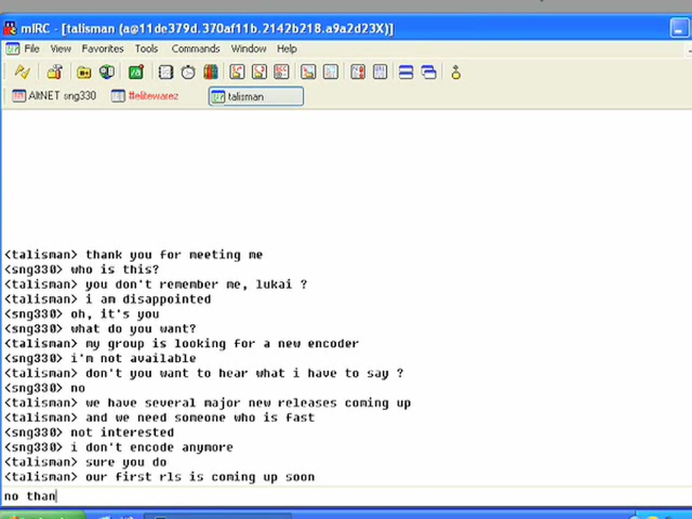
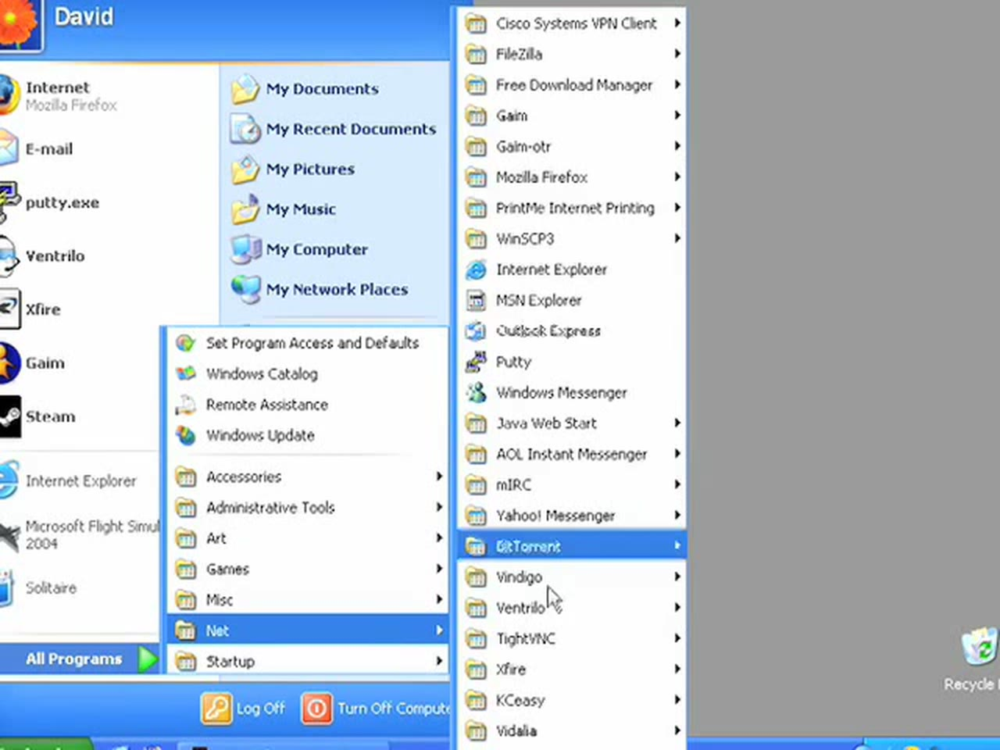
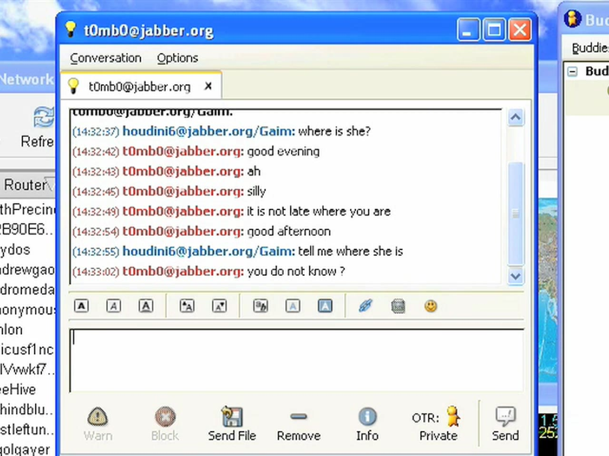
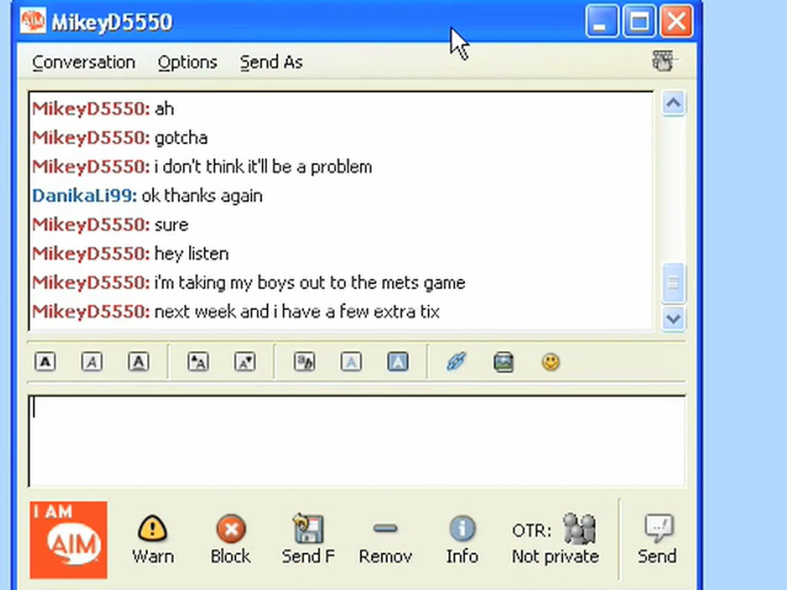
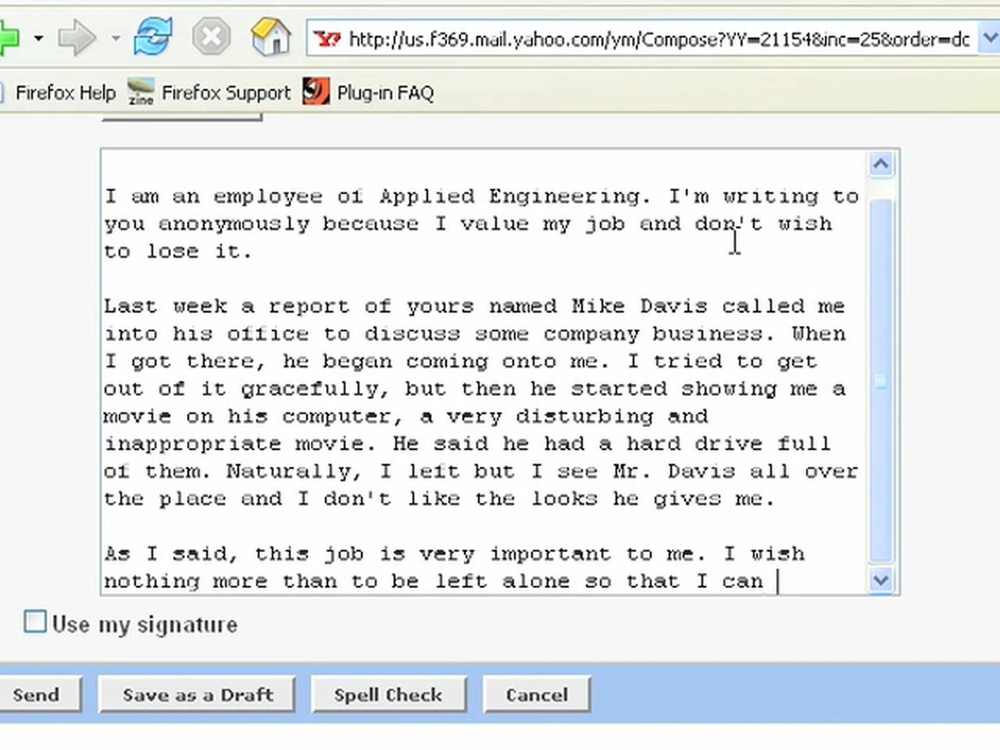
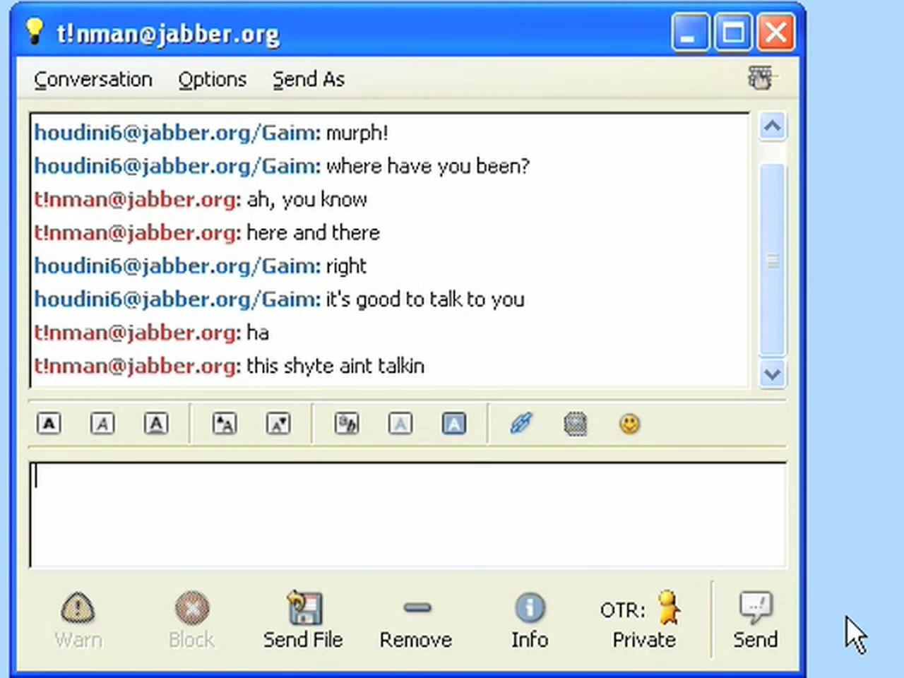
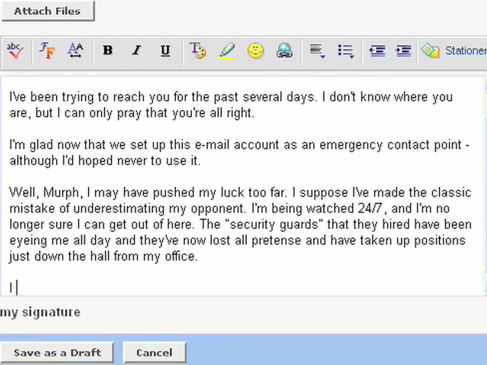
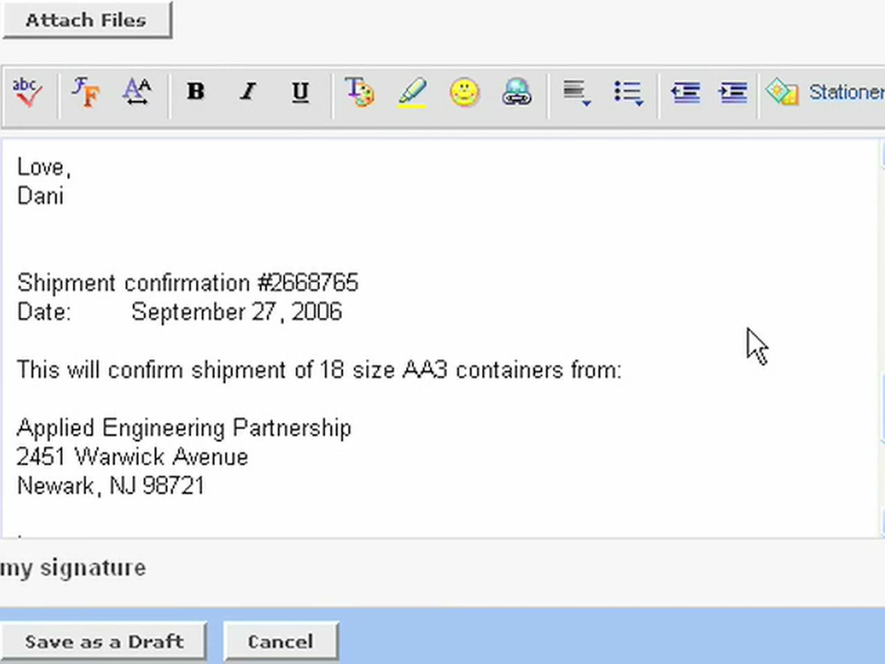
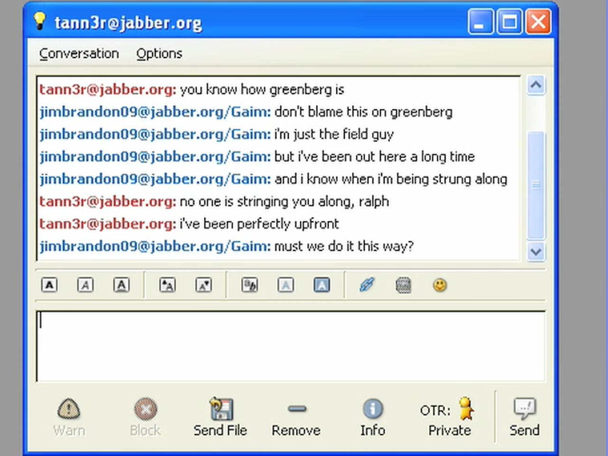
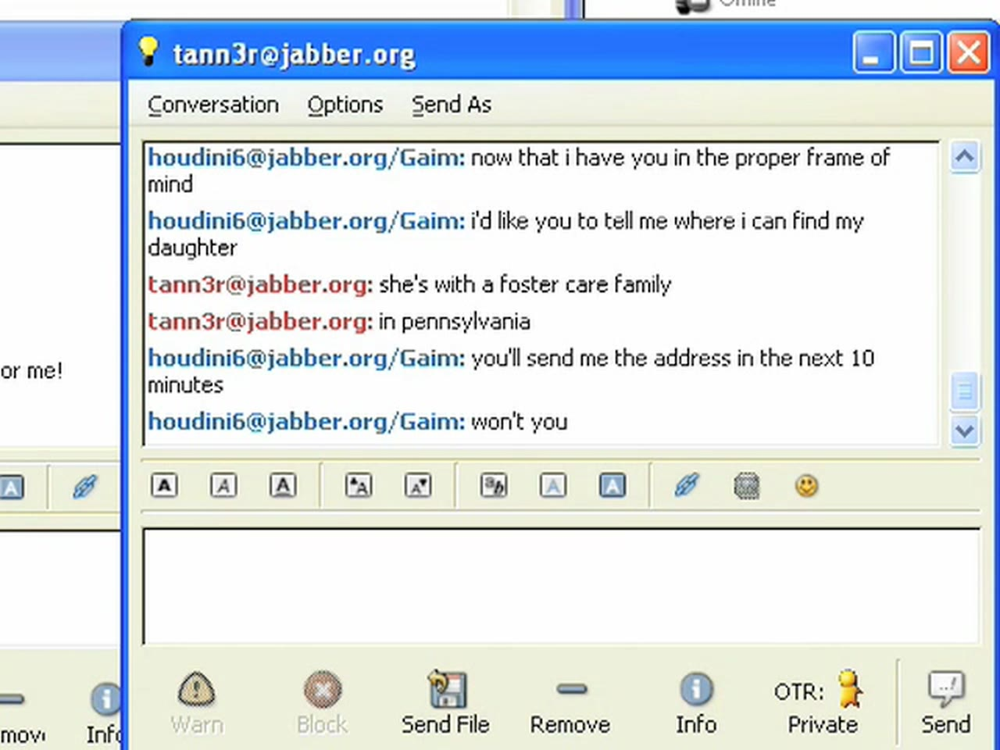

# The Scene 2.0 (2006) — Season 2 Episode Synopses

Reconstructed from the episodes themselves: on-screen text — Jabber, AIM and mIRC
windows, emails, browser tabs and terminal output — read frame by frame, merged with
the spoken narration from locally generated transcripts. No published episode
synopses exist for this season either. Links to the series and its records are at the
end.

**Coverage:** complete — all 20 episodes, including the cold-open narration that opens
each one.

This is written for someone who has watched the series, or doesn't mind knowing: the
episode entries point forward to what things turn out to mean, and the sections after
episode 20 take the whole season as read.

## The season at a glance

| # | Title | POV | What happens |
| --- | --- | --- | --- |
| 1 | the recruitment | lukai | An old contact recruits an ex-encoder on IRC, is refused, and turns the request into a threat. The conversation moves to Jabber, where it stops being about the scene. |
| 2 | Katerina | lukai | The leverage: a daughter in an orphanage, a mother recently dead, and a courteous man who knows exactly where both of them stand. Terms are agreed at $75,000. |
| 3 | the job | lukai | A temporary accounting position at Applied Engineering Partnership in Newark; a Swiss account opened by email. |
| 4 | some to china, some to iran | lukai | The goods are named, and they are weapons parts. An eBay account is prepared to launder the payments. |
| 5 | the other window | Danika | A second handler appears and calls her by a different name. She is running an operation, not being blackmailed into one — and being blackmailed into one at the same time. |
| 6 | Danika | Danika | The cover working: a colleague in shipping, a favour, and an invitation to a ball game. The photograph on her monitor is real. |
| 7 | partner | Danika | Her handler calls her *agent*. She sniffs the colleague's passwords while he thanks her for a lovely evening. |
| 8 | filling up Mike Davis' computer | Danika | She has the inventory database. She is also filling a colleague's hard drive with pornography over IRC. |
| 9 | the carrot and the stick | Danika | She refuses to destroy him and is overruled by a name above her handler. A fabricated harassment complaint is already written. |
| 10 | Murph | Danika | An old friend of her father's, the only person in the season who talks like one. Her mother has died. Mike, suspended, writes to say none of it is true. |
| 11 | three minutes | Danika | The money moves. The shortest episode in either season, and the cruellest line in this one. |
| 12 | tombo works for ICE | Danika | The deal collapses over a three-day customs delay, and Murph delivers the fact the season has been built to conceal. |
| 13 | the bust that didn't happen | Danika | Two windows, two incompatible accounts of the same operation, relayed line by line. One of them is checkable. |
| 14 | jim brandon | Danika | A new man in the dead man's job, pinging her at exactly the wrong moment. She stops being necessary and starts being a liability. |
| 15 | the bluff | Danika | Sealed in, watched, and out of leverage, she invents some. |
| 16 | wonderful news | Danika | She writes her own last letter to one window while the other tells her that her daughter has been found and a car is coming. |
| 17 | the offer expires in 15 seconds | Ralph Lasky | Inside the agency for the first time: a field officer holds his own supervisor to ransom for a briefing, and names a retired man neither of them was supposed to know about. |
| 18 | bellbird | Ralph Lasky | The history. A recruitment in 1970s Beijing, six agents, four still alive, and a programme measured in generations. |
| 19 | what your government bought | Danika | Out, in a motel, and told what her father was — and what the weapons she shipped were actually for. |
| 20 | the frame, returned | Danika | The method she was ordered to use on an innocent man, used on the man who ordered it, with that man's help. |
## Episode 1 — the recruitment *(POV: lukai)*

> *I'd been out of the scene for over a year and I wasn't looking to return. I
> guess I should have known that the scene would come looking for me.*

The season opens on a channel doing what warez channels do — an XDCC bot spamming
its slot count into `#elitewarez` — and then a private message that has nothing to
do with any of it.

> **&lt;talisman&gt;** thank you for meeting me
>
> **&lt;sng330&gt;** who is this?
>
> **&lt;talisman&gt;** you don't remember me, lukai ?
>
> **&lt;talisman&gt;** i am disappointed
>
> **&lt;sng330&gt;** oh, it's you

talisman says his group needs an encoder, that they have releases coming, that they
need someone fast. It is an ordinary scene recruitment, and `sng330` turns it down
eight times — *i'm not available*, *not interested*, *i don't encode anymore*, *no
thanks*, *i have no time for this*, *i can't do this right now*, *tell your group to
find somebody else*, *i have to go to work*. Then the register changes:

> **&lt;talisman&gt;** you really don't want to disappoint my group
>
> **&lt;talisman&gt;** let's discuss in a secure channel
>
> **&lt;talisman&gt;** i will idle here while you set it up

sng330 types *it's done* and gives a Jabber address. Everything after this in the
season happens there.

Between the two conversations the narration stops being about her and explains the
machinery, in the season's only piece of exposition:

> *There are lots of ways to have a private conversation in this world. In fact, if
> you know where to look, you can access some of the most advanced cryptography on the
> planet. For free. Tor is a global network of double-blind servers. It's basically an
> onion rooter. Criminal cartels share it with the intelligence agencies who invented
> it. All the traffic is ground up and re-assembled, so that nobody can trace it. And
> nobody has to trust anyone else.*

Her Start menu, open on screen a few seconds later, is the same claim in software:
Gaim and Gaim-otr, mIRC, Putty, WinSCP3, FileZilla, TightVNC, a Cisco VPN client — and
Vidalia, which is the Tor controller the narration has just described.

In the encrypted window the other man is `t0mb0`, and he is not recruiting an
encoder at all.

> **t0mb0:** our mutual friend wishes to engage your [services]
>
> **t0mb0:** he has buyers
>
> **t0mb0:** and we need to put a deal together quickly
>
> **houdini6:** i left the scene a long time ago
>
> **t0mb0:** come now
>
> **t0mb0:** once you're in you cannot leave
>
> **houdini6:** i can and i did
>
> **t0mb0:** your naivete is refreshing
>
> **t0mb0:** it must be wonderful to be young
>
> **t0mb0:** but none of us can stay a child forever
>
> **t0mb0:** your involvement is required

houdini6 says he is logging out. t0mb0 asks him to wait, and posts a link —
`http://walkin.thruhere.net/lukai.jpg` — with *have a look*, *and then we can talk
some more*. The episode ends on the link. What the picture shows is never stated;
the next episode is about what it means.

## Episode 2 — Katerina *(POV: lukai)*

> *When I first got into this scene, I was convinced I could game the system.
> I thought I was smart enough to remain anonymous and still make a profit.
> But nothing in life comes without a price.*

One conversation, and it is the one the season is built on. t0mb0 opens with an
unhurried courtesy that never lets up — *good evening*, *it is not late where you
are*, *good afternoon* — while houdini6 asks the same question three different ways.

> **houdini6:** where is she?
>
> **houdini6:** tell me where she is
>
> **t0mb0:** you do not know ?
>
> **t0mb0:** that's right
>
> **t0mb0:** it must be hard to get information
>
> **t0mb0:** since your mother passed on
>
> **t0mb0:** (my condolences, btw)

Then, line by line, t0mb0 lays out everything he knows, in the gentlest possible
phrasing:

> **t0mb0:** i [imagine] this is the worst thing for you
>
> **t0mb0:** to be separated from your baby for so long
>
> **t0mb0:** missing the critical development period
>
> **t0mb0:** and now
>
> **t0mb0:** not knowing who is raising her
>
> **t0mb0:** this is not a good situation you have made for [yourself]

houdini6 answers with the only thing she has: *i did it for katerina*, *and i did it
for my mother*, *you know i had to leave the country*. t0mb0 agrees with him — that
is the cruelty of it. He recites the plan back as though admiring it: enter the
scene, earn money, bring Katerina and her mother to the US, *with your family
contacts, etc.*, *it is a good plan*, *things are no different now*.

> **houdini6:** just tell me where she is
>
> **houdini6:** and i promise i will help you
>
> **t0mb0:** an orphanage
>
> **t0mb0:** one of the better ones, actually
>
> **t0mb0:** our mutual friend has seen to it that she is [well cared for]
>
> **t0mb0:** you see, lukai
>
> **t0mb0:** there is no need for useless confrontation
>
> **t0mb0:** we can work together

Terms: houdini6 will get the client anything he needs, and wants Katerina in the
country in return. $75,000 US up front, to an account he will open; t0mb0 asks for
bank details when she has them. The last exchange of the episode is the contract in
plain words:

> **houdini6:** i need some assurance from you
>
> **houdini6:** about katerina
>
> **t0mb0:** i can assure you
>
> **t0mb0:** if you don't come through for us
>
> **t0mb0:** you will never see katerina

## Episode 3 — the job *(POV: lukai)*

> *I've seen a face of the internet that most people will never know. Still,
> like any web surfer, I come online every day hoping to find the one thing I
> am looking for.*

t0mb0 wants a status report and gets one: houdini6 has taken a temporary position at
**Applied Engineering Partnership**, a subcontractor. The location disappoints her
handler.

> **t0mb0:** location ?
>
> **houdini6:** newark
>
> **t0mb0:** this is far from new york
>
> **t0mb0:** not acceptable
>
> **t0mb0:** perhaps you should move closer
>
> **houdini6:** 1:15 mins
>
> **houdini6:** unnecessary

The position is in accounting, which t0mb0 calls *excellent* and then *this is
perfect* — the first sign that the target is the company's own paperwork rather than
anything in the scene. She begins *in a week and a half*.

Behind the chat, a browser window carries the other half. The mail is addressed to
`jlaurent@bbvabankltd.ch` under the subject *Personal Account*, opens *Dear Mr.
Laurent:*, and confirms the opening of an account in the name of
**Michael Cunningham**, with *an initial deposit of $75k
(US) via wire transfer*, forms to be faxed and a routing number requested. The account
will be in **Bern**.

## Episode 4 — some to china, some to iran *(POV: lukai)*

> *People say the world is changing, but the reality is that a few simple
> principles still drive everything. With the scene, it's all about supply
> and demand.*

The goods are named, and the season stops being about software.

> **t0mb0:** our friend has provided me with details of the job
>
> **t0mb0:** i will send along the technical specifications
>
> **t0mb0:** what else do you need to know
>
> **houdini6:** difficulty level
>
> **t0mb0:** it is nothing out of the ordinary
>
> **t0mb0:** there are all items with which you are familiar
>
> **houdini6:** where are they going?
>
> **t0mb0:** some to china
>
> **t0mb0:** some to iran
>
> **houdini6:** nothing to iraq or afghanistan?
>
> **t0mb0:** no
>
> **houdini6:** good, that's harder

Alongside it, the laundering, and it is being assembled on camera. The browser is on
`antiquefurniture.net`, on a listing titled *Important Pair French giltwood Armchairs
at Patrick Sandberg Antiques in London*, and she is saving the photograph — `705.jpg`
— to the desktop. Then an eBay registration flow fills the screen, and houdini6
explains that *an american named michael cunningham* will be selling *several
expensive antiques* — the same name as the banker in episode 3, and the
episode never says whether that is one man, one alias, or carelessness.

The specifications move by FTP, and the client is open beside the chat: connected to
**82.165.238.165** on port 21, retrieving a directory listing for
**`/home/a/yatb-rev159/`**. t0mb0 asks whether the server is secure; houdini6 answers
*of course it is, it's clean*. The file lands, receipt is confirmed, and t0mb0 says
*everything is in order*.

The local pane of that same window reads `C:\Documents and Settings\David\Desktop`.

## Episode 5 — the other window *(POV: Danika)*

> *US-built fighter jets, missiles and helicopters can be found in every
> corner of the globe. But when a regime falls out of favor with America, it
> becomes illegal to sell them parts. This has given birth to a global black
> market, where billions of dollars of high-tech weapons parts change hands.
> Those of us who make a living on that market have a name for it. We call it
> The Scene.*

This is the episode where the season turns over, and it does it by opening a second
chat window. A new contact greets houdini6 by a name nobody has used yet:

> **tann3r:** danika?
>
> **houdini6:** hello stan
>
> **tann3r:** how's it going?
>
> **houdini6:** operation is on schedule
>
> **tann3r:** pls confirm that you have made contact with michael
>
> **houdini6:** confirmed
>
> **tann3r:** good
>
> **tann3r:** he's your ticket into inventory and shipping
>
> **tann3r:** divorced
>
> **tann3r:** two kids
>
> **tann3r:** and hasn't had a date in years
>
> **tann3r:** judging by his movie rentals, etc.
>
> **tann3r:** he's a pretty lonely camper

So she is running an operation, and someone has been reading a man's rental
history to plan it. The personal cost surfaces in the same window:

> **tann3r:** you holding up okay?
>
> **houdini6:** as well as can be expected
>
> **tann3r:** don't worry
>
> **tann3r:** this will all work out
>
> **houdini6:** i've no doubt that it will work out for you
>
> **houdini6:** but i want my daughter back
>
> **tann3r:** i know it
>
> **tann3r:** we're checking all of the orphanages in that part of [the country]
>
> **tann3r:** we'll find her
>
> **houdini6:** that assumes she actually is in an orphanage

While that runs, t0mb0 is in the other window — *lukai?*, *why haven't i heard from
you?*, *what is the status?* — and houdini6 answers both men at once, telling t0mb0
*nothing to report* and *i am still setting up here* while tann3r asks whether t0mb0
is lying. *i have no way to verify one way or another.* Then: *just keep him close*,
*and we'll have this operation wrapped up in no time*, *do you think tombo suspects
anything?*

To t0mb0 he describes the accounting fraud in detail — his position gives him access
to most of the company's systems, so altering income statements, payables and
receivables *will not be a problem*; she will make it appear that existing customers
are increasing the size of their orders, and pay with the Swiss money. That is *the
easy part*. The hard part is inventory and shipping:

> **houdini6:** i haven't been able to access those systems
>
> **houdini6:** tried to hack the db yesterday
>
> **houdini6:** but iw as unsuccessful
>
> **houdini6:** the security measures are good and i am [not]
>
> **t0mb0:** try again tonight
>
> **houdini6:** no, the network admin is already suspicious
>
> **houdini6:** i need to find someone in inventory who [has access to the database]
>
> **houdini6:** once i am into the database, i can ship goods [wherever i want and
> then alter the records]

t0mb0 calls it a logical plan and asks how he will get that person. The reply is the
last line of the episode, and the first time houdini6 uses her handler's name:
*don't worry, tomasz.*

## Episode 6 — Danika *(POV: Danika)*

> *When you operate in the scene, you can't afford mistakes, you can't afford
> wasted time, and most of all, you can't afford to feel badly about the
> people you hurt along the way.*

An entire episode of the legend working, on a screen with no Jabber in it at first —
just AIM, and a colleague. `DanikaLi99` is the accountant Applied Engineering thinks
it hired; Danika is also, as episode 5 established, what her own side calls her.

> **MikeyD5550:** Danika
>
> **DanikaLi99:** hi Mike
>
> **MikeyD5550:** sorry for the [noise]
>
> **MikeyD5550:** i'm over at the warehouse today
>
> **MikeyD5550:** it's loud as hell and tough to hear
>
> **DanikaLi99:** i prefer IM anyway
>
> **DanikaLi99:** you're just saying that because we sign your paychecks
>
> **MikeyD5550:** you got me there

She wants a document. He offers to ask his boss — *ned snyder* — rather than have her
email him, and asks, reasonably, what she needs it for. The answer is prepared: *i
noticed some minor flaws in the last earnings report and i'm trying to track them
down*. He says it won't be a problem.

Then he changes the subject, and the episode becomes something else:

> **MikeyD5550:** hey listen
>
> **MikeyD5550:** i'm taking my boys out to the mets game
>
> **MikeyD5550:** next week and i have a few extra [tickets]
>
> **MikeyD5550:** thought you and your little girl might like to come along
>
> **DanikaLi99:** she's actually not here
>
> **DanikaLi99:** not in the states i mean
>
> **DanikaLi99:** she's still in estonia
>
> **MikeyD5550:** ah i see
>
> **MikeyD5550:** when i saw her pic on your monitor i just assumed...
>
> **MikeyD5550:** why don't you come with us yourself?

She hesitates. He presses — *beer, hotdogs, fat guys from jersey*, *what's not to
like?* — and she gives in: *you drive a hard bargain*, *i spose it is*, *thank you it
sounds like fun*. He replies *you just made my day!*

The detail that lands the invitation is the one true thing on the screen. Her
daughter really is in Estonia, and the photograph on the monitor really is hers.

The episode closes back in Jabber, with the same man discussed as an asset:

> **t0mb0:** what is the status of the [inventory]
>
> **houdini6:** moving forward
>
> **t0mb0:** our friend grows impantient
>
> **t0mb0:** you have contacted the proper parties ?
>
> **houdini6:** the operations manager
>
> **houdini6:** he controls inventory
>
> **t0mb0:** he is vulnerable
>
> **houdini6:** very
>
> **houdini6:** he has no idea what is about to [happen to him]

## Episode 7 — partner *(POV: Danika)*

> *Trafficking illegal weapons parts requires the involvement of a number of
> people. Sometimes the participants are willing, and sometimes they're not.*

tann3r opens in a register he has not used before, and in doing so says out loud what
episode 5 only implied.

> **tann3r:** hey partner
>
> **tann3r:** just the usual annoying check-in from your other half
>
> **houdini6:** i don't have time for this
>
> **tann3r:** do i detect a note of impatience, agent [?]
>
> **houdini6:** i'm not used to having a babysitter
>
> **tann3r:** well this wasn't exactly my first choice of an [assignment]
>
> **tann3r:** but they assigned BOTH of us to this operation
>
> **tann3r:** so i'd appreciate an update if it's not too much trouble

The update is a break-in, described flatly while it happens:

> **houdini6:** i am currently breaking into mike davis' [machine]
>
> **tann3r:** he's not there?
>
> **houdini6:** no i went by his office. he's at the warehouse
>
> **tann3r:** how are you attacking the box?
>
> **houdini6:** packet sniffer
>
> **houdini6:** it's not hard
>
> **houdini6:** i'm collecting passwords off the network
>
> **houdini6:** once i find his i'll just use it to log in remotely

No inventory database yet: *mike's boss is out of town*. Then, unprompted, an
apology — *sorry i'm so touchy*, *it's the pressure* — and tann3r says *it's okay*
three times. houdini6 asks the only question she cares about: *is there an update from
estonia?* Twelve orphanages checked, about fifteen to go. *So sit tight.* — *why must
it take so [long]* — *keep your chin up, partner.*

And in the third window, at the same moment, the man whose passwords she is sniffing
is thanking her for a nice evening:

> **MikeyD5550:** thansk for coming out last night
>
> **MikeyD5550:** the boys had a blast
>
> **MikeyD5550:** especialy charlie
>
> **DanikaLi99:** he's a sweetie
>
> **MikeyD5550:** yeah but he's been acting out since his mother left
>
> **MikeyD5550:** anyway, i was thinking next time we could leave the kids with
> [someone]
>
> **MikeyD5550:** dinner and a movie perhaps?
>
> **DanikaLi99:** that sounds great

She asks him to firm up plans when he gets back from the warehouse, and he catches
it:

> **MikeyD5550:** how did you know i was at the warehouse??
>
> **DanikaLi99:** oh i just assumed
>
> **DanikaLi99:** seems like you're there all the time

She asks what time he is coming back. *Sure* — *that will give me plenty of time to
finish up what i'm doing.* What she is doing is standing in his office.
## Episode 8 — filling up Mike Davis' computer *(POV: Danika)*

> *Surfing the internet feels private, but that couldn't be further from the
> truth. Almost anything you do online is visible. And you never know who's
> watching.*

The episode opens on a joke that turns out not to be one.

> **tann3r:** how goes it?
>
> **houdini6:** i'm currently donwloading hardcore porno
>
> **tann3r:** haha, i'll be sure and put that on the report
>
> **houdini6:** you should
>
> **houdini6:** it's what i'm doing
>
> **tann3r:** you're serious?
>
> **houdini6:** yes, i am serious, stan

She is doing it on `irc.a0hell.net`, in a channel called `#ALTERED-PORN`, by DCC — a
screen of warez-scene furniture put to a use the scene never intended. The status
window names her own end of it: *Local host: user-0cev611.cable.mindspring.com
(24.239.152.53)*. An episode about framing a man for what is on his hard drive, run
over a residential cable connection with her name on the bill. And the drive
filling up is not his:

> **tann3r:** and you're downloading this to your hard drive at work?
>
> **houdini6:** downloading it, yes
>
> **houdini6:** but not to _my_ hard drive
>
> **tann3r:** wha? not following you?
>
> **houdini6:** i'm filling up Mike Davis' computer
>
> **tann3r:** i see said the blind man

There is also friction, and it is the first time tann3r pushes back:

> **tann3r:** i know i'm new to the unit and all
>
> **tann3r:** but i'm working my ass off
>
> **tann3r:** trying to find your little girl
>
> **tann3r:** think you could cut me just a little slack?
>
> **houdini6:** you're right
>
> **houdini6:** sorry again
>
> **houdini6:** i must learn to behave

In the other window, progress and impatience. houdini6 has acquired the inventory
database; t0mb0 is unmoved.

> **t0mb0:** not acceptable
>
> **t0mb0:** we are already 7 days behind schedule
>
> **houdini6:** the operations VP was out of town
>
> **houdini6:** i could not access the db until today
>
> **t0mb0:** that sounds suspiciously like an excuse
>
> **houdini6:** please tomaz
>
> **houdini6:** i'm doing everything i can

Asked what is holding her up, she explains the whole shape of it: she will alter the
inventory database and the shipping log to reflect the client's purchases, which
means overwriting the current files on the server, which means covering her tracks —
*if anyone ever questions our clients' shipments i must [be protected]* — and she has
broken into a computer that will let her do it. The method is named in the last line
of the episode: *by making sure that somebody else in the company gets the [blame]*.

## Episode 9 — the carrot and the stick *(POV: Danika)*

> *Immigration and Customs Enforcement, ICE, is the largest investigative
> agency in the Homeland Security Department. I've been a part of the agency
> for the past four years, but the agency has been a part of my life since the
> day I was born.*

The first line is a refusal.

> **houdini6:** i'm not going to do this
>
> **tann3r:** the mike davis thing?
>
> **houdini6:** that's right
>
> **tann3r:** it's not coming from me, danika
>
> **tann3r:** it's coming from higher up

The frame is already built — *i've partitioned his hard drive*, *and filled it with
the evidence*, *we can make him the scapegoat whenever [we need to]* — and houdini6's
objection is that it is now unnecessary:

> **houdini6:** nothing will go wrong
>
> **houdini6:** i overwrote the inventory db on the server
>
> **houdini6:** and no one suspects a thing
>
> **houdini6:** the weapons will be shipped to tombo's client
>
> **houdini6:** right on schedule

The name above tann3r is spoken here for the first time: **greenberg**, who *doesn't
want to take any chances* and *won't risk having your cover blown if something [goes
wrong]*. If it does, *we want people to automatically blame davis*, because *it's the
best way to keep suspicion off of you*.

Behind the chat is the other half of the frame, and it is worse than the pornography:
a letter, composed on screen in a Yahoo account opened for the purpose —
`infinitematter@yahoo.com` — from an anonymous employee of Applied Engineering.
*Last week a report of yours named Mike Davis called me into his office to discuss
some company business. When I got there, he began coming onto me... he started
showing me a movie on his computer, a very disturbing and inappropriate movie. He
said he had a hard drive full of them... I'm sure Mr. Davis will deny all of this.
But all you have to do is examine his hard drive and you'll see that I'm telling you
the truth.*

> **houdini6:** so you're willing to ruin an innocent man's career and reputation
> just as an added measure of prtoection?
>
> **tann3r:** this is an important operation
>
> **houdini6:** that's bullshit
>
> **houdini6:** you don't go to extremes like this over some [2nd rate operation]
>
> **tann3r:** you have your orders
>
> **houdini6:** i want to talk with greenberg

tann3r offers the softer version — *take my advice*, *do what greenberg wants*, *i
will PERSONALLY see that davis lands on his feet*, *we can set him up with a defense
industry gig*, *he'll have a new job within 8 weeks* — and gets the question nobody
in this operation has an answer to:

> **houdini6:** and what will you tell his children?
>
> **houdini6:** that their daddy didn't really download all [of that]
>
> **houdini6:** something about this smells, stan
>
> **houdini6:** there's another reason you want mike out of [the way]
>
> **houdini6:** what is it?
>
> **tann3r:** i've given you the carrot, danikia
>
> **tann3r:** don't make me use the stick

## Episode 10 — Murph *(POV: Danika)*

> *I grew up believing that the people who protected us were different, that
> they were superior in a way. But people are always just people, and
> sometimes you need protection from the protectors.*

A third name appears in her Jabber window, after t0mb0 and Stan, and he is the only
person in the season who talks like a human being. `t!nman` is English, hates typing, and has known Danika's family since
before Danika was born.

> **houdini6:** murph!
>
> **houdini6:** where have you been?
>
> **t!nman:** ah, you know
>
> **t!nman:** here and there
>
> **houdini6:** right
>
> **houdini6:** it's good to talk to you
>
> **t!nman:** ha
>
> **t!nman:** this shyte aint talkin
>
> **t!nman:** i aint no bloody typist
>
> **houdini6:** i know, but it's secure
>
> **t!nman:** if you say so
>
> **t!nman:** i'm never gonna get used to it
>
> **houdini6:** you're just like my dad

The family history arrives sideways, in condolences. Danika's mother has died — her
name was **Vicky**, she died in Estonia, and Murph knew her *since the old days back
in beijing*.

> **t!nman:** i'm so very sorry luv
>
> **t!nman:** i hadnt seen vicky since the old days back in beijing
>
> **t!nman:** but i'll miss her just the same
>
> **houdini6:** she hated estonia
>
> **houdini6:** she hated all the travel
>
> **houdini6:** it's so awful that that's where her life ended
>
> **t!nman:** she might have hated the travel
>
> **t!nman:** but she loved yer dad
>
> **t!nman:** and she went into his life with her eyes wide open
>
> **t!nman:** she got lots out of it i expect
>
> **houdini6:** she didn't know everything about dad
>
> **t!nman:** she knew enough
>
> **t!nman:** her family was diplomats

Murph has been watching from the trade side: *i've seen some of tomasz['s] people
getting pretty worked [up]*, *looks like they're expecting a big shipment*. And then
She asks him for the thing the agency has been promising for five episodes.

> **houdini6:** listen
>
> **houdini6:** murph
>
> **houdini6:** i need your help
>
> **t!nman:** already on it luv
>
> **t!nman:** we'll get yer little girl back

He says it has to be quick — *there's something going on*, *something with ICE that i
can't figure out* — and lays out the clock: the money moves, the shipment happens in
days, and *they're going to come down on tomasz right [away]*. Murph asks one
question, *the customer is who i think it is?*, and draws the conclusion the rest of
the season runs on:

> **t!nman:** then we have to find yer little girl before all this goes [down]
>
> **t!nman:** because once the arrest happens
>
> **t!nman:** we will have lost our chance to get her back

Threaded through all of it, ignored, is a second window. Mike Davis has been
suspended, and he is writing to the only person at the company who was ever kind to
him:

> **MikeyD5550:** i'm not supposed to talk to anybody at the company
>
> **MikeyD5550:** so don't worry
>
> **MikeyD5550:** you don't have to reply
>
> **MikeyD5550:** i just wanted you to know
>
> **MikeyD5550:** that none of the stuff people are saying about me is true
>
> **MikeyD5550:** i don't know how it happened
>
> **MikeyD5550:** but none of it is true
>
> **MikeyD5550:** NONE OF IT
>
> **MikeyD5550:** i just wanted to get that off my chest
>
> **MikeyD5550:** i wont bother you [again]

## Episode 11 — three minutes *(POV: Danika)*

> *The scene is like a body of water, black and silent and cold. I stare into
> it every day, hoping for a glimpse of what's lurking beneath the surface.*

The shortest episode in either season, and it does one thing. She types into a
window that does not answer:

> **houdini6:** murph, you there?
>
> **houdini6:** we're running out of time
>
> **houdini6:** the money just went through
>
> **houdini6:** i can only stall the weapons shipments for maybe a week

On screen behind her, the money: a bank's confirmation to
`michaelrcunningham5@gmail.com` that *per your request of last week, we have
completed a wire transfer*, and that *the name on the receiving account is Applied
Engineering Partnership*. The figure is on the screen too — **$74,507.89 (US) to
router number 8890754**, which is the $75,000 agreed in episode 2 with something
taken out of it on the way.

Then Mike, back from his week, apologising for having had feelings about being
destroyed:

> **MikeyD5550:** sorry about last week
>
> **MikeyD5550:** things were getting to me for a while there
>
> **DanikaLi99:** you sound much better now
>
> **MikeyD5550:** this whole situation's just been hard
>
> **DanikaLi99:** i'm sure
>
> **MikeyD5550:** i'm glad you believe [me]
>
> **MikeyD5550:** it really means a lot
>
> **DanikaLi99:** i think everyone here believes you
>
> **DanikaLi99:** i just wonder who could have done this to you?

## Episode 12 — tombo works for ICE *(POV: Danika)*

> *A bust in the scene is like someone getting shot in a big city. It's not
> uncommon, but if you're a guy on the street, you go about your business
> knowing that it's unlikely ever to happen to you.*

Two windows, and the season's floor gives way in the last two lines.

With Murph, waiting: *talk to me, murph*, *why haven't i heard from you???*, *it's
coming down to hours now*. Murph is expecting a call from a contact who *had
something to tell me re tomasz*. *We got to be patient. There's nothing else for it.*

With t0mb0, the deal finally breaks. The shipment is three days late at customs, and
Tomasz treats lateness as breach:

> **houdini6:** i kept up my end of the bargain tomasz
>
> **houdini6:** i want katerina back
>
> **t0mb0:** you have worked hard, lukai
>
> **t0mb0:** nobody disputes this
>
> **t0mb0:** we have kept your daughter safe
>
> **t0mb0:** and well cared for
>
> **houdini6:** where is she??
>
> **t0mb0:** even though you have breached the terms of [our agreement]
>
> **houdini6:** the weapons are only 3 days late!!!
>
> **houdini6:** you're just keeping her as a bargaining chip
>
> **houdini6:** you're never going to let her go
>
> **t0mb0:** you need to adjust your perspective lukai
>
> **t0mb0:** in return for your work
>
> **t0mb0:** we are keeping katerina out of harm's [way]

She threatens the only way she can — *otherwise i'll call up some of my father's
[friends]*, *and let them handle it* — and Tomasz answers with the sentence that
tells you what kind of man Danika's father was:

> **t0mb0:** if you turn me in to the chinese
>
> **t0mb0:** it will be the death of katerina for sure
>
> **t0mb0:** i promise this
>
> **houdini6:** your life and katerina's are tied together then

Then Murph comes back, and the episode ends on it.

> **t!nman:** hold off!
>
> **t!nman:** my guy just called me
>
> **houdini6:** what did he say???
>
> **t!nman:** he didn't find out where they got [her]
>
> **t!nman:** but he's confident that she'll be safe
>
> **houdini6:** how can he say that?
>
> **t!nman:** there aint gonna be no bust luv
>
> **t!nman:** [i] dont have all the answers
>
> **t!nman:** but the picture's gettin clearer
>
> **t!nman:** the americans want those weaps to go through
>
> **houdini6:** how do you know that?
>
> **t!nman:** because tombo is working for the same people you are
>
> **t!nman:** he's working for ICE

## Episode 13 — the bust that didn't happen *(POV: Danika)*

> *My father once said, working in the scene takes everything you've got. If
> you don't want to give it, the scene will take it anyway.*

Two windows, side by side, telling incompatible stories — and for once the viewer can
check one against the other in real time, because she relays each line as it
arrives.

tann3r reports a triumph:

> **tann3r:** the operation is all but done
>
> **tann3r:** now comes the paperwork
>
> **tann3r:** you know all the basics of the bust
>
> **tann3r:** it's all about interrogations now
>
> **houdini6:** has tombo been useful?
>
> **tann3r:** in fact
>
> **tann3r:** he's singing like a bird
>
> **tann3r:** we've taken down his whole networks
>
> **tann3r:** 9 arrests so far
>
> **tann3r:** and counting

Murph, being told the same thing second-hand, answers in four words: *utter and
complete horseshit.* And then explains why, which is the most purely
scene-literate argument in either season:

> **t!nman:** if he'd really taken down a player like tombo
>
> **t!nman:** don't you think i woulda known about it
>
> **t!nman:** the whole scene woulda shut down
>
> **t!nman:** it's all a crock
>
> **t!nman:** they guy you were chatting with was probably not [tombo]
>
> **t!nman:** just some govt spook

Meanwhile tann3r explains why Katerina still cannot come home, and the explanation is
elegant:

> **tann3r:** tombo has acknowledged that they have her
>
> **tann3r:** and that she's safe
>
> **tann3r:** the thing is
>
> **tann3r:** katerina is their only leverage
>
> **tann3r:** they know we want her back
>
> **tann3r:** and so they're using her as a bargaining chip

She takes the news the way anyone would, and then asks the only question that matters
to her:

> **houdini6:** I'm glad it's a success stan
>
> **houdini6:** but what about katerina?

She tells him the truth about what this is doing to her — *i honestly don't know
how much more of this i can [take]*, *he's feeding me all of this stuff about
[her]*, *and whether it's true or not it's very hard to [bear]* — and gets *don't
worry*, *everything humanly possible*, *i assure you*, *i promise to keep you
updated*. Murph, in the next window, says *ain't none of it true*, *she's safe and
sound and we'll get her back*, and then the instruction that defines the rest of the
season:

> **t!nman:** now play along, luv
>
> **t!nman:** just play along

The episode ends with Murph setting the new problem. A whole shipload of weapons
parts has just moved. *Blackhawk parts dont just disappear. Somebody got [them]. The
question is [who].*

## Episode 14 — jim brandon *(POV: Danika)*

> *When I first came to the States, I thought it would be a safe haven, a
> place where I could build a life apart from the one I had known. But
> wherever I go, my demons have a way of finding me.*

Danika comes back to work to find the company hardened against her: *one of the new
multilayer firewalls, a packet logger, and they rearranged their network*. An Nmap
run scrolls behind the conversation — `nmap -sS -sV -A -f -v -v 199.46.198.87`, a
fragmented scan of 1,680 ports started at 10:49 — and it finds too many fingerprints
to identify the host.

> **t!nman:** a bit o paranoia can be healthy
>
> **t!nman:** tell my you've been careful
>
> **houdini6:** i've been meticulous
>
> **houdini6:** maybe too much so
>
> **houdini6:** because i haven't found out anything

She wants a record they have not thought to alter — *i may at least be able to see
who's been [logging in and when]*, *at least it will give us some clues* — and
answers Murph's scepticism with something that sounds like her father talking: *in my
experience, if you follow the right path, the answers will reveal themselves.*

Then a new window opens, and it opens in exactly the wrong place.

> **jimbrandon09:** danika?
>
> **DanikaLi99:** yes
>
> **jimbrandon09:** it's jim brandon
>
> **jimbrandon09:** got your IM from Mike Davis' computer
>
> **jimbrandon09:** i hope you don't mind my pinging you
>
> **DanikaLi99:** no, not at all
>
> **jimbrandon09:** i'd have called
>
> **jimbrandon09:** but i'm here in the warehouse
>
> **jimbrandon09:** they've put me into mike's old job
>
> **jimbrandon09:** and i'm trying [to] figure everything out

He would like her to walk him through some items — *i'm trying to familiarize myself
with the systems*, *and how they link up to accounting, etc.* She says *glad to
help*. He says he will swing by.

She turns to the other window and says what the audience is thinking:

> **houdini6:** i just heard from jim brandon
>
> **houdini6:** the guy they put in place of mike davis
>
> **houdini6:** it can't be a coincidence
>
> **houdini6:** that he's pinging me just now
>
> **houdini6:** god, i feel like they're watching my every [move]
>
> **t!nman:** how would he know
>
> **houdini6:** maybe their fancy new IDS flagged my scans
>
> **houdini6:** or it's possible
>
> **houdini6:** they hid something extra in the db server
>
> **houdini6:** something in the kernel...

Murph's conclusion is the episode's last turn, and it moves her from operator to
target:

> **t!nman:** these guys have a way of being rid of people that [have outlived their
> use]
>
> **houdini6:** but i pose no threat to them?
>
> **t!nman:** untrue
>
> **t!nman:** let's assume they shipped those weaps to someone [who shouldn't have
> them]
>
> **t!nman:** (not a stretch)
>
> **t!nman:** they don't want you nor noboby else knowing about it
>
> **t!nman:** THAT's what's makin them nervous
>
> **t!nman:** THAT'S why they're upping the security
>
> **t!nman:** you were once necessary to them
>
> **t!nman:** but now you're a liability
>
> **t!nman:** and i want you out of there

She asks for a little more time to find where the weapons went. Murph tells her
what finding out would mean: *it's good cause that will prove that the US gov't is
[arming someone it shouldn't]*, *and you'll have ICE by the short and curlies.* And
the bad news is that *they'll know it* too.
## Episode 15 — the bluff *(POV: Danika)*

> *In the secret branches of law enforcement, there are those who represent a
> threat, and those who can help stave it off. Somewhere along the line, I
> crossed from the latter into the former.*

The company has closed around her. The VPN is *"down for maintenance"*, the whole
place is sealed off from outside, and she has had to come in physically to work at
all. Murph wants her gone.

> **t!nman:** forget the weaps shipment, luv
>
> **t!nman:** pack up yer shit
>
> **t!nman:** and get out of there NOW
>
> **houdini6:** not until i get that data
>
> **t!nman:** it ain't worth yer life
>
> **houdini6:** but it might be worth katerina's

She has a lead, and it is the new man:

> **houdini6:** jim brandon is the one who'se altered the records
>
> **houdini6:** whatever else he is, he's a lousy hacker
>
> **t!nman:** so how does that help you
>
> **houdini6:** i've been sniffing him
>
> **houdini6:** watching his keystrokes
>
> **houdini6:** his computer's broadcasting the works
>
> **houdini6:** and with any luck
>
> **houdini6:** he'll mention where the weapons went

The surveillance is now physical — *there's two new "security guards" here*, *and a
small asian man who's been on my train* — and Murph assumes her flat is bugged and
her workstation logged. It is, and she has already stepped around it: she has wedged
a second operating system into her machine and runs the company's *heavily monitored
windows install in a virtual machine*, so *they can eavesdrop all they want*.

Then Stan pings, and Murph coaches her through it in real time, before it happens:

> **t!nman:** stay cool now
>
> **t!nman:** he'll take one of two tacks
>
> **t!nman:** he'll either try and drag things out
>
> **t!nman:** (exend the relationship for some reason)
>
> **t!nman:** or he'll tell you to meet him someplace
>
> **t!nman:** if he drags it out it means they're off balance
>
> **t!nman:** and need time to assess the situation
>
> **houdini6:** and if he wants to meet me?
>
> **t!nman:** if he wants to meet you
>
> **t!nman:** set the meeting
>
> **t!nman:** and then get your sweet arse out of that building ASAP
>
> **t!nman:** be brave now, luv
>
> **t!nman:** put yer pokerface on
>
> **houdini6:** i don't have any cards murph

Stan drags it out, exactly as predicted. Greenberg is *quite pleased with the outcome
of the operation* and sends *his personal congratulations*; he would like her to stay
on at the company, indefinitely, on salary. She asks what she needs, and answers her
own question:

> **tann3r:** is there anything else you need?
>
> **houdini6:** i need my daughter back
>
> **tann3r:** i know
>
> **tann3r:** you can serve her best by staying within the fold
>
> **houdini6:** no need for veiled threats, stan
>
> **houdini6:** i get it

And then she finds a card after all. She tells him she is happy to stay, and mentions,
conversationally, that she was just telling a few friends how much she enjoys the
work — *i sent them all messages*, *specific messages*, *it's always good to have
friends around you for support*, *don't you agree?*

> **t!nman:** what'd you tell him
>
> **houdini6:** i made him think that i had the info already
>
> **houdini6:** and that i'd given it to several friends - just in [case]
>
> **t!nman:** bloody brilliant
>
> **t!nman:** you'll be safe for a while then

She has nothing. It is a pure bluff, and it buys her the rest of the season.

## Episode 16 — wonderful news *(POV: Danika)*

> *I met Murphy in Estonia, three days after my sixth birthday. That's nearly
> twenty years ago now, but I still see him standing with my father, telling
> me to go ahead and blow out the candles.*

Two things happen in this episode and they are in different windows, and the whole
season is in the gap between them.

In the first, an email. Not to anyone in the operation — to Murph, at an address the
two of them set up *as an emergency contact point*, *although I'd hoped never to use
it*. It is the longest single piece of writing in either season, and it is a woman
composing her own last letter while the people outside her office get into position.

> Well, Murph, I may have pushed my luck too far. I suppose I've made the classic
> mistake of underestimating my opponent. I'm being watched 24/7, and I'm no longer
> sure I can get out of here. The "security guards" that they hired have been eyeing
> me all day and they've now lost all pretense and have taken up positions just down
> the hall from my office.
>
> I have my escape plan all set, but now that it's come to it, I'm not at all
> confident [...]
>
> God I'm scared. What do I do, Murph? I just don't know what to do??
>
> But don't worry Murph, I'm not giving up. I'm going to stay cool and get the hell
> out of here right now. I'll write you again when I get to a safe place, OK? When
> you read this, let me know how to contact you.
>
> Oh, and by the way, there's one other thing: in case I don't make it, I contacted
> the shipping company and I told them there was a billing problem. Following is an
> email that contains the actual address where the weapons were shipped.
>
> Anyway, I hope you can do something with this information. You've been a great
> friend. A second father, really.

Attached below it, the thing she went into the building for. It is a shipment
confirmation, and it is the answer to the question the whole season is about, sitting
on screen in plain type four episodes before anyone says it out loud:

> Shipment confirmation #2668765
>
> This will confirm shipment of 18 size AA3 containers from:
> Applied Engineering Partnership, Newark, NJ 98721
>
> to
>
> No. 46, Zhanlanguan Lu, Jishou, Hunan, China
>
> SHIPMENT WAS RECEIVED OCTOBER 4, 2006 &mdash; SIGNED BY [H. XIOU] &mdash; 3:25pm

The confirmation is dated **September 27, 2006** and the sender is at **2451 Warwick
Avenue, Newark**. Above it, the letter ends the way nothing else in the season does —
*Love, Dani*.

Hunan is where, in episode 20, Murph says he has been spending time with Wei Chang.

In the other window, at the same moment, Stan is delighted.

> **tann3r:** danika
>
> **tann3r:** i have wonderful news!
>
> **tann3r:** tombo has finally given us katerina's location
>
> **tann3r:** it wasn't easy
>
> **tann3r:** but our field ops people have verified it
>
> **tann3r:** i'm flying into newark today
>
> **tann3r:** and you and i are going to pick her up!
>
> **houdini6:** stan that's so wonderful
>
> **houdini6:** thank you SO MUCH!
>
> **tann3r:** i told you we'd come through
>
> **houdini6:** i'm so happy!!
>
> **tann3r:** i'll be on the ground in two hours
>
> **tann3r:** we'll send a car to pick you up
>
> **tann3r:** then you and i can fly out tonight to get katerina
>
> **houdini6:** thank you for all you've done

The two are interleaved on the same screen, and the timings show her writing around
him. The men in the corridor go into the letter at 2:39; Stan's invitation arrives at
4:03; and at 5:36 she adds the line that ties them together — *Jesus. This is really
it. Stan's asked me to get together in person, just as you [said he would]*. Murph
predicted both tacks in the previous episode, and this is the second one. A car is
being sent for a woman who has already written that there are men outside her door.

## Episode 17 — the offer expires in 15 seconds *(POV: Ralph Lasky)*

> *My name is Ralph Lasky, but at work I'm known as Jim Brandon. I'm a field
> operative, what's commonly called a spook. After 15 years in the service,
> I've seen every facet of undercover law enforcement. But no matter how long
> you're in the game, there are some aspects of it you just don't get used to.*

The first of two episodes shot from inside the agency rather than against it, and the
first in the season where Danika does not appear at all. The man who took Mike Davis's
job has stopped pretending to be an operations manager.

> **jimbrandon09:** am I going to get a straight answer or [not]
>
> **tann3r:** i've told you everything i can
>
> **tann3r:** you know how greenberg is
>
> **jimbrandon09:** don't blame this on greenberg
>
> **jimbrandon09:** i'm just the field guy
>
> **jimbrandon09:** but i've been out here a long time
>
> **jimbrandon09:** and i know when i'm being strung along
>
> **tann3r:** no one is stringing you along, ralph

The leverage is simple and he applies it without embarrassment:

> **jimbrandon09:** you're the supervisor
>
> **jimbrandon09:** and now you have a decision to make
>
> **jimbrandon09:** you can tell me what i want to know
>
> **jimbrandon09:** or you can lose your man at applied [engineering]
>
> **tann3r:** you're not serious
>
> **jimbrandon09:** you better believe i am
>
> **jimbrandon09:** i'll fold up my laptop and walk out of here right now!
>
> **jimbrandon09:** how do you think greenberg will like [that]

His assessment of the operation is the audience's, delivered to the man responsible:
*you've screwed this job up nine ways*, *danika's gone*, *you were sloppy on the
weapons [shipments]*, *and the records leaked out*. And then the piece Stan did not
have:

> **jimbrandon09:** and now you've got another old fart from my day asking all the
> wrong questions
>
> **tann3r:** what are you talking about?
>
> **jimbrandon09:** his company handle was spartan
>
> **jimbrandon09:** but most of us knew him as "murph"
>
> **tann3r:** and the relevance of this is....
>
> **jimbrandon09:** murph was pretty tight with danika's old man
>
> **jimbrandon09:** she's covered her tracks here very well
>
> **jimbrandon09:** but from the little we saw, she's been hooked up with murph for
> a while now
>
> **tann3r:** why wasn't that in your reports???
>
> **jimbrandon09:** didn't put it together until recently
>
> **jimbrandon09:** but you're her supervisor
>
> **jimbrandon09:** you should have know about murph
>
> **jimbrandon09:** i'm starting to believe that danika's father had something to do
> with her being assigned to the case

So Murph is not a scene contact who happens to know the family. He is agency, retired
or otherwise, and Danika's father is somewhere in the reason she was given this
operation at all.

The episode ends on a countdown. Stan needs to think about it; Ralph gives him
fifteen seconds, then ten, then five, through *you're going to fuck up your pension*
and *everything about the case was in your brief!* Stan folds — *all right*, *the old
man's going to castrate me* — and Ralph, who has just held a knife to his supervisor's
career, is gracious about it: *he doesn't have to know, stan*, *i'm not trying to fuck
up your career*, *i just want to do my job.*

## Episode 18 — bellbird *(POV: Ralph Lasky)*

> *Governments keep secrets for a variety of reasons. Some of those reasons
> are better than others.*

Ralph has tracked Murph down and opened an encrypted conversation with him. Neither
man has anything to gain from the other except information, which makes this the most
straightforward exchange in the season.

> **t!nman:** first it'd be good to know who i'm speakin with
>
> **jimbrandon09:** it's ralph lasky
>
> **jimbrandon09:** we worked together for a while in [beijing]
>
> **t!nman:** i remember you
>
> **t!nman:** cryptographer
>
> **t!nman:** ex navy as i recall, right?
>
> **jimbrandon09:** correct
>
> **t!nman:** you had the hots for that little redhead
>
> **jimbrandon09:** in fact, i still do
>
> **jimbrandon09:** she's my wife
>
> **t!nman:** hahaha!
>
> **t!nman:** well good for ya then

Then he explains why he is doing this, and it is the closest the series comes to a
statement of principle:

> **jimbrandon09:** we both know that if you stay in this business long enough you
> see a lot of shit
>
> **jimbrandon09:** most of it you can't do anything about
>
> **jimbrandon09:** but every once in a while
>
> **jimbrandon09:** you see something you can
>
> **jimbrandon09:** and that's what i'm seeing now

And then the history. Danika's father was **Zhen**, American operational name
**bellbird**.

> **jimbrandon09:** i assume the word "bellbird" is familiar?
>
> **t!nman:** yes, zhen
>
> **t!nman:** danika's daddy
>
> **t!nman:** bellbird was his american op name

Approached in the 1970s, just promoted to the diplomatic corps; the company liked him
because they thought he had *the potential to rise up through the ranks in the chinese
govt*. Hesitant at first, and then persuaded once he understood the scope of it. About
a dozen were approached, *all of them young and from good [families]*, *but each of
them had a reason to work for the [Americans]* — in Zhen's case an uncle the Party
killed. Six were successfully recruited. Four are still alive.

> **jimbrandon09:** it was a longterm program
>
> **jimbrandon09:** which is itself a radical departure for [the agency]
>
> **jimbrandon09:** they finally learned to think like their enemy
>
> **jimbrandon09:** the chinese govt don't think in terms [of years]
>
> **jimbrandon09:** they think in terms of generations

And the conclusion, offered as suspicion rather than fact:

> **jimbrandon09:** i'm telling you that zheng's operation [never ended]
>
> **jimbrandon09:** it's still going on
>
> **jimbrandon09:** and i can't verify this
>
> **jimbrandon09:** but if you could track illicit weapons shipments out of the us
> over the past fifteen years
>
> **jimbrandon09:** i think you'd find that the four surviving members of zheng's
> [cohort] were getting more than their [share]

## Episode 19 — what your government bought *(POV: Danika)*

> *I'd left Applied Engineering nearly a month ago, and I'd not heard a word
> from anyone since. In one way it was a relief, but at the same time, I
> thought the silence would drive me mad.*

She is out. A motel, after a getaway she ran to Murph's instructions — *i switched
subways several times*, *and followed a fairly labyrinthine path*, *no one was with
me* — and Murph, who has been missing for three episodes, finally answers.

> **t!nman:** good girl
>
> **t!nman:** well done
>
> **houdini6:** murph, i've been sick with worry

He went to ground because someone with *juice* was asking after him and he could not
be sure the chats weren't being read. The someone turns out to be Ralph:

> **t!nman:** it turns out the guy lookin for me was someone of [interest]
>
> **t!nman:** jim brandon
>
> **t!nman:** chill
>
> **t!nman:** turns out he and me go back a ways
>
> **t!nman:** i knew him under another name of course
>
> **t!nman:** the thing is,
>
> **t!nman:** he doesn't much like yer boss
>
> **t!nman:** nor what stan's been doing to [you]

Then Murph tells her about her father, and the season's actual subject finally comes
into view.

> **t!nman:** yer dad and a bunch of others spent years working for [the americans]
>
> **t!nman:** they were basically double agents
>
> **t!nman:** you prolly knew as much
>
> **t!nman:** they provided info
>
> **t!nman:** and in return they had fantastic careers in the chinese [government]
>
> **houdini6:** how did the US help their careers?
>
> **t!nman:** oh usually they'll give info at the right ties
>
> **t!nman:** not to mention money and access
>
> **t!nman:** over time
>
> **t!nman:** these double agents probably became valuable assets
>
> **t!nman:** yer dad was in diplomatic circles
>
> **t!nman:** but the four guys left are in the chinese military
>
> **t!nman:** and someoen got the gright idea that it would be good [to strengthen
> their collective hands]
>
> **houdini6:** the weapons?
>
> **t!nman:** weapons, cash, connections
>
> **t!nman:** the whole works

Which makes the shipment she was blackmailed into arranging not a theft at all.

> **t!nman:** i can't say for sure
>
> **t!nman:** but it seems to me
>
> **t!nman:** that yer government has spent a lot of years and a [lot of money]
>
> **t!nman:** basically planning [this]

## Episode 20 — the frame, returned *(POV: Danika)*

> *We'd planned everything out to the last detail and Murph assured me that we
> were doing the right thing. But now that the time had come, I was anything
> but confident.*

The longest episode in the season, and it is a single operation run across three
windows with two people helping her.

She is not ready. *The timing has to be perfect*, *what if it isn't?*, *the money
won't be enough on its own*, *i don't know murph*. Murph gives her the only
instruction available: *just do yer job and it will turn out fine*, *now just be cool
and let's have this done*. *Here goes.*

> **houdini6:** hello stan
>
> **tann3r:** what a pleasant surprise
>
> **tann3r:** care to tell me where the hell you've been?
>
> **houdini6:** actually no
>
> **houdini6:** i think i'd rather not
>
> **tann3r:** i guess we don't have much to talk about then
>
> **houdini6:** quite the contrary
>
> **houdini6:** we've got plenty to discuss

In the second window is **Mike Davis** — the man she framed, recruited, and now
depending on. He is inside Stan's machine, and he is not in yet.

> **MikeyD5550:** danika
>
> **MikeyD5550:** hold off a sec!
>
> **DanikaLi99:** i'm already chatting him!
>
> **MikeyD5550:** crap
>
> **MikeyD5550:** having a problem
>
> **MikeyD5550:** not in yet
>
> **DanikaLi99:** i thought you were in already????
>
> **MikeyD5550:** just stall him
>
> **MikeyD5550:** and i will get this done
>
> **DanikaLi99:** you've GOT TO, mike

So the third window is Murph, feeding her lines while she stalls a federal supervisor
in real time. *I'm choking.* *What do i say???* *Come on murph, he's waiting.* *I'm
fucking this all up!!!* Murph thinks — *hmmmmmm* — and then hands her two names.

The first is his own:

> **houdini6:** my old friend murph
>
> **houdini6:** i believe you folks knew him as "spartan"
>
> **tann3r:** i'm not aware of that name
>
> **houdini6:** sure you are, stan
>
> **houdini6:** he used to work with my father
>
> **tann3r:** that was before my time

The second name stops him dead:

> **houdini6:** murph had a little chat with greenberg last [night]
>
> **houdini6:** apparently they were discussing a man you [know]
>
> **houdini6:** a man named wei chang
>
> **houdini6:** still there?
>
> **houdini6:** well done murph
>
> **houdini6:** that got him

Murph adds that he has been spending time with Wei — *in hunan* — and Stan changes
register: *you're playing with fire, danika.*

Then Mike gets in.

> **MikeyD5550:** it worked!
>
> **MikeyD5550:** i have access to stan's box
>
> **MikeyD5550:** upping the content now
>
> **MikeyD5550:** haha
>
> **DanikaLi99:** lovely
>
> **DanikaLi99:** thanks a million mike!
>
> **MikeyD5550:** no sweat
>
> **MikeyD5550:** give him a big kick in the balls for me!

And she turns the operation's own weapon around, using the exact method she was
ordered to use on Mike in episode 9.

> **houdini6:** i don't think so, stan
>
> **houdini6:** what i'm playing with is you
>
> **tann3r:** escuse me?
>
> **houdini6:** come on now, stanny
>
> **houdini6:** don't tell me you've forgotten about all that steamy sex we had
>
> **tann3r:** have you lost your MIND?
>
> **houdini6:** or all that money we stashed away together?
>
> **tann3r:** WHAT are you talking about???
>
> **houdini6:** check your bank account
>
> **houdini6:** the wire transfers are all there
>
> **houdini6:** if your memory is that badm you can check your chat [logs]
>
> **houdini6:** you'll see all the records of the conversations
>
> **houdini6:** all the things you said you'd do to me after we'd diverted [the money]
>
> **houdini6:** all those nasty little pictures you sent me
>
> **houdini6:** some of the really bad ones were even illegal, weren't they stan
>
> **tann3r:** this won't work
>
> **houdini6:** sure it will
>
> **tann3r:** how did you get all this filth onto my computer?
>
> **tann3r:** i'm deleting it
>
> **houdini6:** good idea
>
> **houdini6:** that will make you look that much more guilty when the computer
> forensics guys check your hard drive
>
> **houdini6:** even better
>
> **houdini6:** toss out your computer
>
> **houdini6:** when they find the copies of the logs on the server you can tell them
> how your box mysteriously disappeared at just the right [moment]

Then she asks for the only thing she has ever asked for.

> **houdini6:** now that i have you in the proper frame of [mind]
>
> **houdini6:** i'd like you to tell me where i can find my [daughter]
>
> **tann3r:** she's with a foster care family
>
> **tann3r:** in pennsylvania

Pennsylvania. Not an orphanage in Estonia, which is where twenty episodes of searching
had been directed — but in the custody of the people doing the searching. Whether she
was ever in Estonia at all is a question the series leaves standing.

> **houdini6:** you'll send me the address in the next 10 minutes
>
> **houdini6:** won't you
>
> **houdini6:** and you'll take care of all the paperwork so that kat and i can go
> off and live in peace?
>
> **houdini6:** way to go, stan

The last card of the season carries no date and no next episode — only *END OF
[SEASON]*, and an address to visit for information on upcoming projects.
### The personal thread

Season 1 was about a group. This one is about one person, and everything that happens
to her happens through a child she cannot reach.

Katerina is in Estonia, or is said to be. The mother who was raising her has died —
her name was Vicky, she hated Estonia and hated the travel, and she came from a family
of diplomats. Danika left the country to earn the money to bring both of them to the
United States, which is the reason she entered the scene in the first place, and t0mb0
recites that plan back to her in episode 2 as though admiring it. Every subsequent
demand is enforced with the same sentence in different words: *if you don't come
through for us, you will never see katerina.*

Her own side makes the identical promise in a warmer voice. Stan is checking
orphanages — twelve by episode 7, about fifteen left. By episode 13 he has an
explanation for why she still cannot come home, and it is elegant: Katerina is *their
only leverage*, and *they know we want her back*. By episode 16 he has found her, and
a car is on its way.

In episode 20 the child is in Pennsylvania, in foster care, and has presumably been
there all along.

The second relationship in the season is the one nobody is running. Murph is old,
English, hates typing, calls her *luv* and *good girl*, knew her mother in Beijing and
her father before that, and is the only person who ever tells her something true
without being forced to. He is also the one who says *now play along, luv* — the
instruction that lets her survive the last seven episodes. Her email in episode 16
puts it plainly: *you've been a great friend. A second father, really.*

And there is Mike Davis, who is in the season for one reason: to be destroyed so that
suspicion stays off her. He invites her and her daughter to a ball game; he mentions
that his youngest has been acting out since his mother left; he apologises, after
being suspended for something he did not do, for having let it get to him. She asks
him, in episode 11, who could possibly have done this to him.

He is also the one who gets into Stan's computer in episode 20.

### The season's timeline

The fiction is dated much more precisely than season 1's was, because season 2 leaves
timestamps on screen rather than in window captions.

| Where | Date |
| --- | --- |
| A bank's wire-transfer confirmation, episode 11 | **Sep 3, 2006** |
| An Nmap run against the company network, episode 14 | **2006-09-28 10:49 Eastern** |
| The shipment confirmation attached to the episode 16 email | dated **September 27, 2006** |
| The same confirmation's delivery stamp | received **October 4, 2006**, 3:25pm, in Jishou, Hunan |

Set against the twenty-episode span, that puts the whole season inside a few months of
autumn 2006 — and places the weapons on a dock roughly four episodes before anyone on
screen works out where they went.

### The release schedule

There isn't one, and that is itself a difference worth recording. Every season 1
episode but the tenth ended on a card announcing when the next would appear, which is how that
season's near-real-time release pattern can be reconstructed. Season 2's end card
carries only a web address. Episode 20's reads *END OF [SEASON] — FOR INFO ON UPCOMING
PROJECTS, VISIT: WELCOMETOTHESCENE.com*, and nothing in any of the twenty episodes
gives a date. The Internet Archive item is dated 2006 and that is all there is.

### Open questions

Not among them: where the weapons went. Episode 16 puts the delivery address on screen
— Jishou, in Hunan province — and the series then spends four more episodes letting
its characters work out what the audience has already been shown.

**Whose computer is it.** The Start menu in episode 1 — on the machine the episode is
told from, the one running her mIRC and her Jabber — is logged in as **David**. It is
not a one-frame slip: the FTP client in episode 4 shows the local path as
`C:\Documents and Settings\David\Desktop`. No character called David exists in this
season — but one does in the last one. Season 1's encoder, pyr0, is called David thirteen
times in episode 14 of that season, out loud and only out loud — by his mother up the
stairs and by her boyfriend through a locked door. His name is never typed on screen.
So the machine Danika's
story is shot on is the machine pyr0's was, account and all, carried across two years and
a change of series. The sequel shares no characters with the original, and this is the
only thread that reaches back to it: a user profile nobody thought to rename.

**Michael Cunningham** is one alias, not two people, and the window furniture settles
it. The episode 3 mail is addressed to `jlaurent@bbvabankltd.ch` — the banker is
J. Laurent, at a Swiss bank — and Cunningham is the *name on the account being
opened*. In episode 4 the same name is the eBay seller moving *several expensive
antiques*; in episode 11 the bank writes back to `michaelrcunningham5@gmail.com`
opening *Dear Mr. Cunningham*. One invented American, used to hold the money, sell the
cover goods and take the confirmations. He never appears because there is nobody to
appear.

**Whether t0mb0 is a person at all.** Murph's argument in episode 13 is that the man
Danika spent twelve episodes negotiating with was *probably not [tombo]*, *just some
govt spook*. Episode 12 says he is working for ICE. Nothing later confirms which, and
he never speaks again after episode 12.

**Wei Chang.** The name that ends Stan's resistance in episode 20, said to be one of
the four surviving members of her father's cohort, now in the Chinese military, and to
have been talking to Murph in Hunan. He is never seen, and the conversation with
Greenberg that Danika describes may be a bluff of Murph's — she is reading his lines
off another window as she types them.

**Greenberg** is named in episodes 9, 15, 17, 18 and 20 and never appears. He is the
person who decided Mike Davis had to be ruined, the person pleased with the outcome,
and the person Ralph says *probably knows* what the operation was for.

### POV by episode

1–4 lukai · 5–16 Danika · 17–18 Ralph Lasky · 19–20 Danika.

The desktop is the POV, and it is readable from the window furniture: the title bar
names the remote party, and the local user's lines are the blue ones. Every episode
but two is Danika's machine.

**The window count says something different here.** In season 1 the number of open
windows tracked how much trouble a character was in, and everyone's count climbed.
Danika's barely moves. Counting conversations rather than windows, she runs two at a
time for almost the entire season — one of t0mb0, Stan or Murph, plus one other — and
only in episode 20 does she run three at once. Six have just one: 2, 3, 4, 9, 16 and 19.

What is fixed is not the number but the arrangement. From episode 5 onward there is
almost always a second live conversation running against the first, and the two men in
them are being told incompatible things by the same person in the same minute. Each
believes he is the one getting the truth. The series makes the viewer read both columns
at once, which is the only way to feel what holding that costs her.

Episode 13 is the purest version: Stan's account of a triumphant bust and Murph's
four-word verdict on it, side by side, with Danika relaying each line to the other man
as it arrives. Episode 20 is the escalation — three windows, two of them helping her
run the third.

### Character notes

- **Danika** — `sng330` on IRC, `houdini6@jabber.org` on Jabber, `DanikaLi99` on AIM,
  and **lukai** to everyone who knew her before. An ICE agent working undercover in an
  accounting job at Applied Engineering Partnership in Newark. She grew up abroad and
  came to the States as an adult — episode 14's narration opens *when I first came to
  the States* — and her family's life was in Estonia; her mother **Vicky** has just died there, her daughter **Katerina**
  ("Kat") is missing, and her father was a Chinese diplomat run by American
  intelligence. She is a considerably better technician than anyone around her — packet
  sniffers, a keylogged workstation, a second operating system wedged under the
  company's monitored Windows install — and the only person in the season who refuses
  an order.
- **t0mb0** (`t0mb0@jabber.org`) — **Tomasz**. Courteous, unhurried, and the most
  frightening presence in either season precisely because he never raises his voice.
  Holds Katerina over her for twelve episodes. Episode 12 says he works for ICE.
- **Stan** (`tann3r@jabber.org`) — her supervisor, new to the unit, addresses her as
  *danika* and *partner*, and is the case's actual antagonist. Runs the orphanage
  search that never finds anything, orders the destruction of Mike Davis on Greenberg's
  instruction, claims in episode 16 to have had her location verified, and in episode
  20 gives it up in two lines under pressure.
- **Murph** (`t!nman@jabber.org`) — company handle **spartan**. English, retired,
  knew Danika's mother in Beijing (*i hadnt seen vicky since the old days back in
  beijing*) and was, in Ralph's words, *pretty tight with danika's old man*. Feeds her
  lines through
  the final confrontation. The nearest thing the season has to a moral centre, and the
  only character whose information is never wrong.
- **Ralph Lasky** (`jimbrandon09@jabber.org`, cover name **Jim Brandon**) — ex-Navy
  cryptographer, fifteen years in, put into Mike Davis's job. Introduced as a threat
  and revealed as the one person inside the agency willing to break procedure because
  *every once in a while you see something you can [do something about]*. His wife is
  the redhead Murph remembers him chasing in Beijing.
- **Mike Davis** (`MikeyD5550`) — operations manager, divorced, two sons, one of whom
  is called Charlie. Framed for possession of pornography and an invented harassment
  complaint, suspended, and then recruited by the woman who did it. Gets the last laugh
  in episode 20 and asks her to pass it on.
- **Zhen** (op name **bellbird**) — Danika's father. The screen spells him both
  *zhen* and *zheng*, sometimes within a few lines of each other. Approached in 1970s Beijing after
  his promotion into the diplomatic corps, one of six successfully recruited from about
  a dozen candidates, motivated by an uncle the Party killed. Four of the six are still
  alive and are now in the Chinese military.
- **Greenberg** — above Stan. Never appears.
- **talisman**, **ned snyder**, **michael cunningham**, **wei chang** — named,
  consequential, never seen.

### The series itself

*The Scene 2.0* was produced by **Jun Group Entertainment** and released free on the
web in 2006, twenty episodes, in the same format as season 1 — almost entirely
on-screen text, with a first-person narration opening each episode. It is a different
story with a different cast; nothing from season 1 carries over but the method.

| Where | What's there |
| --- | --- |
| [Internet Archive — Welcome to the Scene Version 2.0](https://archive.org/details/welcometothescene_version2.0_xvid) | All 20 episodes as `episode2.0` through `episode2.19`, in Xvid AVI, H.264 MP4 and OGV |
| [Wikipedia](https://en.wikipedia.org/wiki/The_Scene_(miniseries)) | Production background for the series as a whole |
| [Internet Archive — The Scene Season 1](https://archive.org/details/the_scene_season_1) | The first season |

**A note on the licence.** Season 1 settles its own licensing on screen: a card at the
end of episode 1 reads *Copyright (c) 2004 Jun Group, Inc. This work may be
redistributed under the Creative Commons Attribution-NoDerivs license*, linking to
`by-nd/2.0`. **Season 2 prints no such card in any of its twenty episodes** — the only
thing on the final frames is a web address. So for this season the sole source is the
Internet Archive item's metadata, which claims Attribution-NonCommercial-NoDerivatives
3.0 — and that is the same metadata that demonstrably gets season 1 wrong, by adding a
NonCommercial term the series never claimed. Treat it as unverified.

### On the sources

Quoted exchanges follow the client they came from. This season runs on three:

- **Gaim, talking Jabber**, is most of it, and it prints a full address —
  `houdini6@jabber.org/Gaim: text`. Repeated down a quote block that is unreadable, so
  the local part alone is used here: **houdini6:**, **t0mb0:**, **t!nman:**,
  **tann3r:**, **jimbrandon09:**. The full addresses are in the recovered logs.
- **AIM** prints a screen name, and those are left exactly as they appear —
  **MikeyD5550:**, **DanikaLi99:**.
- **mIRC**, quoted from episode 1 only (it is on screen again in episode 8, in a channel nobody speaks in), uses `<nick>` — **&lt;sng330&gt;**, **&lt;talisman&gt;**
  — which is how it actually renders a line.

Square brackets inside a quotation mark text that runs off the edge of its window and
was never legible; the words inside them are inferred from context and are not on
screen.

Everything outside brackets is what the frame shows, **including the characters' own
typos** — *donwloading*, *impantient*, *especialy*, *iw as*, *you should have know*.
Those are preserved because they are on the screen. OCR's own errors are not: the rule
throughout is that a misspelling every capture of a line shares is the actor's and
stays, while one that varies between captures is Tesseract's and goes.

Each episode entry opens with that episode's **cold-open narration**, in italics.
Those are spoken, not on screen, and come from transcripts generated locally with
faster-whisper; they run for the first ten or twenty seconds of every episode and are
the only sustained speech in the season. Everything else in the episode entries is
read off the screen.

All twenty were re-transcribed with the vocal track separated from the score
(`--ff_vocal_extract mdx_kim2`, `large-v2`, pyannote VAD), and the twenty narrations came
back word for word as quoted here, give or take three words this pass corrected — *the*
scene rather than *this* scene in episode 4, *favor* in episode 5, and *the one I had
known* in episode 14. The
second pass roughly doubles the subtitle count, but the additions are all song: the
narration sits in the quiet at the head of each episode, before the music starts, which is
why the first pass caught it intact. Season 1 was not so lucky.

One trap in the audio: the episode files on the Internet Archive are numbered
`episode2.0` to `episode2.19`, so `episode2.16` is episode **17**, not 16. The
narration above each entry has been matched to the episode it actually opens, checked
against what happens in that episode — Ralph Lasky introduces himself over episode 17,
which is the first episode told from his desk.

On-screen text was recovered by sampling every episode at one frame every three
seconds and reading the windows directly. The handles are leetspeak — `t0mb0` with two
zeros, `t!nman` with an exclamation mark — which is exactly what OCR destroys, so all
of them were confirmed by reading the frames by eye rather than by majority vote
across readings.

**A note on what is easy to miss.** Not all of this season is chat. The single most
important document in it — the letter Danika writes to Murph in episode 16, while men
take up positions outside her office — is an email, and a sweep that looks only for
chat lines does not see it at all. Neither does it see the shipment confirmation
attached below it, the fabricated harassment complaint in episode 9, the wire transfer
in episode 11, or the Nmap output in episode 14.

### The infrastructure

Everything nameable that appears on a screen in twenty episodes. Most of it is never
spoken aloud; some of it answers questions the dialogue leaves open.

A dagger (†) marks a string taken from OCR and not yet checked against the frame
itself. Everything unmarked was read off the frame — one entry still carries the
dagger.

| What | Where |
| --- | --- |
| `#elitewarez` on AlNET, ~2,230 users, topic *-=EliteWareZ Group=- » Anything &amp; Everything, Always Elite* | ep. 1 |
| `http://walkin.thruhere.net/lukai.jpg` — the photograph | ep. 1 |
| `jlaurent@bbvabankltd.ch`, subject *Personal Account*, opening *Dear Mr. Laurent:* — the Swiss bank | ep. 3 |
| `82.165.238.165` port 21, user `a`, remote `/home/a/yatb-rev159/` — the specifications drop | ep. 4 |
| `C:\Documents and Settings\David\Desktop` — the local pane of that FTP client | ep. 4 |
| `antiquefurniture.net/largeimage.asp?ID=705`, and `signin.ebay.com` — the laundering cover | ep. 4 |
| † Marvell Gigabit Ethernet adapter, `192.168.1.155` — the interface she sniffs | ep. 7 |
| `irc.a0hell.net`, `#ALTERED-PORN`, and her own host `user-0cev611.cable.mindspring.com (24.239.152.53)` | ep. 8 |
| `infinitematter@yahoo.com` — the account the anonymous complaint is sent from | ep. 9 |
| `michaelrcunningham5@gmail.com`, subject *funds transfer*, Sep 3 2006 7:30 PM — *$74,507.89 (US) to router number 8890754*, into an account named **Applied Engineering Partnership LLP** | ep. 11 |
| `nmap -sS -sV -A -f -v -v 199.46.198.87` &mdash; Nmap 4.11, 1,680 ports, 10:49 EDT on 2006-09-28 | ep. 14 |
| `bludlines@yahoo.com` — the emergency account she and Murph set up | ep. 16 |
| Confirmation #2668765, 2451 Warwick Avenue, Newark NJ 98721 → No. 46, Zhanlanguan Lu, Jishou, Hunan, China; received October 4 2006, 3:25pm, SIGNED BY [H. XIOU] | ep. 16 |

The distinction matters because these are exactly the strings OCR destroys, and it
destroys them plausibly. It gave me `yatb-rov159` for `rev159`, `-sU` for `-sV`,
`jlauront` for `jlaurent` and `user-Gcev611` for `user-0cev611` — four readings that
look entirely reasonable and are all wrong. Everything else here was checked against
the frame and proved correct as OCR had it. The single remaining dagger is the
capture interface in episode 7: the adapter and its address survive on exactly one
sampled frame, in a dialog the sampling caught only once, and that frame has not been
re-read by eye at full size the way the others were.

Two details are worth pausing on. The FTP window in episode 4 and the Start menu in
episode 1 both name the machine's Windows account, and it is neither of hers. And in
episode 8, while she fills a colleague's hard drive with material that will end his
career, the IRC status window is printing her own residential cable host in clear.

### Ten frames

The season is read rather than watched, and a few of its frames carry more than any
description of them can. These are reproduced for reference; they remain Jun Group's.

*Episode 1, 2:30. The whole season starts as an ordinary scene recruitment, refused eight
times. talisman's host is cloaked; the channel tab behind says `#elitewarez`; the line
being typed at the bottom is "no than[ks]".*

*Episode 1, 4:06. The toolkit, a few seconds after the narration explains Tor: Gaim and
Gaim-otr for the encrypted chat, mIRC for the scene, and Vidalia, which is Tor's own
controller. The account name is **David** — nobody in this season, but the name season 1's encoder, pyr0, is called out loud in its episode 14.*

*Episode 2, 1:48. Two questions and five deflections, timestamped to the second. t0mb0
answers "good evening", "ah", "silly", "it is not late where you are", "good
afternoon" — and then "you do not know ?" The OTR indicator reads Private.*

*Episode 6, 3:45. The cover identity at work, and the only warm conversation in the
season. Note the status line: on AIM the OTR indicator reads **Not private**, where
every Jabber window in the season reads Private.*

*Episode 9, 3:15. The second half of the frame-up, composed on screen from a throwaway
account. Nothing in it happened. "But all you have to do is examine his hard drive and
you'll see that I'm telling you the truth" — which, by episode 8, is true.*

*Episode 10, 1:30. Murph, arriving. He is the only person in twenty episodes who types
like someone who would rather be talking.*

*Episode 16, 2:45. Not a chat window, and the most important document in the season:
"The 'security guards' that they hired have been eyeing me all day and they've now lost
all pretense and have taken up positions just down the hall from my office."*

*Episode 16, 8:06. Attached beneath the letter, and the answer to the whole season:
confirmation #2668765, dated September 27, 2006, eighteen containers leaving 2451
Warwick Avenue, Newark. Above it, the only sign-off she gives anyone — "Love, Dani".*

*Episode 17, 2:06. The first episode told from inside the agency, and the frame that
identifies its narrator: the man calling himself Jim Brandon is addressed as **ralph**
by his own supervisor.*

*Episode 20, 13:00. Twenty episodes of searching Estonian orphanages, and two lines
under pressure.*

### Where to look

Timings for the moments the season turns on, in case you want to check any of this
against the episodes. Taken from the Internet Archive H.264 encodes and accurate to
about three seconds, the sampling interval. The range is first legible frame to last,
not the length of the beat.

| Ep. | What | On screen |
| --- | --- | --- |
| 1 | the talisman approach, in mIRC | 1:27&ndash;3:18 |
| 1 | the photograph link | 6:09&ndash;6:15 |
| 2 | "where is she?" | 1:24&ndash;4:12 |
| 2 | "you will never see katerina" | 5:39 |
| 3 | Applied Engineering, and the $75k | 2:09&ndash;3:54 |
| 4 | the eBay registration | 1:15&ndash;2:39 |
| 4 | "some to china" / "some to iran" | 3:12&ndash;3:45 |
| 5 | the first "danika" | 1:03&ndash;1:27 |
| 5 | the file on Mike Davis | 1:54&ndash;2:33 |
| 6 | the Mets invitation | 3:33&ndash;4:15 |
| 8 | the `#ALTERED-PORN` channel | 1:00&ndash;6:39 |
| 8 | "i'm filling up Mike Davis' computer" | 3:45&ndash;4:15 |
| 9 | the anonymous complaint being written | 2:21&ndash;3:45 |
| 9 | "i've given you the carrot" | 7:39&ndash;7:45 |
| 10 | Vicky, and Beijing | 4:03&ndash;4:42 |
| 10 | Mike's protest — "NONE OF IT" | 2:57&ndash;3:27 |
| 11 | the wire transfer &mdash; $74,507.89 | 1:00&ndash;1:09 |
| 12 | "he's working for ICE" | 6:54&ndash;6:57 |
| 13 | "singing like a bird" / "9 arrests so far" | 2:33&ndash;3:33 |
| 13 | "blackhawk parts dont just disappear" | 7:03&ndash;7:12 |
| 14 | jim brandon introduces himself | 4:33&ndash;7:15 |
| 15 | the bluff | 10:12&ndash;10:54 |
| 16 | "i have wonderful news!" | 3:24&ndash;4:48 |
| 16 | the email to Murph | 1:12&ndash;7:21 |
| 16 | the shipment confirmation, with the Hunan address | 8:03&ndash;8:09 |
| 17 | "his company handle was spartan" | 5:12&ndash;5:57 |
| 17 | the countdown | 7:33&ndash;8:33 |
| 18 | "bellbird" | 4:30&ndash;5:21 |
| 18 | "they think in terms of generations" | 7:18&ndash;8:27 |
| 19 | "they were basically double agents" | 6:03&ndash;8:00 |
| 20 | "a man named wei chang" | 6:30&ndash;8:51 |
| 20 | "she's with a foster care family" | 12:42&ndash;13:18 |

Two are worth finding on your own copy. The photograph link in episode 1 is on screen
for six seconds and is the reason the entire season happens. And episode 11's wire
confirmation — the money that buys the weapons — sits there for nine.
